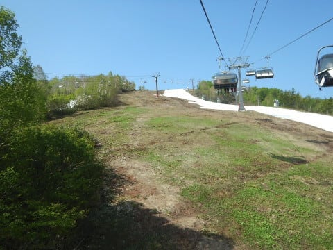
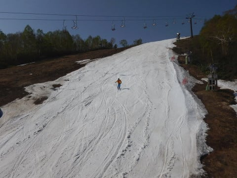

# 5月26日（日）ファイナルかぐら詳細レポート！…

📅 投稿日時: 2018-05-29 06:39:37

🏷️ カテゴリ: [2018スキー滑走日記](c11b88dc181f34079ab41db74a3587646.md)

ということで．

昨日速報レポートした，かぐらファイナルデー．

今日は，写真たっぷりの詳細レポートです！

えー．

まず．

この日は，ギリギリ朝イチのロープウェーに飛び乗ったのですが…

おそらく，営業前に待っていた人は全員始発のロープウェーに

乗れたんじゃないかな．

それほど人は多くなかったですね…

で．

ロープウェー山頂に着くと．

先週と同じく，板とブーツを預けて，

トラックでゴンドラ乗り場まで運んでもらいます．

わが身は，ストックだけ持って．

普通の靴でトコトコみつまたリフトまで歩いて…

みつまたリフトで登ったあと…

ゴンドラ乗り場まで，歩くこと7-8分．

かなりの人数が歩いてますね…

で．

ゴンドラ乗り場にやってくると，

預けた板とブーツが置いてあるので．

ブーツを履き替え，板を持ってゴンドラに

乗ります…

そんな感じで，ロープウェーに乗ってから約45分．

ようやっと，かぐらゲレンデに到着！

うむ．

かなり幅が狭くなりましたね…

しかし，先週の状態を考えると．

まさかファイナルの今日までクワッドを

営業するとは！

ってな感じで．

朝イチのコースに出てみますが…

うむ．

リフトの上から見ると，コースはもう

かろうじてつながってる感じ…（涙）

リフト降り場は，幅2m程度の廊下ですね（泣）．

そこから先は，ちょいと幅が広がってますが…

コース全面に硫安がガンガンに効いていて．

硫安が効いてる固いところと柔らかいところが

入り交じって，朝からちょいとコースは

凸凹してる感じ…

コースの幅はこんな感じ．

朝イチはまだコース上に穴が開いてないので，

まぁ大回りは無理としても，大きめの中回り

程度の幅で滑れるように見えます…

朝イチは人も少なめで，

コース中盤部分は，まぁまぁ滑れる感じでしたが…

和田小屋前からリフト乗り場に向かっては．

うーん．

これは完全に廊下と化してますね…

でも．

この時間はまだ雪が白いので，良かった．

後からわかる．

この時は，まだマシだった…

で．

リフトは終日ガラガラで，飛び乗りでした．

ってな感じで．

今日はここまでで，かなり写真も多くなったし．

さらになぜか，ご無体時間なので（涙）．

すみませんが，今日はここまで…

残りは明日，レポート後半に続きます．

いや～．

昨日の速報レポートでお分かりかと思いますが．

後半の写真はすごいよ～．

すごい写真がいっぱい出てくるので．

後半もお楽しみに！

## 💬 コメント一覧

### 💬 コメント by (新潟のスキーヤー)
**タイトル**: Unknown
**投稿日**: 2018-05-29 21:32:46

二年前のかぐらより酷そうですね！

毎年、かぐらの終了＝私のシーズン終了！

だったのですが…

本日！

月山に行ってしまいました！(^^;

１日ガッツリ滑らなければ、新潟市からだと

普通に日帰りが出来てしまい…

なんだか、開けてはいけないパンドラの箱を開けてしまった気分です。

これで私のシーズンオフ時が

自分でもよく分からなくなってきました…笑

Sさんは月山も毎週行かれるのですか？

月山レポートも楽しみしております。(^^)

### 💬 コメント by (Skier_S)
**タイトル**: 新潟のスキーヤーさま
**投稿日**: 2018-05-30 02:08:18

2年前のかぐらとそれほど変わらないかも…

2年前は，ペアしか滑れなかったので．

それと比べると，まだ恵まれてたかもしれません（笑）．

しかし，新潟から月山ですか！

普通に日帰りですか…

ついに，危険な領域に足を突っ込みましたね（笑）．

これで，もう抜けられませんよ…

私はさすがに月山へは毎週は行けません(^^;

おそらく，次は6月中旬．

今シーズンは，6月末まではもちそうにないから，

月山は一回だけかな～…

