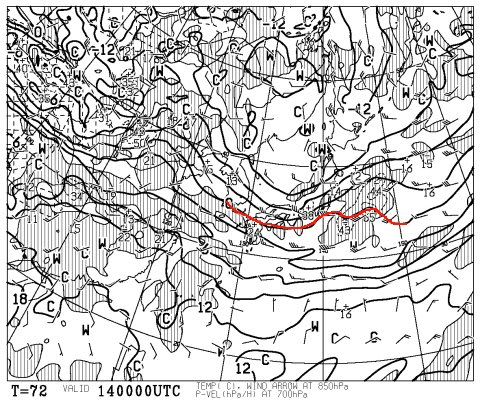

# 定番！この週末の志賀高原の天気は…土曜は冷え冷え，日曜は気温が上がるかな？

📅 投稿日時: 2015-03-12 01:21:58

🏷️ カテゴリ: [スキー天気予想](c6554f5c3c106093b511a8daae23757e8.md)

えー．

「天気予想はいいから，早く試乗レポートやらんかいっ！」

って声も聞こえそうですが．

ほら．

やっぱり．

水曜は定番の天気予想をやっておかないと，

一応，参考にしている人もごくわずかながらいるようなので…

ってことで．

天気予想ですが．

現在の志賀高原．

ガンガンに冷えて，粉雪が積もっているみたいですね～．

金曜までは冷えた雪が降り続くので．

先週末の湿った雪が凍ったアイスバーンが，

週末までに隠れてくれるんじゃないかなぁ，と期待！

で．

肝心な週末の天気ですが．

土曜の500hpa図を見ると…

うむむ！

水色で示したように，トップシーズン並みの

-30℃の寒気が北陸地方まで入り込んでます！

これは，かなりの雪が積もる目安ですね～．

そして，850hpa図を見ても…

0℃線はかなり南まで下がっており，

志賀高原は-6℃線がかかる程度．

…これだと，志賀高原の朝は-10℃近くまで下がる感じですか．

まぁ，この時期としては冷えた朝になりそうです．

で，土曜の地上天気図はこんな感じで…

水色で塗った，降水量が予想される領域．

志賀にかかってますね～

この天気図が正しければ，土曜は雪降りで始まります．

前日から降雪が続き，朝イチはそこそこのパウダー．

ブーツ～ひざパフパウダーが楽しめるかも…？

ただ．

現在の予想では，風向きがちょいと微妙…

矢印で示した部分，ちょっと等圧線が凹んでますが．

ここのへこみの形がどうなるかで，風向きが全く変わり．

志賀に雪雲が流れるかどうか，全く変わっちゃうんですよ…

風向きが西に回れば，朝もそんなに積もってないないかも…

風向きが北に回れば，土曜は午後まで終日雪降りになります．

ううううううーむ．

いまのところ．

予想は難しいなぁ～．

で．日曜ですが．

850hpaの0℃線は，こんな感じで志賀より北に上がってしまい…

そして，午後9時の地上予想天気図はこんな感じで，

西から低気圧が近づき，降水域の網掛けが志賀に

ぎりぎりかかっています…

午前中は高気圧に覆われて天気は良さそうなんですが．

この，西からの低気圧の接近により．

午後は雲が増えていきますね～．

うーむ．

日曜は，土曜からうって変って，気温が上がり気味の，

暖かい一日になりそう…

って感じで．

まとめると

土曜日：朝から冷え冷えの雪！かなり冷えたいい雪が前日から降り続いて

　　いるので，朝はブーツ～ひざパフ程度の，軽い新雪が楽しめそう！

　　終日気温は低く，昼間でも-5度くらいまでしか上がらない感じで，

　　一日中冷え冷えの雪質でしょう！

　　…ただ，柔らかい雪が積もっているので，夕方はちょっとコースが

　　凸凹してきそう．

　　天気は…すごく微妙．現在の天気図では，一日雪になっても不思議じゃ

　　ないけど…

　　ここは，個人的なカンで，雪が降ったりやんだり，時折雲の切れ間から

　　太陽が射したり…と，目まぐるしく天気が変わる一日，と予言．

　　まぁ，3月中旬と思えない，トップシーズンの雪質で楽しめる

　　一日でしょう！

日曜日：朝は晴れ．朝のうちは，柔らかいトップシーズン並みの

　　シマシマピカピカ圧雪バーンを美味しくいただけるでしょう．

　　ただ，昼に向かって気温が上がっていき，午後に向かって

　　ちょっと雪が重くなっていくかも…

　　また，昼～午後の，どこかのタイミングで雲が増え始め，

　　…夕方には，湿った雪が降り始めるかも…

　　まぁ，降り始めるとしても夕方遅めだと思うので，

　　ほとんど影響ないかな．

　　基本的には，平年並みの気温で，晴れ．

　　昼間は暖かく感じるくらいかな（先週よりは冷えるけど）

　　午後は曇が増えていく…

　　という，快適な春スキーの一日かな～．

という感じで．

先週までの，ドボドボ春雪に比べれば．

256倍くらいまともな雪質で滑れる，恵まれた週末になりそうかなっ！

## 💬 コメント一覧

### 💬 コメント by (マルハバ)
**タイトル**: グッドコンディション予報♪
**投稿日**: 2015-03-12 20:06:14

遭遇のチャンスは・・・日曜朝か？

単独行動でちょっと早めに焼額に出かけるか？

土曜の夜に宴会を抜け出してナイターを

“見に”いく・・なんて手もあるか？（笑）

### 💬 コメント by (Skier_S)
**タイトル**: マルハバさま
**投稿日**: 2015-03-13 01:04:57

日曜も，リフトが動いている間は天気がもちそうで…

結構いい週末になりそうな予感！

ただ，今回は子連れスキーなので，子供の

都合によって一の瀬滑ってる可能性も…

土曜のナイターでは，確実にダイヤモンドで滑っています（笑）．

