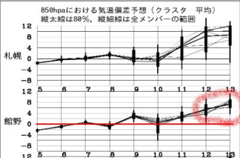
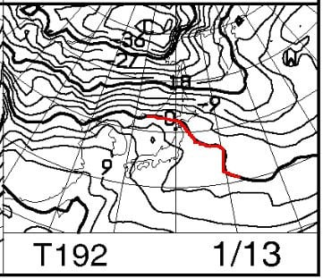
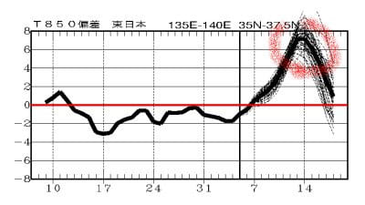

# Skier_Sはこの3連休も志賀高原で滑ってるとお思いでしょうが，明日は滑りに行けず(涙)…そして，13，14日あたりは恐ろしいことが起こる

📅 投稿日時: 2023-01-07 03:30:48

🏷️ カテゴリ: [日記](cc4b5682fb7b8b144980957a978653fb0.md)

えー．

このBlogを読んでいる皆さんは．

当然，私がこの3連休，

3日間とも志賀高原で滑っている

とお思いでしょうが．

…なんということか．

こんな時間にBlog更新しているくらい，

仕事が終わらない(涙）

年末年始も宿題があったけど．

年末年始休みが終わったら．

仕事始めからフルブーストで

仕事が降ってきて．

仕事始め3日目で死にそう…（泣）

とりあえず．

明日はスキーに行ってるどころじゃ

無くなりました(涙)

3連休2日目からは滑りに行きたいけど…

行けるかなぁ…

しかし．

コロナの緊急事態宣言や，家の引っ越し

とかでもない限り，平日徹夜してでも

スキーに行っていた私が，土日や

年末年始休みにスキーに行かないなんて…

こんな日が来るとは思わなかった…

で．

この3連休の天気ですが．

やはり，私がスキーに行けない呪いか．

8日のパウダー予想は無くなりました

水曜の段階では，

　昨晩からの積雪は10～20cmほど．

　非圧雪バーンはブーツパフ．

と書きましたが．

残念ながら，予想ほど低気圧が発達せず，

さらに完全な西風で…

志賀はほとんど積もらない予想になりました(涙)

とりあえず，この3連休の天気は…

7日(土)：この日の冷え込みは弱いけど，

　朝の気温は-5℃以下までは冷えそう．

　朝の積雪は0cm．

　あさイチはいい感じのシマシマ！

　昼間もマイナスキープ．

　曇り時々晴れ間．

　雪質は良い．

8日(日)：朝までに5cmほど積もるか

　あさイチの気温は-8から9℃．

　昼間の気温は-2~3℃程度とこの

　時期にしては気温が高め．

　でも，昼間もマイナスキープなので

　雪質は悪くない．

　あさイチは圧雪の上にうっすら

　わずかに新雪．

　バーンはそこまで柔らかくないので

　午後になってもそこまで荒れなさそう

　ただ，積雪がほとんどないので，

　雪が薄いところは地面がまた

　見えてくるところも…

　

9日(月・祝)：朝イチの気温は-6~7℃．

　朝は曇り，雪がわずかにちらつくかも．

　あさイチは締まり気味の圧雪バーン．

　昼間も雪がぱらついたり止んだり．

　基本的に曇り空．

　この日の昼間は気温は低めで，

　あさイチから気温はほとんど上がらず．

　結構寒い．

　数日雪が積もってないので，バーンは

　締まって，午後になってもそれほど

　荒れないかも．

って感じでしょうか…

やはり3連休も，

私がスキーに行けない呪い

のため，志賀高原は積雪の積み増しが

ほとんどなさそうです…

だけど．

3連休のあとは，雪が積もって

くれるのかな…

…

…

…

…え？

えええええ？？

うげっげげげげげ！！！？？？

なんじゃこりゃーーーーーっ！！！！

このBlogを読んでいる方は，これらの

ずが意味することがよく分かるはず…（涙）

ということで．

13日以降，14，15日と

めちゃくちゃ気温が上がりそう

です（激烈な涙）

そして．

14，15日の土日に，狙ったように

低気圧が来るので…

今のままだと．

14，15日の週末は，空から液体が

落ちてくる終末週末になりそうです…

…ヤバい．

今後，9日にちょっと積もった後，

そのあとはほとんど積雪がなさそうで．

その状態で14，15日液体が降ると…

ゲレンデは，１月と思えない状況に

なりそう…

…まぁ，私が14，15日にスキーに

行けなければ，むしろ雨でも降って

くれればあきらめもつくから，私の

液体が降ってくる呪い

で雨になってしまいそうだけど．

今のところ，私がスキーに行ける

可能性がまだゼロではないので．

14，15日の週末の天気が，このままの

天気図通りになって液体が降る週末に

なるかどうかは…

私がこの週末にスキーに行けるか

どうかにかかってますね．

スキーヤーの皆さん．

私が14，15日の週末にスキーに行けるよう，

祈っていてください！←祈るべき対象が違うから

## 💬 コメント一覧

### 💬 コメント by (地元民)
**タイトル**: Unknown
**投稿日**: 2023-01-07 10:51:57

この10年間、強烈冬型⇒大寒波になっても等圧線が斜め=里雪型の頻度が異様に増えている気がするのは自分だけでしょうか。

特にこの五年間は顕著。

そもそもの偏西風の蛇行が変なんでしょうか。地球温暖化が関係してる?

### 💬 コメント by (a-island4138)
**タイトル**: Unknown
**投稿日**: 2023-01-07 16:51:55

そいえばニュースでヨーロッパのスキー場では温暖化で雪が無いとか…　まさか日本も影響あるんですかね!?

### 💬 コメント by (オオスギ)
**タイトル**: Unknown
**投稿日**: 2023-01-07 18:34:10

姉がスイス在住なのですが、全くと言っていいほどスキー場には天然雪が無いみたいです・・・

ほとんどが、人口降雪機の上に水を撒いて凍らせて、なんとか、GSコースを作り、地元の競技スキーヤーに滑らせていると言っています。

日本のスキー場にくるオースオリア人・スイス人はほぼ９９％天然雪を求めて来日するようです・・・

### 💬 コメント by (Skier_S)
**タイトル**: 明日からゲレンデ復活！
**投稿日**: 2023-01-08 00:21:22

＞地元民さま

そうなんですよ…最近西風が多くて．

どうも，西日本側に寒気が偏り気味で，きれいな東谷になってくれないんですよね…

偏西風の蛇行がずれてるんですけど，この原因は…良く分かりません．

ラニーニャとかそっちの方が効いてるかも？？

＞a-island4138さま

ヨーロッパの方はそうらしいですね～．

ワールドカップ会場とかも，コースにしか雪が無かったり，すごいことに

なってますよね…

やはり日本はまだマシなのかも？？

＞オオスギさま

スイスも雪がないんですか！！

氷の上を滑らさせられるわけですね…

それから比べれば，志賀高原は雪がないとか言っておきながら天国ですよね…

