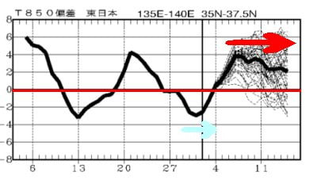
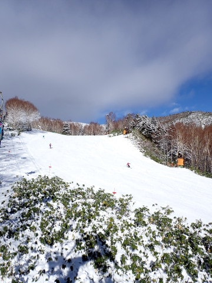
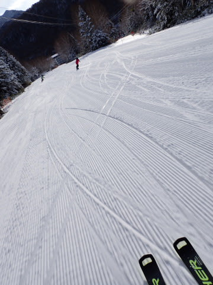
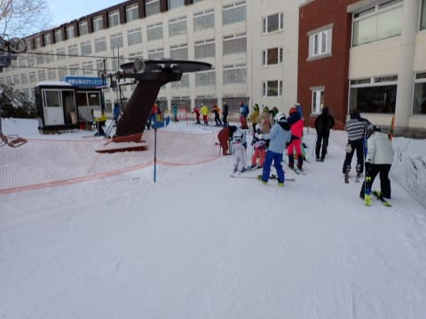
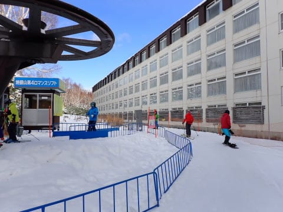
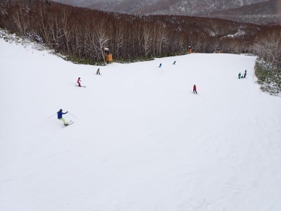
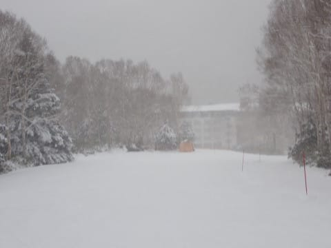
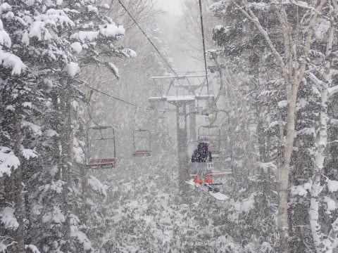
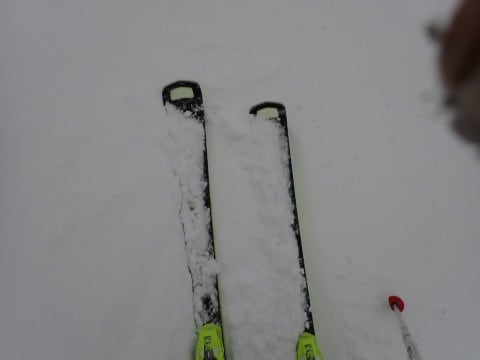
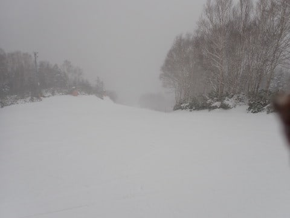

# 2023/12/3(日)の志賀高原焼額山スキー場，速報レポート！…午前ちょっとだけリフト混雑したけど，ゲレンデの雪はいい感じ！天気は曇りのち雪

📅 投稿日時: 2023-12-04 02:57:56

えー．

本日も，いつも通りラストまで滑ってから

帰ってきたので…

帰宅は深夜11時過ぎ．

その後，月曜までにやっつけなくてはならない

仕事をやっていると，こんな時間…（涙）

まだ仕事が終わってないので，今日の

志賀高原レポートは，日曜帰宅日恒例の

速報モードにて！

…の前に．

これから一週間，次の週末までの天気ですが…

いいニュースと悪いニュースが．

まず，いいニュース．

5，6日に雨になるかも…と書きましたが．

今のままの天気図なら，5，6日は気温が

上がるものの，志賀高原ではほとんど

雨は降らずに済みそうな感じ…！

で．悪いニュースですが…

6日の高温のあと，冬型の気圧配置になって，

8日あたりは雪が結構降るかも…？

と思ってましたが．

7，8日の木・金にちょっと冷え込むものの，

人工降雪機がぎりぎり動かせる程度で，

雪もほとんど積もらず．

そして9日の土曜はまた高温になりそうで…

このままの天気図だと．

来週末までに，天然雪はほぼ期待できず．

さらに人工降雪機が動かせるのも，

1週間で4日と7日夜～8日朝のわずかの時間

だけになりそうで．

人工降雪の積み増しもほぼなさそうと．

かなりダメダメな感じです…（泣）

うーん．

この週末と比べて，オープンするゲレンデが

そんなに増える可能性はなさそう…（泣）

2週間予想を見ても，

28日ごろから続いた冷え冷え期間が終わって．

5日からは，平年比+3～4℃高い気温が

13日ごろまで続きそうで…

ダメダメな感じです（涙）

うーん．

次の週末は，焼額のゴンドラが動くことを

期待したいところですが…

このBlog読者全員が，全身全霊で

冷え冷え踊りを休むことなく止まること

なくひたすら夜通し狂ったように踊り続け

ないと，厳しい感じになってきました（涙）

とりあえず．

次の週末にゴンドラが動かなかったら，

読者の皆さんの神に捧げる冷え冷え踊りが

足りなかったということになります…←人のせいにしてはいけない

ってなことで，本題へ．

本日の志賀高原の速報レポート！

まず．

あさイチは結構気温も低く，日も差して

バーンも見やすく，結構いいコンディションで

スタート！

あさイチは，しっかりした下地の上に，

天然雪が圧雪された柔らかい層が薄く

乗った柔らかシマシマ！！！

気持ちいいよ！

ただ，午前中は昨日よりちょっと人が

多めで，9時から11時くらいまでは

ぼちぼちリフト待ちがありました…

でも，リフト待ちは長くても3分程度．

11時を過ぎると，リフト待ちはなくなり，

ほぼ飛び乗りに！

コース上も，午前中はちょっと人口密度が

高かったものの．

午後になると，コース上もガラガラ！

しかし．

午後2時前から降り始めた雪は，

結構強い勢いで降り始め…

午後2時過ぎには，ゲレンデにうっすらと

雪が積もっていくくらいに降り，

営業終了が近づく15時過ぎには，

前が見にくくなるほど降り積もる雪と，

あまりの寒さで戦闘力がそがれる

感じで，滑る人も全くいなくなるレベル

でしたが…

今日もしっかりラストまで滑ってきました～！！

また明日，余力があれば詳細レポート

します～！

…これからまだ仕事やっつけないと…（泣）

## 💬 コメント一覧

### 💬 コメント by (レインボー76)
**タイトル**: Unknown
**投稿日**: 2023-12-04 14:55:40

久々にお邪魔いたします。

月曜日の志賀高原情報

朝の蓮池-7℃。冷え込んでいい感じ。いよいよシーズン初滑りです。

焼額山四ロマ8時30分スタート。ワンターン目はプルークで。あれっ！いいぞ！

10センチの新雪が踏まれて、マシュマロのような雪だ。

2ターン目からはすぐにパラレルに。YouTube「スノホリ」(森田昂希、森田優香プロ)で勉強したことが、観てただけでいつの間にか身に付いてる！快適幸せ、私は若い！

遅～い四ロマで10分１本のペースで滑りまくっていたけど、幸せは長くは続かないのが世の常。

ユキヤマアプリにチェックインしてないとの指摘が入りました。

一日ただ働きしてしまった己れの不始末を深く反省して終了。

明日は、熊の湯も一ノ瀬も行きたいけれど、ブーツを履いたりする作業が楽なヤケビかなあ。

### 💬 コメント by (レインボー76)
**タイトル**: Unknown
**投稿日**: 2023-12-05 15:11:08

火曜日の志賀高原情報

朝の上林0℃、蓮池+2℃。曇りのち晴れ。

降っていないので、バーンは固めで板が走って爽快。

昨日と同じ17本、ひたすら滑って11時過ぎに終了。これではレインボー(２時までにやめる)を名乗り辛くなってきました。

楽しいけれどずっと同じ所を滑っていたら、やっぱり飽きます、普通の人は。

昨日これをラスリフまでやった奇特な人は、四ロマ47本だったそうな。今日もその人にだけは、どうしても追いつけませんでした。

### 💬 コメント by (Skier_S)
**タイトル**: ＞レインボー76さま
**投稿日**: 2023-12-06 01:30:48

この週末はお世話になりました．

今シーズンも平日レポートありがとうございます～！

また，これから土日の休みもなく，毎日のお仕事が続きますね（笑）

しかし4ロマ47本！！？？

土日はリフト待ちもあったからか，お昼も休まず滑ったけど，一日40本は行かなかったです…

