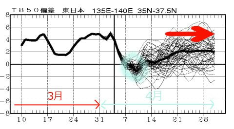
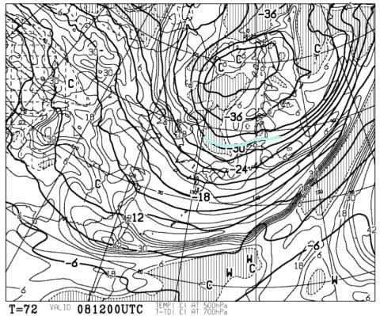

# これから1か月，4月は冷えるのか？…そして土日の天気予想も微修正．

📅 投稿日時: 2018-04-06 06:57:13

🏷️ カテゴリ: [スキー天気予想](c6554f5c3c106093b511a8daae23757e8.md)

えー．

昨日は比較的早く，日付が変わる前に帰れたのですが．

…でも，疲れがたまっていたのか．

記事を書いている途中で，

PCの前で突っ伏して今まで寝ていた

Skier_Sです（涙）．

…なんてこったっ！！！！

ってなわけで．

本日は短めの更新…

とりあえず，4月に入ったわけなので．

4月は冷えるのかな～，

と，長期予報を見てみたところ．

うーむ．

微妙…

まぁ，平年比より気温が下がった日が一日もなかった

異常に暖かかった3月に比べれば．

水色でマークした，7～10日くらいまでの

期間は，平年より低くなるだけマシですが．

…それ以降は，また平年比+2℃くらいの日が

続きそう…

うーむ．

3月ほど異常高温…ってわけでは無いですが．

4月も，冷え冷えではなさそうです（涙）．

GWに突入する4月末までで，冷えるのは

今週末がラストチャンスっぽい…（涙）．

あぁ…もう柔らかい雪で滑るのは望み薄なのか…

でも．

8日の冷え込み，水曜段階の予想より

強くなってきました…水色で示した真冬並みの寒気，

500hpaの-30℃の寒気が入ってきてます！

8日は終日晴れの予想でしたが，

これだけ寒気が強いと，8日は雪がちらつくかも…

西風なので，そんなに積もるほど降らなさそうですが．

で．気温の冷え始めも昨日の予想より早くなり，

土曜の昼前には冷えはじめるかも…？？

土曜の早朝までは雨～みぞれでしょうが，

朝には止んでそうで．

上手くいけば，土曜の夜からまた雪になり，

それがうっすら積もって，日曜朝は

やわらか圧雪になってくれそう．

これが柔らかい雪で滑れるラストチャンスかも…

また明日，ラストの詳細予想やります～！

## 💬 コメント一覧

### 💬 コメント by (はっち)
**タイトル**: 直近の予測によると
**投稿日**: 2018-04-06 19:44:55

朝一には雨は上がってそうですね。

先週土曜日のビデオ編集が終わってYoutubeにUPしましたが、Skier_Sさんが映っているカットがあります。

すぐにわかると思いますが(笑)

### 💬 コメント by (Skier_S)
**タイトル**: はっちさま
**投稿日**: 2018-04-07 05:05:31

土曜は天気もちそうですね…

今週末も志賀ですか？

またお会いしましょう！

