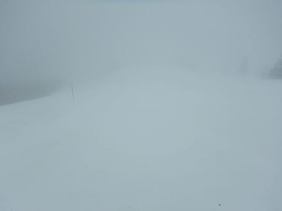
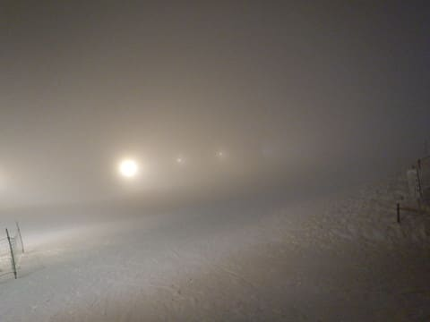

# 2019/3/22(金)，飛び石連休谷間の志賀高原スキー場は…朝はガス＆ガチガチアイスバーン．曇り時々雪で，昼間は緩んだバーン＆ガチガチバーンのミックス（涙）

📅 投稿日時: 2019-03-22 21:55:57

🏷️ カテゴリ: [2019スキー滑走日記](c3e4496fc0fb7f9c17ff21214a35b1ace.md)

えー．

皆さんお気づきのように．

飛び石連休の谷間の本日も．

志賀高原で滑ってました～！！

ってなわけで．

本日金曜日．

朝8:30の通常営業開始時に，

焼額ゴンドラに飛び乗って，

山頂にやってきますが…

ガスだよ（涙）

あさイチの山頂の気温は-1℃と，

結構高めですが．

でも．

ゲレンデはガチガチに固まって

ますね…（涙）

一見気持ちいいシマシマバーンに

見えますが．

シマシマのままガチガチに固まっていて．

滑ると足にビリビリと激しい振動が

やってくる，

電動マッサージ機バーンです（泣）

エッジの効きにくい硬いバーンで，

前が見えないので…

これは怖い．

かなり怖い（泣）

開始後1時間ほど，9:30には

ガスも上がってきて…

ガチガチだったバーンも

表面が緩んで，ようやく

エッジが利くように

なってきましたよ～！！

さらに，時折青空も見えるように

なってきましたよ～！！

だのに．

さすが平日だけあって，

ゴンドラもガラガラ！！

やっと，楽しくなって来たよ…

と，思っていたところ．

…晴れ間は長く続かず．

またすぐにガスが…（涙）

基本的に天気は曇ったり，

かすかに雪がぱらついたりの

天気でしたが．

昼間も気温は0度前後と，

ちょうど微妙な感じの気温だったので．

北向きの焼額GSコースや．

奥志賀．一の瀬などは終日

雪は硬いままで…

白樺コース，唐松コースなどの

南向きコースは．

ごく時々ですが，日が差したのもあり．

そのせいで，ゲレンデは結構緩んで．

雪は荒れていきました…（涙）

午後になっても，天気は

ガスったり，

ガスが上がったりと

微妙な天気が続きました…

この写真では，自分たちのいるところは

ガスがかかってませんが．

向こうに見える一の瀬は，完全

ガスの中に入っちゃってます…

そして．

午後遅くになってくると．

気温が低く下がっていき…

昼間に柔らかく緩んでいたバーンも，

冷えたザラメのように固まって

行きました…

ってな感じで．

久しぶりの平日スキーでしたが．

バーンは，昼間に一部緩んだところが

あったものの．

全体的に，手ごわい硬いバーンが

多めで．

そして，一日の多くが，ガスに

覆われて．

うーーん．

お約束の，ゴンドララストまで

滑ったものの．

微妙な感じの一日でした…（涙）

そして．

ナイターの時間になっても，

ガスは上がらず．

視界が悪そうだったので．

大変珍しいことに．

本日，ナイターに行くのはやめて．←ここ驚くところ

宿でおとなしく過ごしたのでした…

…明日は．

朝まで雪がちらつくものの．

積もるほどではなさそうなので．

冷え冷えの明日の朝．

かなり硬めのバーンコンディションで

スタートとなりそうです．

…昼間も気温が上がらないし．

終日曇り～小雪の天気なので．

バーンは全く緩まず．

終日ガチガチのバーンになりそうな

感じ…

あぁ…先週のやわらかいバーンが

懐かしい…

## 💬 コメント一覧

### 💬 コメント by (Goku)
**タイトル**: Unknown
**投稿日**: 2019-03-22 22:51:21

どうやらこの感じからして、明日の早朝はスペシャルアイスバーン決定でしょうか！

少し緩み始めた通常営業からのスタートが無難とみた。

### 💬 コメント by (かず)
**タイトル**: Unknown
**投稿日**: 2019-03-22 23:17:27

今日は飲みにしました　膝もやっと階段普通に降りれるようになりましたよ　Sさん貴重な平日なのに残念ですねー来週は行きます

### 💬 コメント by (地元民)
**タイトル**: Unknown
**投稿日**: 2019-03-23 01:18:34

さすがの志賀高原もお彼岸過ぎだとアウトでしょうね～。若い頃、地元なので、他のスキー場が腐った雪しかなくなる３月は、志賀に通ってましたが、お彼岸まではけっこう小麦粉状態のことがありました。でも、お彼岸過ぎは悪雪しか経験ないです。

あ、そういえば、昔、４月１日に志賀高原で悪雪だったんですが、次の日、戸隠スキー場に行ったら状態、良かったことあったな～。

春は斜面の向きが重要みたいですね～。戸隠、北西斜面です。志賀高原で北西斜面は、熊の湯や横手山か・・・。両方とも楽しくない斜面だからな～。

### 💬 コメント by (タカ)
**タイトル**: Unknown
**投稿日**: 2019-03-23 10:28:17

本日の北海道はキロロですが、めっちゃ雪です。おとといまで雨降ってたのに、わずか２日で２ヶ月程季節が戻りました。北海道の恐ろしさ体感してます。猛烈パウダーで窒息しそうですが、たまらない状況です

### 💬 コメント by (ほっぽ)
**タイトル**: ３／２３　志賀高原
**投稿日**: 2019-03-23 20:51:45

Ｓさん

ナイターまでお疲れ様です。

今日はどこもツルツルアイスバーン祭りで疲れました。

朝一の一の瀬ファミリー正面、何も出来ずにただ落下するだけでした。(^^;

今日の滑走レポートをアップしておきました。

### 💬 コメント by (Skier_S)
**タイトル**: 今日は早朝～ナイターまで．疲れた…
**投稿日**: 2019-03-23 23:11:44

＞Gokuさま

今日はお疲れさまでした～！

早朝は良かったですよ．

でも，今日は終日ヤケビが一番良かったですね．

＞かずさま

いや．

今日は来なくて正解だと思います．

かなり体に優しくない雪でした．

来週までに，コンディション良くなるといいんですが…

まぁ，この時期はもう冷え冷え新雪は期待できませんね（涙）

＞地元民様

志賀は，時々4月になってもいい雪が降ったりするんですが…

でも，滅多にありませんけど(笑)．

志賀は大体春になると，朝日を浴びる焼額はすぐ雪が

ダメになります．

その時は，朝日を浴びない西斜面の一の瀬ファミリー，

高天ヶ原は昼頃まで雪がもったりします．

ゲレンデの向きは，大切ですよね…

＞タカさま

キロロはパウダーですか！！

うらやましすぎる…

と，アイスバーンを一日滑った人間としては

うらやましがらずにいられません…

キロロ，楽しんできてください…

＞ほっぽさま

一の瀬はすごかったみたいですね．

でも，ナイターは良かったですよ～！！

### 💬 コメント by (Reader)
**タイトル**: ありがとうございました
**投稿日**: 2019-03-27 08:11:56

土曜日，Friendsシールをいただきました．

ありがとうございました．

２０年以上，志賀高原をうろうろし，このblogを，多分，５年以上拝見している割には，なかなかお目にかかれませんでしたので，やっとという気分です．

感激です．

ところで，２６日の夜，雪が降り始めました．

ところが２７日の朝は，ほぼ晴天！　平日スキー万歳です．

### 💬 コメント by (Skier_S)
**タイトル**: ＞Readerさま
**投稿日**: 2019-03-28 06:21:02

土曜日はありがとうございました～！

そんなに長いこと読んでいてくださったのですね…

ありがとうございます．

27日は良かったみたいですね～．

奥志賀に皇太子ご一家が来ているようなので，

奥志賀の整備はバッチリのようですし．

また志賀でお会いしましょう～！

