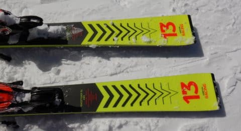

# 2021シーズンモデルのスキー板，試乗レポート…VOLKL RACETIGER SL

📅 投稿日時: 2020-03-27 00:34:37

🏷️ カテゴリ: [スキー板試乗](c0bd8048615710cee890e403a36cc9a2b.md)

えー．

この土日の天気ですが．

やっぱり予想は極めて難しいですね…（涙）

というか．

冬から春にかけての天気図ではほとんど経験

したことが無い，停滞前線を伴う天気図で，

私の脳内データベースには，こんな天気図の時

志賀高原の天気がどうなるかは入ってません…（泣）

ってなことで．

土曜の昼間は，雨になるか雪になるか，

未だによくわかりません（泣）

ほんのわずかの予想ずれで，雨になるか

雪になるか，超微妙なポイントにいます．

微妙な何かが時折降りそうですが，

ずっと降りっぱなしじゃなく，降っても

時折パラパラ程度っぽい感じなのが救い…，

でも．午前中は風が強そう．

まぁ，焼額ゴンドラが止まるほどではないかと

思ってますが．

日曜は…朝のうちは雪がちらつくかもしれないけど，

リフト営業開始前後には止んで．

遅くとも昼，早ければ午前中から晴れるかも…？？

昨日は，午後から晴れの予想をしましたが．

もしかするともう少し早くから晴れるかも？？

朝に雪が積もってくれれば，意外といい日に

なるかもしれません．

まぁ，明日最終予想しますが．

今はもしかすると，

悪天候よりコロナウイルスの蔓延が

スキーヤーにとっては辛いかも…

ってなことで．

本日のメインは，2021シーズンモデルのスキー板の

試乗レポート，フォルクル編です．

…これは，先々週の志賀高原で試乗したもので，

かなりいい雪のコンディションで試せたものです…

では，どうぞ～！

○VOLKL RACETIGER SL 165cm

基礎小回り用

今シーズンモデルは，RACETIGER SL DEMOと呼ばれてましたが．

来シーズンは，DEMOの名前が取れるのか，

単にRACETIGER SLという呼称になるようです…

競技用は，RACETIGER SL WCという名称になるのかな？

このRACETIGER SLは，ガッツリ競技用のプレートが

付いたモデルではなく，rMOTIONのビンディングが

板直付けで着いており，競技用よりマイルドな感じ…

そして，165cmで127-68-103と，

サイドカーブは昨年のSL DEMOと

全く同じですね…

基本的に，今シーズンのSL DEMOから，

サイドカーブもビンディングも変わってません．

あ，競技用のSL WCとは，異なるサイドカーブに

なります．

とりあえず，履いてみると…

ビンディングに重さがあり，板自体に

驚く軽さはないけど，

滑った感じが，すごい軽く軽快！

ターンの前半からすっとたわんで

ターン始動してくれて．

そしてターンの仕上げで，

溜まった圧が気持ちよい早さで

ヒュンと戻ってくる，

いい感じのばね感があります．

ガッツリグリップしてずれを許容しない

SL競技用の重厚さより，基礎モデルっぽい

軽快さ，動かしやすさがあるモデル．

それなのに，ターン始動ですっとたわんだあと，

谷回りの早い段階からエッジの線に乗って，

きれいにカービングで回ってくる

オートマチック感があり，

さらに切り替えの際に適度に元気な

返りがあるので，切り替えもかなり

オートマチック．

しっかりエッジの線に乗ったまま，

深く回しこんでいくことができます．

そして，スピード耐性も結構高いです．

普通のゲレンデスピードなら，これだけあれば

十分な感じ．

それでいて，SL競技モデルほどグリップは

激烈ではないので．

板を動かしながら滑ることも可能．

ズラシのコントロールもいい感じに決まります．

ただ，オートマチックに回ってくる特性が

あるので，大回りは厳しいかな…

小回りスペシャルと割り切る必要があります．

大回りや，縦に落としていくターンは

不得意です．

とりあえず．

旋回性も高く，かなりオートマチックに

たわみに乗った深い小回りができるので．

強めの横Gに耐える体力と，

早めの板の返りについていく技術が

必要という，

決して楽にゲレンデを滑り降りる板では

ないけれども．

そこそこの技術レベルと体力がある人の

小回りスペシャルの板としては，

かなりおススメな感じの板でした…．

## 💬 コメント一覧

### 💬 コメント by (かず)
**タイトル**: Unknown
**投稿日**: 2020-03-27 11:09:39

本日はザラメで板つかみはないですかね？  色々検討して無難な日月にしました  春シーズンは滑るだけでなく自分もプラスビール 妖怪撃退を楽しみにしてます  新たな撃退アイテム買い込んだので今年こそ！

### 💬 コメント by (レインボー)
**タイトル**: Unknown
**投稿日**: 2020-03-27 12:31:25

金曜日の志賀高原情報(妖怪退治成功)

2ゴン強風で(故障？)運休。珍しく奥志賀ゴンドラが作動。ＰＰ取ってすぐにエキスパートへ突入。気持ちいい！でも、搬器の揺れが半端ない。２本目の最後に、妖怪が少しいたずらを。いつ運休されても仕方ない状況で、そこで武蔵(弱いけど)は考えた。

一本一本大事に滑ろう！これが良かった。

三高でもいたずらされかけた時、昨日から最も目を惹く滑りをしている人が、私と同じ[ワックスではない]not waxを塗っているではあーりませんか。これに力を得た私は、付着した黒いゴミを拭って、ワックスではない液体を塗ると、三高すーイスイ、エキスパートもすーいすい(下手だけど)。でも、強力な妖怪にはロングランは対応不可。最後は力尽きました。

9時15分ゴンドラが力尽き、10時20分三高がご臨終。

最後のダウンヒルは、しっかり塗ってスタート。できるだけエッジで滑ることを心がけたら、ノーブレーキ。

妖怪が嫌いな人は、まずは場所を変える、次はまめに液体のお世話になる、そしてエッジを立てて滑る、かなあ。皆様、いい方法があったらご教授いただけませんでしょうか。

レインボーを大きく早退した私は、昼間から本麒麟のお世話になっております。

### 💬 コメント by (レインボー)
**タイトル**: Unknown
**投稿日**: 2020-03-27 12:56:24

追記

ダウンヒルのニ壁の上、熊落とし入口の上のカーブ、これを一壁と言うのかなあ。ここで、突っ立って、手を拡げて、タイタニック直滑降をしてみたら、強風のおかげで見事なまでのスピードコントロールができました。何事にも遊び心があると、心が豊かになりますね。

そうそう、昨日、一の瀬のダイヤモンドからファミリーへの連絡リフトを何分で回せるかを、測ってみました。乗車時間は1分20秒。一回り2分丁度でした。空いていれば一時間に30本、８時間で240本も乗れます。これって、もしかして、乗車本数のギネス？

気になる標高差は、一本16mですから、一時間で480m。８時間では3840mです。

これって、20000mよりも遥かに凄い(変わった)精神力の持ち主でないとできませんよね。上手な人は山ほどいるわけですから、こんなユーモア、これこそが20000mクラブの原点かと。

どなたか、チャレンジャーはおられませんでしょうか。ちなみに私の記録は、なんと一本です。なんし高齢ゆえ残りが少ないので、、、

### 💬 コメント by (かず)
**タイトル**: Unknown
**投稿日**: 2020-03-27 13:11:28

今のNOT WAXは分かりませんが20年位前ですかね？黒い丸い容器の液体でした  自分も試しましたがテフロンなので  その後バラフィンまで弾いてしまう！！知識もなくどうにもならなくて板処分してしまいました笑  それから液体恐怖症デス…

### 💬 コメント by (レインボー)
**タイトル**: Unknown
**投稿日**: 2020-03-27 15:51:34

このフォルクルの板、私が注文したものです。試乗レポート、感謝します。

正直、滑りやすかったのと、私のレベルを知っている信頼できるショップの人の勧めもあって、即決しました。来シーズンの自分が楽しみです。

その前に、それまで生き延びねば！

### 💬 コメント by (マルハバ)
**タイトル**: この板のデザイン・・
**投稿日**: 2020-03-27 18:31:04

懐かしい～♪

私の学生時代のVOLKLデザインの復刻ですね！

当時は「フォルクル」ではなく「ボルクル」で

「レースタイガー」ではなく「レーンタイガー」

だったと記憶しています。

追伸：

今年はOB大会が中止なってしまい志賀に行けませんでした。

昨年の病院送りに続いて2年連続でSさんお会いできず残念です（涙）

### 💬 コメント by (Skier_S)
**タイトル**: うーむ．そろそろいろいろ考えないといかんな…
**投稿日**: 2020-03-27 23:45:49

＞かずさま

日，月ですか…

日曜は朝は雨じゃなく雪になってくれそうだし，

リフト営業時には止んでそうだし，月曜も曇り空ながら降らなさそうだし．

土・日よりも，確かに日・月がいいかも…

で，NOT WAX使ったことないんですが，そんな強烈なんですか？？

パラフィンまではじく？？もうワックス濡れなくなるんでしょうか…

＞レインボーさま

まさか，ダイヤモンド連絡ペアを回す人がいるとは

思えませんが，

いたらリフト係員に「なんだありゃ？？」

って思われそうですね…

一日240本って，確かに一日リフト乗車回数記録かも（笑）．

で，FISCHERじゃなくVOLKLにしたんですね！

来シーズンが待ち遠しいですね…

＞マルハバさま

え？？

これって，復刻デザインだったんですか！？？

知らなかった…

Rossignolといい，なんだか20年以上前のデザイン復刻が流行ってますね…

そして，今シーズン志賀に来れずですか．

お会いできず，残念です…

＞下関民さま

コメントありがとうございます～．

私個人あてのコメントということで，いろいろ物議を醸しださないように

非公開とさせていただきました．すみません．

いや．

私もそろそろヤバいなと感じてます…

人口密集地帯でないとしても，長距離移動はいろいろ感染拡大リスクがあるので…

＞読者さま

コメントありがとうございます～！

私としては下関民さんのコメントももっともと思ってますので，

コメントを私のみ閲覧とさせてもらいました…すみません．

でも，私のこともいろいろ気遣っていただきありがとうございます．

まるで私の中の天使と悪魔の声の両方が

ちょうどコメントに出てきたようで，「をを！」と

思ってしまいました（笑）．

＞S県Kさま

コメントありがとうございます～＆ご愛読ありがとうございます．

私に対する応援と捉え，コメントは私のみ閲覧とさせてもらいました．すみません．

皆さんのようなファンと言ってくれる方がいてくださるから，

このBlogを書き続ける元気になっています．

感謝の限りです～！

＞musiさま

すみません…この流れなのでコメント私のみ閲覧可の状態にしてしまいました．

トンネルはドライだったんですね…雨は今止んでるんですか．

明日の朝にかけて雨が降りそうですが，営業開始までには止んでくれそうです．．．

