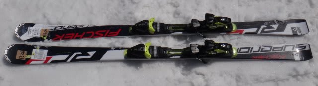
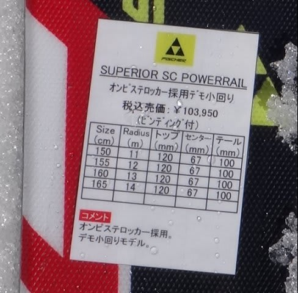

# 2014シーズンモデルのスキー試乗レポートその4…FISCHER編

📅 投稿日時: 2013-03-29 00:21:19

えー．

なんということか．

なぜか今週末も．

土日にスキーに行けないんですね…（激涙)．

で．

あろうことか．

いきなり明日，会社をずる休み(？）して，日帰り志賀を強行することに

してしまいました…

ということで，あと3時間ちょいで出発です．

＃Blog書いてる場合じゃないよ←自己突っ込み

だのに，試乗レポートを書いている私．

今日はFISCHER編です．

今回は一種類のみのレポートです…

---

○FISCHER RC4 SUPERIOR SC Powerrail　165ｃｍ

FISCHERの小回り基礎板トップモデル．

＃厳密には，C-LINEの方がトップモデルか？でもC-LINE，フレックス切替機能とかが

＃ついていて高いので，プレミアムモデルというべきかな～

で．

今シーズンからトップロッカーが入ったようですが．

そのせいなのか分かりませんが，ちょっとトップのグリップが弱め．トップが食い込んで，

板全体がしなってしっかりエッジグリップするという板ではないですね．

テールを使ってやると，回っていきます．

センター～テールに加重していくと，グリップして走っていきます．

傾きの強さより，加重の強さで旋回半径をコントロールできる感じ．

抑えないでいると，比較的まっすぐ走るので，ショート用の板といいながら

比較的ロング気味までターンを引っ張れます．

で，しっかりたわませていくと，山回りで小回りに切れ上がっていきます．

エッジグリップはそこそこ強いけど，ポジションをテールよりから

センター～トップへ移すとグリップが抜けていくので，

ポジション調節でグリップ力を操作できる感じ．

そのため，板自体はかなり動かしやすく，軽快感があります．

だけども，テールのフレックスは比較的強く，張りを感じるので

スピード耐性は十分高いです．

…でも，もう少しトップのグリップがあったほうが好きだな～．

ただ，2-3本滑っただけでは，この板のツボを突ききれてなかった可能性も

高いです…．

＃あまりにも普段履いているATOMICと乗り方が違ったので…
