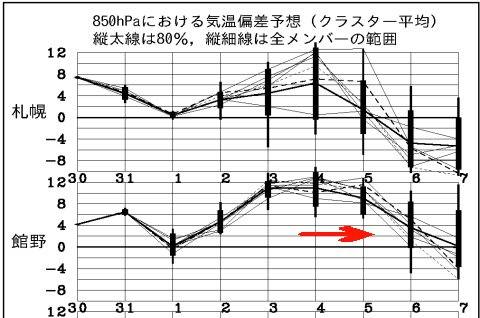
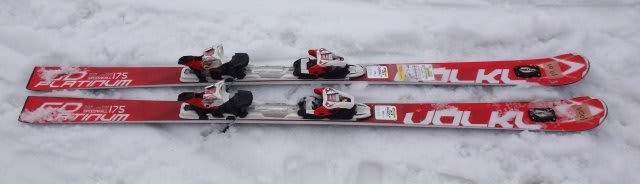
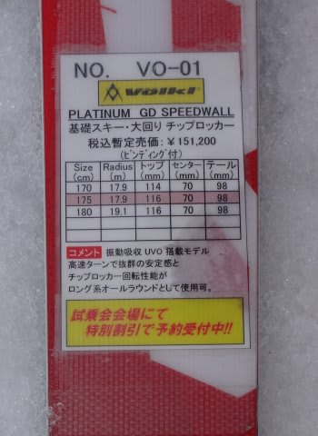
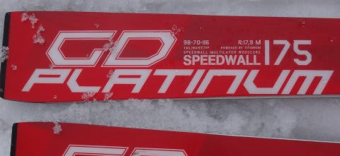
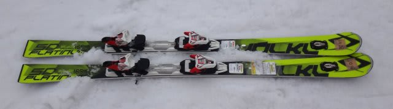
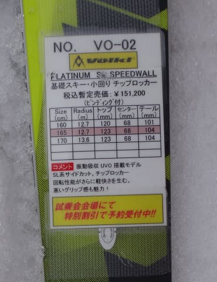
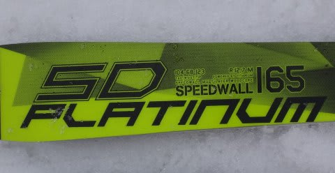
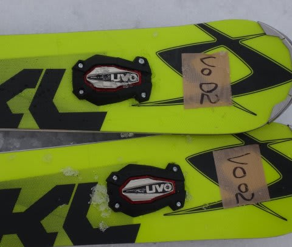

# まだまだ続く！ 2016シーズンモデル，スキー試乗レポート第7回…VOLKL編

📅 投稿日時: 2015-04-01 04:01:20

🏷️ カテゴリ: [スキー板試乗](c0bd8048615710cee890e403a36cc9a2b.md)

今日もご無体時間に帰宅だったわけですが（涙）．

…先週末を振り返ってみると．

月～水に積もった冷え冷え雪のおかげで．

例年より気温が高かったわりに，雪の状態は比較的良くて．

で，天気も良かったので，予想以上に楽しめた週末でしたが…

…

…

…今週末は

来ます．

来ますよ．

いや，悪いほうに…（泣）．

今週末，4，5日は…

ふぎゃーっ！！！

予想が，グラフの上を突き抜けるほどの高温になってるんですが？？

例年より，12度くらい上がっちゃうの？

志賀高原でも，余裕でプラス10℃を突破する気温になるってことか…（泣）．

そして．

今のところ．

土日とも．雨になりそう（激泣）．

うーむ．

なんてこったい！！！！！

という，悪いニュースのあとは．

2016シーズンモデルのスキー板，試乗インプレッションが続きます．

今回は，フォルクルの2機種です．

では，どうぞ～！

○VOLKL PLATINUM GD 175cm

基礎大回り用．

来シーズンモデルも，トップに振動吸収デバイスのUVOが

標準でついてます．

…このモデル，今シーズンモデルからほとんど変わってないのかな？

履いた感じ，かなり軽快で軽さを感じるのに，

比較的グリップはしっかりしていて，結構縦に落としていけます．

荷重はくるぶし荷重，谷回りで多少トップを抑えた方が回りやすいか．

板の返りは優しく，それほど早くないので，しっかりと板を抑えながら，

ゆっくりとロングのリズムで切り替えていけます．

何もせず，板なりに乗っていくだけでスムースに長い谷回りに入ってくれて，

しっかりエッジで切っていくきれいなロングターンが描けます．

板に仕掛ける量ではなく，谷回りの傾き量で回転弧が

自由にコントロールできる感じ．

逆に，乗り手が仕掛けていってもそんなに強い圧が溜まる板ではないので，

乗り手は板にそれほど仕掛けず，板なりに滑っていくと気持ちよい板です．

乗り手が板をたわませようと押し込んでいくと，板が逃げていく感じ．

うーむ．

乗り手が積極的に仕掛けていき，強い圧を受けとめていくX-raceと

対極にあるなぁ…

でも．

傾くだけで，疲れずにきわめて楽にすーーーっと

縦長のロングターンができる板なので，

ロングクルーズをしたい人にはいいかも．

○VOLKL PLATINUM SD 165cm

基礎小回り用．

この板も，基本的には今シーズンモデルの継続なのかな…

とりあえず．

手に持った感じも．

履いた感じも．

スゲー軽いっ！！！！

軽い．軽いよ．

この軽さも，SALOMONのX-raceとは好対照をなすなぁ…

この板も，トップにUVOがついてます．

で．

この板．

固いです．すごいフレックスが強いです．

メタルのばね感の強さというより，コア材の強さ．

この板を履いたのは，午後3時ごろの，雪がザブザブに柔らかく

なってからだったので．

この硬い板を，その本領を発揮できるほど，たわませる

ことはできませんでした…（涙）．

昨シーズンの試乗では，かなりの好印象だったんですが．

柔らかい雪を苦手とすることがよくわかりました…（残念）．

板が軽いので，どういう風にでも振り回せるので．

重い雪だろうが，柔らかい雪だろうが，どうやっても

滑れる板なんですが．

…でも，やはり．

この板が本領を発揮するのは，固い斜面でスピードをだし，

思いっきりグリップさせた領域．

そのような領域では，高いスピード耐性，ものすごい

早い返りによる切れ味鋭い小回りが楽しめるので．

やっぱり，体力・脚力がある人が，そういうコンディションを

中心に，ガンガンハードに攻める用途に向く板だと思います…
