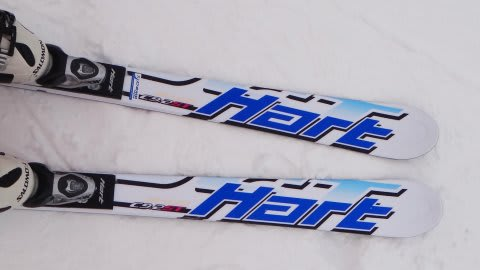
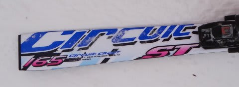

# Hartの板を履いたよ2…Circuit 9.2ST　165cm

📅 投稿日時: 2012-12-28 01:01:08

ということで．

おととい，[スキー仲間](http://blog.goo.ne.jp/suma_shikao)に履かせてもらった[HEADのGS用の板のレポート](e09a4fbd0604488a4f4d9c9503615eb18.md)を書いたので．

今度はショートのCircuit 9.2STの試乗インプレッションをば…．

この板は…普通の基礎用って感じですかね～．

履いた感じはウッドコア，それもサンドイッチっぽい乗り味．

＃この板はサンドイッチ構造じゃなく，キャップ構造だけど…

GSの板と違って，スイートスポットが狭くないですね～．

でも，板を生かせるポジションはセンター．

…っていうより，明確なかかと軸かな．

前後動は，GS板と同様に，全く不要．

トップは押さえなくてOK.

トップがインへ入ってくるショート板じゃなくて．

たわみで曲がるタイプ．

この板も，ビベルが1度でチューンされているのが利いているのか…

かなーり簡単にずらしに入れられます.

どうやってもエッジグリップが外せない，という板ではなく．

マイルドなグリップ感です．

比較的軽く感じるのもあり，板はかなり動かしやすいです．

…予想以上に，楽な板ですね…

なんか，とんがった感じがないので．

端的に言ってしまうと，強烈さがない「普通の板」って感じで．

割と安心して乗っていけます．

とりあえず，結構保守的なサンドイッチ板の乗り味を持つ，

小回りベースの何でもできる板…って印象でした．

…でも．

この板も，全く[以前の試乗のときの印象](ee0cfc1bf77d15e4c7d585d227499bef7.md)と違うんだけど…

やっぱり，試乗のとき．

トゥピースも動かせる，テスト用ビンディングだったのもあって．

…ブーツセンターがずれてたんじゃないかな？？
