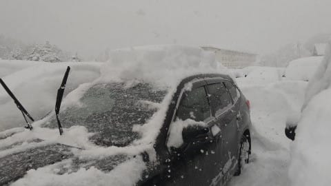
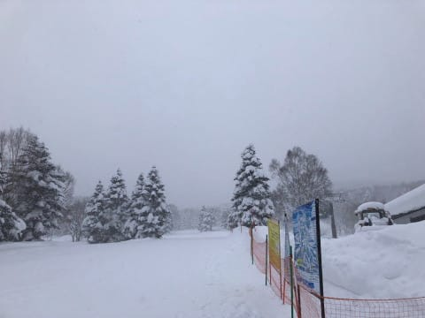
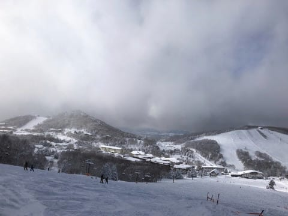
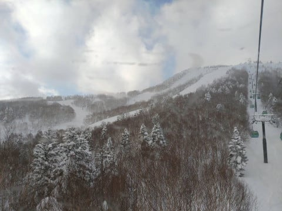
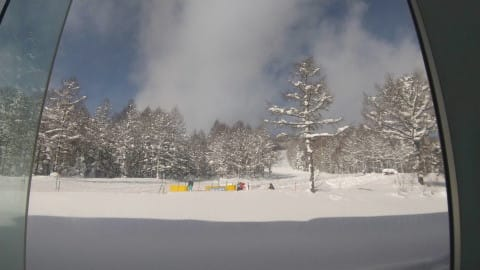
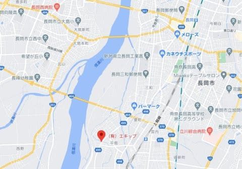
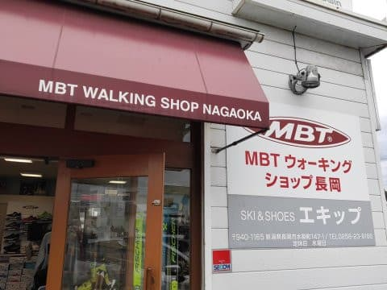
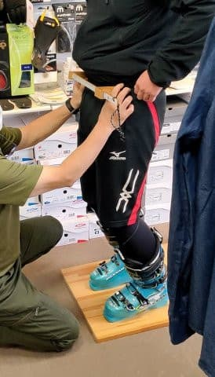
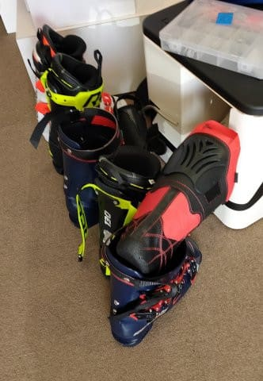
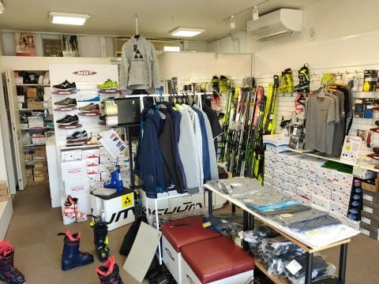

# 長岡のエキップさんで，ニューブーツ・’21モデルREXXAM R-EVO 130Mを作ってみた…その１

📅 投稿日時: 2021-01-11 03:42:15

🏷️ カテゴリ: [スキー雑談](c1f9d2cb7478308da16419928ea3945e9.md)

えー．

本日の志賀高原．

当初予想の天気図から等圧線の向きが

変わってしまい，私の予想を超えて，

朝には最大50cmほど雪が積もったようで…

朝のうちはすごい雪降りだったようです！

ただ，非圧雪バーンの新雪は結構重め

だったようですね…

そして，圧雪バーンも上にかなり新雪が乗っており，

そのおかげで，午後はボコボコになっていった

ようですが…

とはいえ，昼ごろには雪も止み，薄日も

射し始め

午後は結構いい天気になったようです！

午後のボコボコ斜面は手ごわかったようですが．

相変わらず冷え冷えのいいコンディションを

キープしているようですね…

とりあえず．

　西風なので志賀はそんなに積もらないか…

　ただ，かなりの冷え込みなので，

　根性がある雪雲は北アルプスを越えて

　来るものがあるので，志賀は積雪20cm程度かな？

という，朝の積雪予想はちょっと外したけど．

　この日も終日雪がぱらつく天気．一瞬晴れ間も．

　ただ，午後はゲレンデがちょっと荒れ気味か…

というところはぴったり当てたようです…！！

…ですよね…現地特派員の皆様…

ってなことで，本題へ．

今シーズン，[物欲選手権に負けて](ec30d65ecf2d67ea374cb89930ce53a9e.md)

新しいブーツを購入したことはネタにしましたが．

このブーツ，[長岡のスキーショップ，エキップさん](http://www.equipe.jp/)で

購入したのはすでに物欲選手権の記事で書いたところ．

[エキップさんの地図](https://goo.gl/maps/J5KFzqvR1UsbZmbh9)はこんな感じで，

JR長岡駅から4kmほどのところにあるお店．

長岡という土地柄，新潟県の有力選手を始め，

全国からお客さんが来るショップのようです．

そんなに遠くない距離にスキー場もいっぱい

あるので，チューンナップした板やブーツを

ちょっと滑って確かめて…ということができる

って観点では，便利な場所にあるといえる

スキー＆ブーツチューンショップです．

基本的には社長一人でやっているお店で，

一度に一人しか対応できないので，

行くときには電話で予約を！

で．

私の場合は．

お店に行くと，まずは足を見てもらいます…

まず，私の足を見た鈴木社長，開口一番

「これは手ごわい…」

と一言．

かなりスキーブーツを履きこんで，

いろんなところが出っ張っている

私の足．

数多くのスキーヤー，それもプロ級の

スキーヤーの足を見ている鈴木社長をして，

「手ごわい」

と言わしめるとは…

ガンガン競技をやってるようなスキーヤーって，

みんなこんな足だと思っていたんだけど，

そうじゃなかったのか…っ！！

改めて，私の足はかなり特殊な足と認識

させられました(笑)．

そして．足の形は当然として，骨格や筋肉の

つきかたを見て．

それから，下半身の関節の動きを徹底的に

チェックされます．

ブーツを履かずに，膝を前後に動かすと

どのように動くのか，膝がどっちに向いているのか…

と言ったあたりは執拗なほど見られます．

（腸骨の幅を測っているところ．これがスタンスの基準になるらしい…)

ちなみに…

私と一緒に行った某氏は，鈴木社長に

足を見てもらって．

「野球かなんかやってる？それも左投げ？」

と，一発で見抜かれてました．

足の動きや筋肉のつきかただけで，そこまで

見抜くとは！！！

半端ない眼力のようです…．

で．

これまで私の膝は，右ひざを曲げると

内に入る癖があるんだと思っていたところ．

そうでは無くて，

「右ひざが伸びる時に外に逃げる」らしく．

このあたりを考慮してブーツを作りましょうか…

ということになりました．

ここまで足を見てもらった後で，

次はブーツ選びです．

足型や骨格に合うブーツを何種類か

選んでくれるので，実際に履いてみます．

私の場合，他の人がフィット性の良さを

絶賛していたので，履いてみたいな…

と思っていたFISCHERのVACUUMは

「これだけいろんなところが出っ張ってると，

　VACUUMでもフィットしきれない」

ということで却下．

また，ATOMICもおススメではない…

ということで．

いくつかの候補に挙がったのは，REXXAMと

ROSSIGNOL．

REXXAMは，2020モデルまではあまりおすすめ

してなかったようですが，2021モデルは

かなり良くなった…

ということで，今年から推奨しているらしく．

まずはこれが私に向けたイチオシ．

履いてみて，カントなど調整してもらい

いろいろ動いてみますが…

シェル出しをしてないので，やっぱり

きつくて痛いものの．

足首のホールドは，これまで履いていた

ATOMICに比べれば良さそう…

膝も，かなりまっすぐ入ります．

次に，ROSSIGNOLのブーツも履いて

みましたが…

これはどう調整しても膝がX脚になり，

調整しきれなかったのでボツ．

…うーん．

ブーツの違いで，ここまで膝の入り方が

変わるとは思わなかった…！

(いろんなブーツを箱から出してもらい履き比べ中の店内)

([続く](e66af8f871cff365679d8f906ba863327.md)）

## 💬 コメント一覧

### 💬 コメント by (レインボー73)
**タイトル**: Unknown
**投稿日**: 2021-01-11 14:17:19

月曜日の志賀高原情報

湯田中では2センチしか積もってないのに、ヤケビはすごかった。ホントのホントのサラサラふかふか。

白樺、パノラマ、カラマツ、全て圧雪に10センチ以上積もって、まさに上手くなってしまいます。（錯覚かなあ）

パノラマの壁はファーストゲット。エス様の悔しがるご尊顔を思い浮かべながらかは忘れましたが、至福の幸せ！

スーパーもファーストゲット。ふんわりやわらかごめんなさい。

ＧＳもさらさら快適。

でも、でも、今日は新潟県長岡市の、シューズの神様と噂の高い、エキップさんに予約していたので、後髪を引かれながら２時間の滑りでゲームオーバー。

途中、十日町の積雪が半端ない。生まれて初めて目にする光景でした。

今から隊員はニューシューズ、私はインソールです。

他に物欲がわかないか心配！

### 💬 コメント by (ももも)
**タイトル**: Unknown
**投稿日**: 2021-01-11 17:17:49

Ｓ様

レインボー様も物欲が止まらないようです。

S様の自粛中にポチりまくったお話を楽しみにしているのですが…（笑）

ちなみに私は先日の教祖様のご指導のもと、帰ってすぐにポチりと…　教祖様のお告げでは仕方ないですよね!?

### 💬 コメント by (レインボー73)
**タイトル**: Unknown
**投稿日**: 2021-01-11 19:33:31

物欲情報

私事ですみません。ブーツ、インソールの他に、３人でお揃いのフィッシャーのフェイスマスク、一人はフィッシャーRC4RC　180cm 。これで３人全く同じ板が揃います。さらにさらに、太板までも。

私は太板その2に、食指だけで

思いとどまりました。エス化なんてしたくありめせんから。

### 💬 コメント by (Skier_S)
**タイトル**: いい三連休だったようですね…
**投稿日**: 2021-01-11 23:10:21

＞レインボー73さま

レポートありがとうございます～！

あと写真もありがとうございました！

今日はやわらか最高圧雪だったようですね…

そして，物欲選手権はインソール＆フェイスマスクだけで済みましたか（笑）．

またゲレンデレポートお願いします～！

＞もももさま

私も…実は物欲に負けました．

何を買ったかは…ナイショ．

そんな大物ではないので，折を見てネタにするかもです（笑）．

