# 2023/3/4(土)の志賀高原焼額山スキー場は…曇り時々晴れ＆雪，朝はちょっとコロコロがあったものの，冷え冷えトップシーズンの雪！

📅 投稿日時: 2023-03-05 00:21:29

🏷️ カテゴリ: [2023スキー滑走日記](cd943df30cfcc3d0896469e2ff98720cd.md)

ってなことで．

今週末は無事志賀高原にスキーに来れました～！！

…ってか．

これからまだ仕事しないといけないのですが(涙)

でも，本日の志賀高原．

トップシーズン並みの，いいコンディションで．

ラストまで楽しめました～！！！

いやー．

3月に入っても，今日みたいにずっと冷え込んで

くれるとありがたいんですが…

まず．

本日の朝イチは…

予想をちと外して，

曇り～雪降りでスタート(泣)

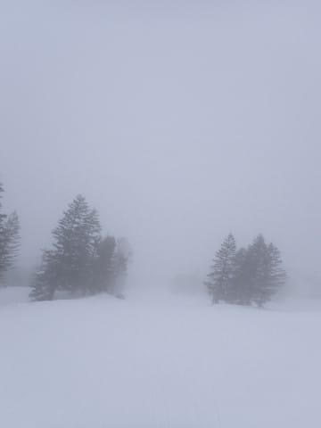

気温は，－６℃という予想を１度外したものの，

この時期としては普通の冷え込みの

‐５℃でしたが…

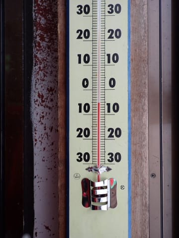

バーンはしっかり締まった感じのシマシマ！！

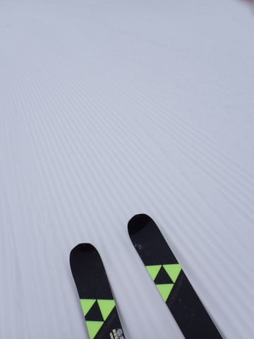

そして，１本目の中盤からは晴れてますよ…！

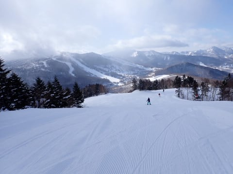

…ただ．

昨晩からの積雪はなく，バーンは結構

締まり気味で，板が多少流される感じの

ところもあったものの…

でも，この時期としては上出来の堅めに

締まった圧雪バーン！

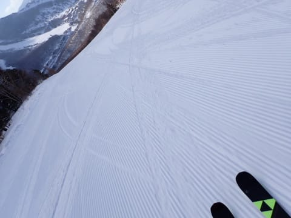

朝イチは，一部にコロコロが出たバーンも

あり，板のグリップが弱めのところも

あったけど．

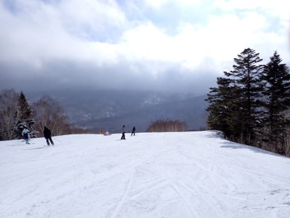

全面的に，冷え冷えの締まり気味の

ハイスピード圧雪バーン！

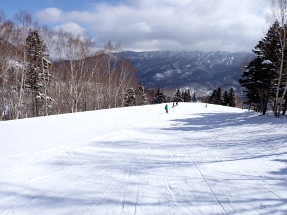

天気は，朝は曇っていたものの…

そのあとは晴れたり曇ったり．

時折雪が舞うこともあったものの…

晴れて日が差すタイミングも多く．

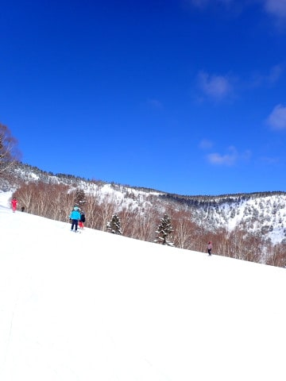

それでいて，気温は低めで，

終日結構雪質もよく…

３月としては，かなりいい雪質で

楽しめましたよ～！！

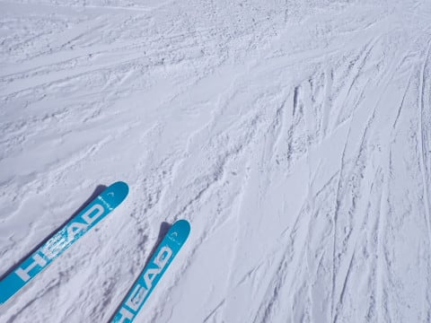

ただ，午前中はちょっと人も多めで．

第２高速リフトも朝10時前から11時頃は

ちょっとだけ並んだし…

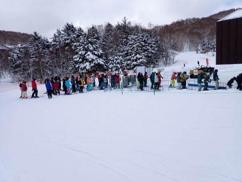

第1ゴンドラも，午前10時から11時と，

午後ちょっとはゲートの外まで列が並ぶ

ことがあったものの．

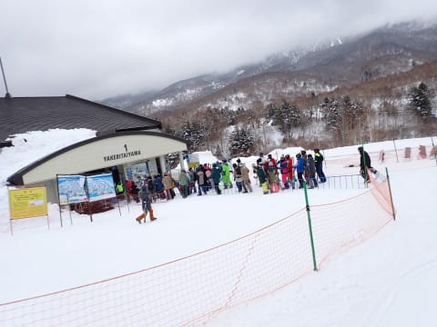

バーンの混雑はせいぜいこの程度．

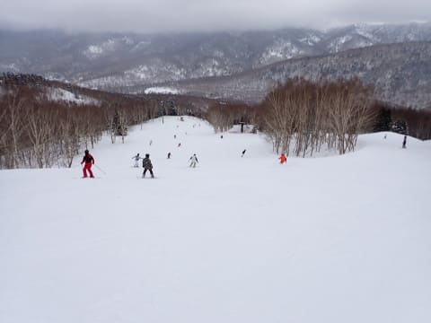

3月に突入したので，

さすがに昼間の気温は上がって

来たものの…

それでも昼間もマイナスをキープしてくれて．

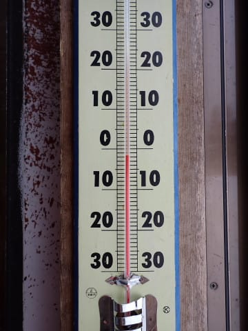

日が差しても，それほど雪は緩みません

でした～！！

今日は日が差したり曇ったり，目まぐるしい

天気で．

ずっと日が差したわけでないことが，

雪が緩まなかった勝因かな…

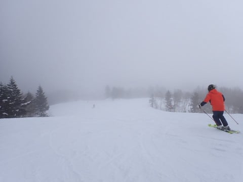

今日の焼額は，第1ゴンドラ側GSコースは，

昼頃には早々に荒れてきたけど…

それ以外のコースは，意外と午後まで

緩むことはなく．

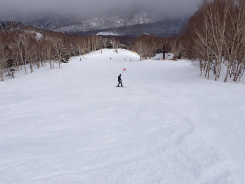

ごくごく一部，バーンに凸凹が出てきた

ところもあるものの．

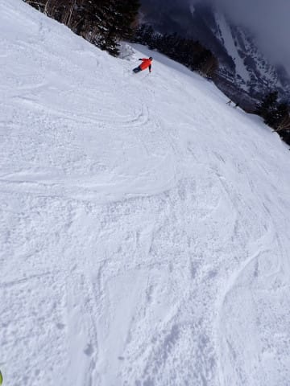

おおむねほとんどのコースは，夕方まで

ほぼ荒れず，フラットで気もちいい大回り

バーンが続き．

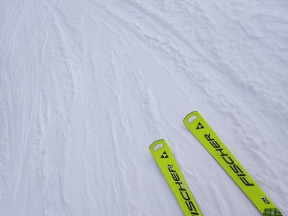

夕方にはさすがに一部荒れてきたものの

全体的には気もちいい冷え冷えのフラットバーンで．

そして午後になっても完全曇りにはならず，

時々ひがさす天気が続き…

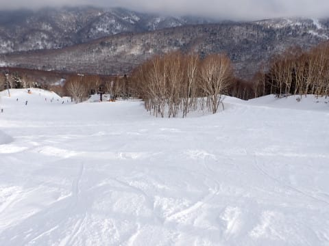

今日も日が陰る，ラストリフトの16:15まで，

しっかり滑り倒したのでした～！！

…しかし．

焼額ナイターが先週で今シーズンの営業を

終えてしまったので，ナイターに行けないのが

つらい…

今晩は雪は積もらなそうだけど．

明日もいい天気だし，朝はそこそこ冷えそうなので，

明日の朝イチの志賀高原は気持ちよさそうかな…

また明日も，志賀高原滑ってます～！！

PS.一部，私の板じゃないのが写ってますが…

そうです．

今週，2024シーズンモデルの試乗会が開催されたので．

市場レポート，お楽しみに…！

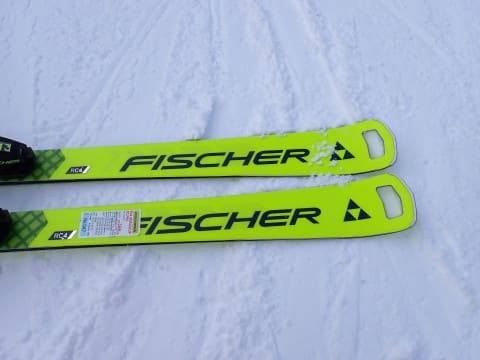

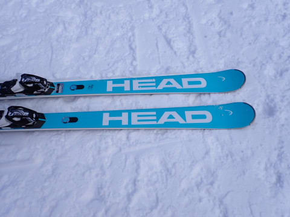

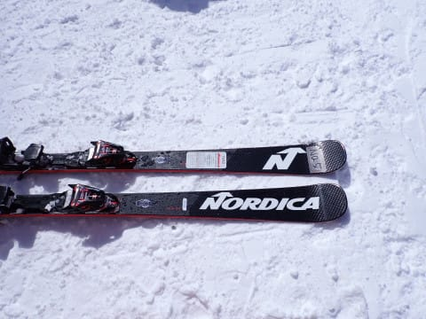

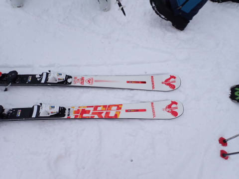

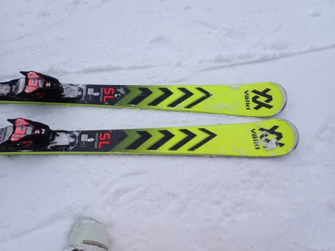

## 💬 コメント一覧

### 💬 コメント by (真美子)
**タイトル**: Unknown
**投稿日**: 2023-03-05 07:00:33

おはようございます。

4日土曜日午後から雫石です。午後から滑りましたが、雪は重く、コースは荒れており、股関節の悪い者としては、かなりキツかったです。やっぱり焼額額がいいな。

### 💬 コメント by (カンタロス)
**タイトル**: Unknown
**投稿日**: 2023-03-05 07:18:40

Sさま、こんにちは。

途中の板の画像見て、密かに物欲選手権を行ったのでは？！と期待してしまいました（笑）

試乗会だったのですね～。ヘッドの板が趣味の別れそうなコスメですね。

### 💬 コメント by (mitsu-light)
**タイトル**: Unknown
**投稿日**: 2023-03-05 19:52:08

過去、ロケやるのでは？というお話がありましたが、鉄腕DASHだったかもしれません。今、焼額山で巨大雪ダルマを作ろう。というのを放送してます😆

### 💬 コメント by (Skier_S)
**タイトル**: コメント回答したつもりが，投稿されてなかった…遅れてすみません
**投稿日**: 2023-03-07 10:08:11

＞真美子さま

雫石滑ってきたんですか．雪が重くて荒れてると股関節に来ますよね…

やっぱり志賀が一番いいですよ！

でも，今週は志賀も春の雪になりそう…

>カンタロスさま

さすがにまだ来シーズン板は買えません(笑)．

HEAD，実物見るとかなりいい色で私は好きでした！

＞mitsu-lightさま

鉄腕DASHでやってましたね～．

一部焼額メンバーが映っていたようです(笑)

