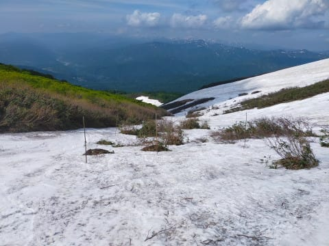
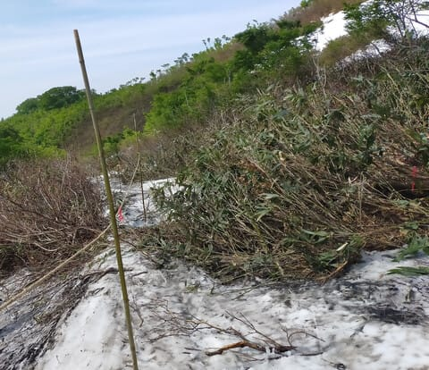

# 2024/6/8(土)の月山スキー場，詳細レポート！…晴れ時々曇り．大斜面も沢コースもほぼ終わりで例年より2週間くらい早い雪解け(泣)．リフトはガラガラだったよ

📅 投稿日時: 2024-06-10 02:53:32

ってなことで．

土曜日帰りで月山へ行ってきて．

…今日は昼過ぎまで寝てました…

でも，睡眠時間8時間くらいなので，

まだ睡眠が足りない感じですが．

午後にやっつけなくてはならない

仕事があったので…

今日も早く寝たかったけどもうこんな

時間（泣）

あぁ…Blog書かずに寝たいけど，

ここでちゃんとBlogを書く偉さ！！←だから自分で自分を褒めるんじゃないよ…

で．肝心の月山ですが．

あした…というか，もう本日の6月10日から

6月の27日までの18日間という長い期間に

渡って，リフトがメンテナンスのため

運休になります．

だもんで，もう10日以降はリフトを

滑れないので，この記事を参考に

滑りに行くわけにいきませんが…

とりあえず，土曜日に行った月山の

詳細レポートです！！

ということで．

土曜の月山ですが…

朝8時からのリフト運転を狙い，

7時過ぎに駐車場へ到着！

一見駐車場は混んでるように見えますが，

かなりガラガラでした…

で．

駐車場からリフト乗り場へ向かいますが…

いやーーー！

雪が減った．

リフト乗り場までの道は全く雪がなく，

この橋までも滑ってこれなく

なったみたいです．

リフト券売り場は，営業開始直前でも

この程度の長さで．

そこまで人は多くなさそう…

朝8時の営業開始時のリフトは人が

並んでましたが…

あさイチ以外は，終日リフトは待ちは

ゼロでしたよ～！

…しかし．

リフト乗り場まで滑ってくるこの道も

全く雪がなくなり，ここを通ってくる

ことはもう不可能．

リフトに乗るためには，リフト乗り場の

下から上がってくるパターンに

なってます．

とりあえず，あさイチリフトに乗って

上に登ってみると…

今日は雲が多めながら，天気は良くて．

薄手の風よけジャケットか，長そで

Tシャツくらいでよい，夏スキーっぽい

天気！

リフトは板を脱いで乗車なので，

速度も遅く．

リフト降り場にももう雪はついて

ません…（泣）

降り場の周りの雪も全然なくなり

ましたね（泣）

ただ，降り場からは．

ここに見える，うっすら汚れた雪が

残った後をたどって，上に登らず

ともゲレンデに出られるルートが

ギリギリ残ってます．

朝のうちはまだ竹藪もそんなに

立っておらず．

なんとなくこんな感じのところを

乗り越えれれば．

ゲレンデまで出ることができましたね…

…でも，雪が残ってるところも

もうそこかしこに木の枝が立っており，

かなり激しい感じですが（笑）．

そして，沢コースに出ましたよ！！

…でも．

もう，圧雪車による圧雪がされてないので．

あさイチの雪は汚れて，かなり

楽しくない感じ…（涙）

上の方はかなり藪もそこかしこに

出てきているし．

こんな所を突っ切っていく必要も

あったりするけど．

まぁ，真ん中はまだマシかな～…

でも，雪は荒れまくり．

真ん中にコブ溝っぽいのがあり，

かなり凸凹した感じのバーンですね…

そして．

下の方にやってくると…

かなり幅が狭くなります．

このロープの左側は，雪の下に

水が流れていて踏み抜くとやばいので，

このロープの右しか滑れません．

うーん．

ここもロープの右しか通れないけど…

この藪を乗り越えるしかないんだな（涙）

板を脱いで，何とかここを乗り越えます…

そのあとも，こんな感じの結構

エキサイティングなところを

通っていきますが．

リフト乗り場に直接滑り込める

ルートは，もうロープが張られていて

行くことができませんね…（涙）

そして，リフト小屋の下に滑りこんで…

最後はここから泥道を登って．

リフト小屋を通り過ぎて，リフト小屋

まで歩いて登っていく感じです…

いや．

もう，沢コースも最終形態ですね…（涙）

ここまでして滑るのか！！！

って感じ．

端的に行って，楽しいか楽しくないかで言えば…

そんなに楽しくないですね（泣）

うーん．

このコースを滑るのに，高い金と

すごい時間をかけて月山まで来たのか？？

…いや．

まだ，大斜面がある．

果たして大斜面やいかに…！？？

ってなことで．

今日はちょっと遅いし．

ここからもかなり長くなりそうなので…

続きはまた明日！

明日も仕事dえ朝早く，

ホントに寝ないと死ぬので，

寝かせてください…

おやすみなさい…

## 💬 コメント一覧

### 💬 コメント by (副院長)
**タイトル**: Unknown
**投稿日**: 2024-06-10 10:47:36

S様、お疲れ様です。月山はかなりの修行のようで、車から降りたら、100歩以内、せいぜい道路を渡る、ぐらいしかできない年寄りには無理です。それゆえ白馬系にはあまりいきません。

往復100キロの件ですが、この間、レクサスLSアドバンスドドライブに試乗してきました。レベル３だそうです。高速のみですが、ほぼ自動です。目線を監視されていますが、手放しで走ります。先行車に追いつくと抜かしますか？ときいてきて、追い越しします。メーターに周囲の車の様子が映っています。なかなかラクチンでした。高齢者のゴルフ場往復御用達車で好評らしいです。お高いですけどいかがです？僕は無理です。

### 💬 コメント by (Skier_S)
**タイトル**: >副院長さま
**投稿日**: 2024-06-11 01:34:20

月山はかなりの修行ですよ…

LSの自動運転もよさそうですね．でも，私には買えません（笑）．

スバルのアイサイトXにも期待しています…

