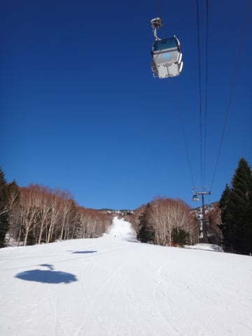

# 4月26日の志賀高原詳細モード…夏みたいな陽気だったなぁ…

📅 投稿日時: 2015-04-28 02:26:20

えー．

全国的に本日．気温が上がったようですが…

な，な，なんだ，これはっ！！！！

志賀高原．朝8時半というのに，

もう気温が19度に上がっちゃってるんですか！？？

なにこれ？？

ダメじゃん…（涙）．

ううううーーーーむ．

さらに今日は超晴天だったようなので．

雪が．

雪が溶けていってしまうっ！！

とりあえず．

GW後半までしっかり冷えるように．

できれば冷えるだけでなく，雪が降ってくれるように．

さらにその雪も，トップシーズン並みのパウダーが降ってくれるように．

祈らねばっ！！！←いや，それ祈っても無理だから

ってことで．

昨日速報した日曜の志賀高原．

詳細モードをば…

えー．

この日も，朝は6時半の早朝営業に繰り出すわけですが…

いやいやいや．

すっきり晴天で，バーンもピカピカですな！！

…だけど．

朝6時半で，なんだかすでに気温はプラス5度もあるって…

なにか，間違ってない？？（涙）．

とはいえ．

朝イチはシマシマの，しっかり締まったバーンがお出迎えっ！

気温は高いけど，今日も放射冷却で，朝の雪はしっかり冷えて，

締まってますよ～っ！！

ピカピカ晴天の，快適バーンをトップスピードで

自由落下だっ！！！

…しかし．

雪はしっかり固まった，ビリビリアイスバーンなので，

固いのが苦手な人には，ちとツラいバーン状況だと思いますが…

でも．

わが武器であるX-Raceは，こーゆー雪こそその本領が出せるのだ！

と，気持ちよくかっ飛ばしていたのもわずか数本．

7時過ぎには…

なんだか，山頂部分以外は，雪が緩みはじめてきちゃいました…

そして．

快晴ピカピカの，強い日差しがゲレンデに照り付けているので．

朝8時過ぎには，ゲレンデ全面，かなり緩んじゃって．

9時，完全全面春雪化完了（涙）．

まぁ．

雪が緩んでからは．

ピカピカ晴天のもと．

ポカポカ春スキーをのんびり楽しみましょうか…

第2高速沿い，唐松コースを滑ってみますが．

ありり？

なんだか，コース右端．

そろそろ，土が出てくる気配が…

そして，白樺コース．

うむ．

一部，半分ほど土が出てますね…

白樺コースから続くブナコース．

ここは，もう1-2日でアウトかな～．

うーむ．

今年は雪が多い年だったけど．

4月は高温が続いて，雪解けは早いよ…（涙）．

去年の今の時期より，雪が少なくなっちゃいました（泣）．

＃雪解けが異常に遅く，記録的なGWの残雪量だった去年が

＃異常だったんですが…

＃まぁ，去年より少ないけど，例年よりは圧倒的に雪は多いかな

でも．

ゴンドラのメインである，パノラマコースはまだまだ

ぜんぜんたっぷり雪はあるし．

麓のゴンドラ乗り場近辺も，まだ全く土が出てくる気配はないし．

ゴンドラで滑る分には，GW後半まで十分

雪がもってくれそうかな～．

んで．

午後は，またまた奥志賀へ移動！

いやー．

日差しがカンカン照って，暑いですよ～．

で．

奥志賀も，麓までまだ全面しっかり雪がついてます．

まだまだ滑れます．

そして．

まだ急斜面も全く土が出てきてませんよ～！！

コブ溝も全然大丈夫！

ってことで．

第2高速ペアをぐるぐるして．

[この方](http://blog.goo.ne.jp/suma_shikao/e/39809ed85b05cdb424096754cfaebce7)と，ひたすらこんな斜面を滑ってました…

…早朝から6時間以上滑って，そのあとの午後にコブって…

もう，体がミシミシ言ってるんですけど…

…とか言いながら．

結局この日も，リフトストップまで滑り続けたSkier_Sなのだった…

でも．

ここ数日あったかすぎ（涙）．

当然，道路も凍結や積雪なんて気配もなく，

この土日は，ぜんぜん夏タイヤで問題ない状況でした．

うーん．

もう少し冷えてくれないかな～（祈）．
