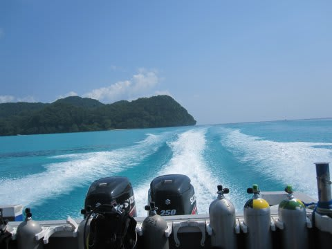

# 2014年10月，小学生の子連れでパラオへダイビングに行ってみた…プロローグ

📅 投稿日時: 2015-07-12 21:20:46

かれこれダイビングを始めてからというもの．

これまでに，[いろんな場所を潜ってきた](https://picasaweb.google.com/101876336039276321250)けど．

大物大好きな私にとって．

パラオは，コモドと並ぶお気に入りの場所なわけなんですが．

　「あー，パラオ行きたい！久しぶりに，パラオに行きたいっ！！」

と，思っていたものの．

子供が生まれてから．

　「…でも．子供連れで，パラオは無理…（涙）」

と，あきらめていたわけで．

…なんてったって．

小型のスピードボートで一日外洋に出っ放し，

移動時間も1時間半から2時間と長く，

昼休みも上陸することは少なく，小さな船の上で

一日を過ごす…って感じのパラオ．

ダイビングポイントで泳げるわけでもなく．

＃ブルーコーナーとかで泳いだら，あっという間に流されて死んじゃう

ダイビングをしない人間が船に乗っても，

狭いスピードボートの上で一日ひたすら

待つしかなくて，退屈だし．

…かといって，一日船で出っ放しなので，

夫婦で交代で子守りをすると．

陸に残る子守り番は途中で交代もできず，

丸一日，ダイビング抜きで過ごさなきゃならないし．

せっかく海外にまで行って，丸一日，

夫婦が別々に過ごすってのも…

なんだか，ちょいと許容しがたいので．

…子連れでのパラオダイビングは，無理，無理っ！！

と，あきらめていたわけだけども．

[前回，フィリピンに行った](eba00449a8604d46409c23a754543fd68.md)ときに．

[冷静に考えると](ef01b33cdf7eca83e783e8090e5a1001f.md)．

「…よく考えると．

　うちの娘って，これまで何度も朝から晩まで

　狭いダイビングボートの上で過ごしてるじゃないか…

　休憩時間に時々泳がせてやれば，むしろ喜んで

　ボートに一日中乗ってるじゃないかっ…！！？？」

[幼稚園時代から，驚くべきシュノーケリング能力を誇る](edfcdaa0d1e19d9149d9ba0d8a391af8a.md)わが娘．

タイでも，フィリピンでも，泳げる時間があれば，

どこでもガンガン泳いでたし．

…1時間半以上の移動時間があるような遠征でも，

全く移動時間を苦にせず，むしろ嬉々として

船に乗ってたよな？？？

…

…これなら．

…基本的に一日ダイビングボートで出っ放し，という

パラオでも，問題ないんじゃね？

…これなら，次はパラオに行けるんじゃね？

と．

そーゆーとき．

なんとも驚くことに．

わが娘に，

「秋休み」

という，

なんだかステキなものがあるらしいことが判明し．

どうやらこの秋休み．

体育の日の3連休+2日間，ということを聞いて．

…なんと！

娘の秋休み，

ちょうど3連休と重なる形なのか……

…一日会社を休めば．

行けてしまうなぁ…．

…一日だけ，会社を休めば…

ということに気づいたあと．

…その後，1時間ほど気を失っていたようですが．

再び意識を取り戻すと．

パラオの予約メールを送っていた，自分に気づいたのでした…

しかし．

とはいえ．

はたして，子連れを受け入れてくれる

ダイビングショップがあるのか？？？

…というところは，ちと壁が高く．

基本的には，子供乗船は，どのショップも拒否．

…まぁ，そうだろうなぁ．

ところが．

今回．

とあるダイビングショップが，わが娘を受け入れてくれて．

驚くことに．

小学生の子連れでのパラオダイビング．

ホントに実行できることとなったのでした…！！！

ということで．

今回は．

小学生の子連れで，パラオのダイビングボートに乗ってしまったという，

ある意味終わった夫婦と．

…ノンダイバーながら，一日パラオのダイビングボートに乗った

小学生の娘が．

いったいパラオでどう過ごしたのかを，

克明につづった物語が，

今，これから始まります…

＃今回利用したダイビングショップも，普通は子連れ乗船

＃断ってます．

＃このBlogを見て，「このショップ，子連れで行けるのね」

＃と思わないでください…

## 💬 コメント一覧

### 💬 コメント by (伽羅)
**タイトル**: Unknown
**投稿日**: 2015-07-13 00:20:15

小学生にしてタヒチにモルディブにパラオ…すごいです^^;

龍馬は小学生以上ノンダイバーも乗れるような話を聞いたので次はぜひクルーズでも。

私は次は9月に潜るつもりです～

### 💬 コメント by (ゆうこ)
**タイトル**: 産まれました！
**投稿日**: 2015-07-13 18:00:26

予定日より1週間ほど早い7月6日に男の子を出産しました！

昨日退院して、今日から自宅で生活してます。

早くいろんな場所に連れて行ってあげたいです。

またスキーのときにはよろしくお願いします！

### 💬 コメント by (Skier_S)
**タイトル**: 伽羅さま
**投稿日**: 2015-07-14 00:17:11

モルジブ，パラオ，タヒチ，そしてコモド．

さらにジンベエもマンタも…

どんな子供だ…って感じです（＾＾；

龍馬も考えたのですが，あまりにもお値段が高すぎて

候補から消えました（泣）．

次は9月，どこに行くんですか？？

また報告お待ちしてます～！

### 💬 コメント by (Skier_S)
**タイトル**: ゆうこさま
**投稿日**: 2015-07-14 00:20:21

ををを！！

おめでとうございます！！！

しばらくは夜も寝られない日が続くと思いますが…

ご安心ください．

あっという間に大きくなります．

そして，スキーやシュノーケリングを

するようになります（笑）．

今年は，スキー場では夫婦交代で子守りを

される感じでしょうか？？

またスキー場でお会いできるのを楽しみに

しています～！

