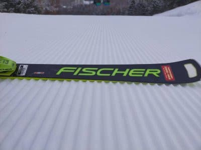

# 今週末も志賀高原！土曜は冷え冷え晴れ！日曜もそこそこ冷えてバーンはそんなに緩まなさそう

📅 投稿日時: 2022-04-02 00:19:44

🏷️ カテゴリ: [日記](cc4b5682fb7b8b144980957a978653fb0.md)

やはり，本日の志賀高原は

予想通りかなり冷えたようですね…！！

水曜の予想の，

　朝は-10℃近い，真冬の冷え込み！

　朝までにうっすら雪が積もってそう．

　昼間も気温は-3℃くらいまでしか上がらず

　冷え冷え．

　天気は朝方は曇り，午後は日が射すように

　なるかも…？

ってのが予言レベルで当たったようです！！

で．

昨晩からの積雪は5cmほどだったようですが…

でも，朝イチは硬めの下地の上に

うっすら積雪で，バーンコンディションは

良かったみたいです！！

そして，気温も－9℃と，ほぼ予想通りの

トップシーズン並みの冷え込みで…

午前中は雲が多めだったものの．

午後は日も射す感じだったようで…

見事に予想通りの天気！

最高気温も－5℃程度までしか上がらなかった

ので，日が射してもバーンは終日緩まず，

いいコンディションだったようです…！！

…あぁ…今日滑れた人がうらやましい．

ってなことで．

なんとか私も週末はスキーに行きますが．

この週末の予想は…

なんと．

強烈な冬型で，土曜朝までに1mの積雪が

ありそうです！！！

…と，エイプリルフールなので書いて

みたかったけど．

微妙にエイプリルフールは終わってしまったので，

真面目に予想しておくと…

土曜は晴れ，朝は-8℃程度の冷え冷え！

朝は硬めながらも，前日に緩んでないので

カリカリではないいい感じのバーン．

昼間は日が当たる東側バーンは日差しで

ちょっと雪がしっとりするかもしれないけど，

気温は昼間もマイナスキープなので

おそらく下地まで緩まず．

西側の一の瀬バーンは終日硬いままじゃ

ないかな？

とりあえず，土曜はコンディション良さそう！！

日曜は…微妙．曇りか晴れか…

おそらく朝は晴れ．

昼間は基本的に曇ったり日が射したりかな…

あさイチは-5℃以下まで冷え込みそう．

昼間も0℃をちょっと超えるかどうかくらいで

そこそこの冷え込み．

曇りなら終日そんなに雪は緩まずに済みそうで，

この日も4月と考えればコンディションは

いいほうです！！

ってな感じですか．

…4月に入りましたが，

まず第1週は，悪くない週末になりそうです…！

焼額は今週末から早朝営業がスタートです！！

第1ゴンドラが6:30~3:45まで営業です！！

（6;30~8:30までは早朝券＠2500円が必要，

　あるいは焼額限定1日券やシーズン券でも

　滑れます！）

そして，今週末で第2高速が終了．

だもんで，焼額と一の瀬が行き来できる

最後の週末になります…

ってなことで．

さすがに早朝に間に合うようには行きませんが．

それでも，あと3時間後に出発です…

またあんまり寝られない…（涙）

## 💬 コメント一覧

### 💬 コメント by (レインボー74)
**タイトル**: Unknown
**投稿日**: 2022-04-02 11:48:25

土曜日の志賀高原情報

朝の上林-2℃　蓮池-3℃。

ヤケビは6時30分からのFTで賑わっている。駐車するのが一苦労で、平日組は一気にトーンダウン。

二高を回していると、まもなくイチゴン10分待ちの掲示が。

相乗りなら大したことないと思ったけど、２時間カラマツをぐるぐる。飛び乗り状態だけど、ゲレンデには常に人が。やっぱり平日がいいなと、二時間で終了。天気も雪もいいのに！

### 💬 コメント by (Skier_S)
**タイトル**: ＞レインボー74さま
**投稿日**: 2022-04-02 22:35:47

今日はコンディション良かったんですが…

それを2時間だけで帰っちゃうとは贅沢な！！

明日も朝はいい感じだと思いますよ…！

### 💬 コメント by (ikkun)
**タイトル**: Unknown
**投稿日**: 2022-04-03 08:03:14

こちらにも( *´艸｀) ゴンドラ山頂のサロットスキーと鎌倉？かまくらの中のおこみん?ちゃんに感動でした  狭くきついあの斜面はやはりちょっと怖いわー(笑)ちなみに地元ゲレンデも昨日今日openですので知り合いレストラン予定です

### 💬 コメント by (Skier_S)
**タイトル**: ＞ikkunさま
**投稿日**: 2022-04-04 02:16:33

奥志賀の狭いところ，人が多いとちょっと怖いですよね…

志賀の奥志賀・焼額はGWまでやってますので，地元のスキー場が終わったら

志賀高原へお越しください！

