# なに？また志賀高原に行ってきたの？？…今度は紅葉を見に，志賀高原へ

📅 投稿日時: 2020-10-12 02:17:25

🏷️ カテゴリ: [日記](cc4b5682fb7b8b144980957a978653fb0.md)

えー．

実は，この週末．

ちょっとした用事があって，新潟県某所へ

出かけていたのですが．

「そのまま帰るのもなんだし，長野まで

　足を延ばして，志賀高原で紅葉でも見て

　帰るか…」

と．

いつもながら，

志賀高原への忠誠心が異常に高い私は．

9月の4連休にも志賀にやってきたばかりというのに．

このオフシーズンで3度目か4度目の志賀高原へ，

今度は紅葉を見にやってきたのでした…

志賀高原の登り坂．

坊平あたりは，まだ紅葉の色づきが薄く…

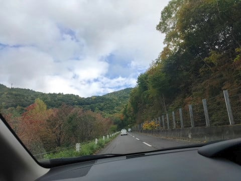

木戸池も，まだちょいと早い感じ．

ピークはあと1週間あとくらいかな？

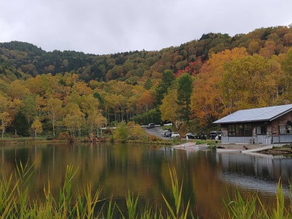

とはいえ，ダケカンバは結構黄色くなっていて．

あと2週間はもたなさそうなので．

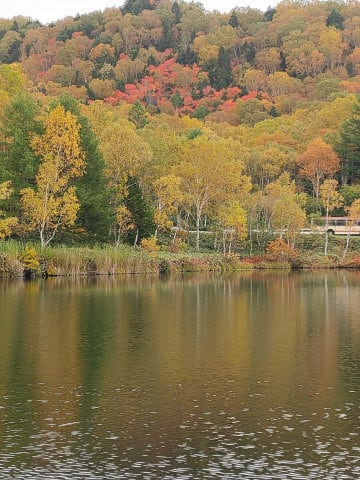

やっぱり，来週あたりがピークかな～．

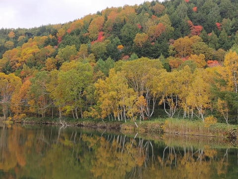

曇り空だったのがちょっと惜しい．

晴天だったら，もう少し緑と黄色の

コントラストが出たと思うんだけど…

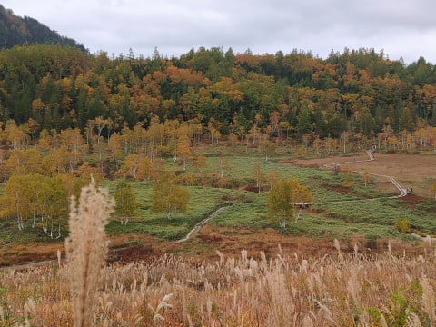

意外と，木戸池より標高が低い

蓮池や一池あたりが，木戸池より色づきが

進んでいて．

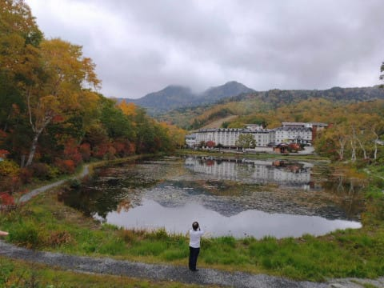

今でも十分写真映えする感じの赤さになって

来てますが．

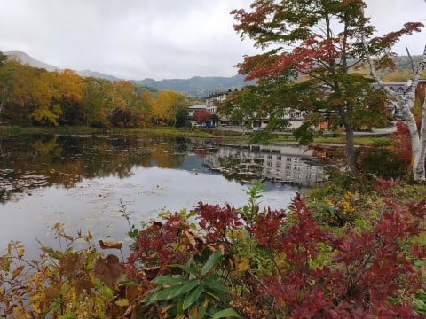

このあたりは1週間後と言わず，

もうすぐピークを迎えそうな感じですね…！

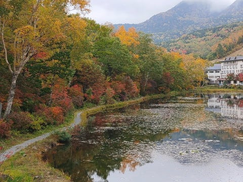

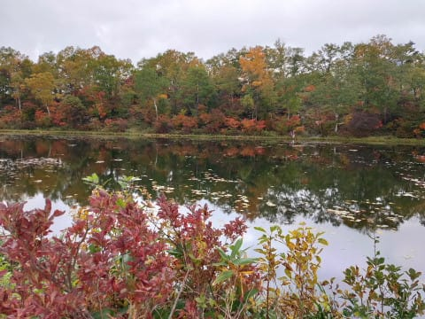

…でも．

今日の志賀高原．

スキーシーズンより車が多いんじゃないか？

というくらい，賑やかでした…

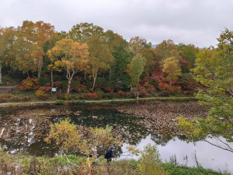

そうそう．

志賀高原まで来ているわけだから．

当然のごとく，聖地巡礼…というか．

わが生息地のパトロール

も行ってきたわけですが．

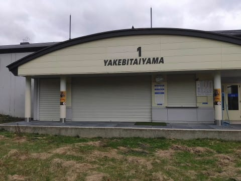

特に今シーズン，何か変わったものは

なさそうですね…

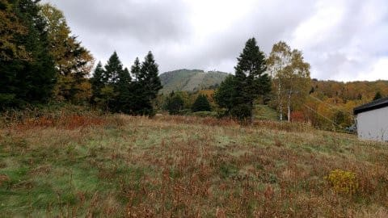

奥志賀も見に行ってきましたが．

きれいに草が刈られており．

紅葉もいい感じでした…

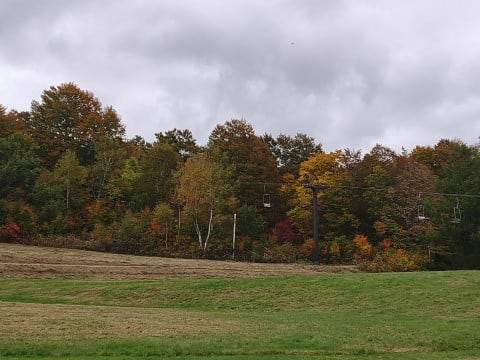

まぁ，志賀高原は，来週あたりが紅葉の

ピークかな．

…ってなことで．

紅葉だけ見てもあれなので．

また，パルスゴンドラの建設現場を

見に行ってきましたが…

うーむ．

まだ，建屋も立ってなければ，

支柱も立ってませんね．

これ，ホントに12月までにできるのかな…？？

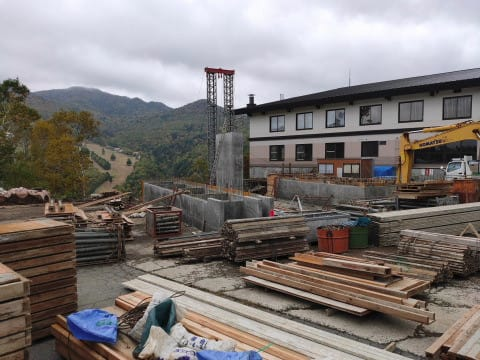

ただ．

支柱などはもう準備されていて．

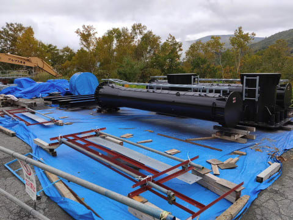

そのほかのいろんな資材も山頂駅舎

建設現場のそばに置かれていましたが．

…この予備用エンジンなんかは，明らかに

使用済み中古っぽいですね…

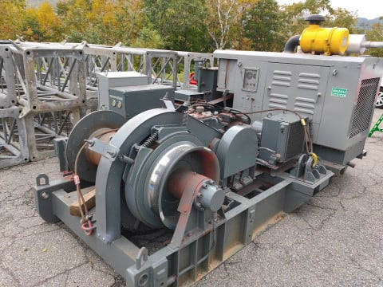

地形に合わせなきゃならない支柱はさすがに

新品っぽかったけど．

そのほかの資材は，やっぱりどこかの

ゴンドラの中古を持って来ている

みたいですね…

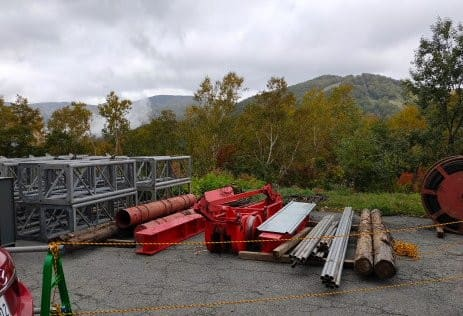

東館山のゴンドラ搬器は，らいちょうバレー

スキー場から持ってきたって話だったけど．

これは一体どこからもってきたのかな？？

…そして．

前回来たときはまだ絶賛工事中だった，

蓮池から，道の駅＆パルスゴンドラ山頂駅舎へ

向かう道沿いの公園化工事が終わってましたが．

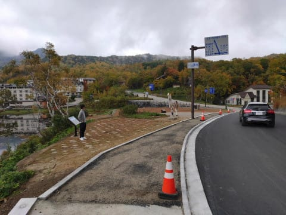

うーむ．

特に何かがあるわけじゃない，

普通の広場ですね．

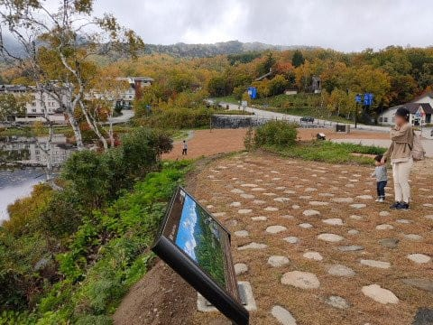

雪に埋もれる冬に来る人には，

公園化されたことは，全く

分からないでしょうね…

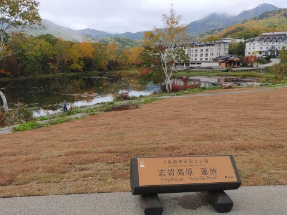

…ってなことで．

志賀高原の定期パトロールを終えたので．

帰宅するわけですが．

…その途中に．

せっかくここまで来たのだからと．

今週から新栗に切り替わった小布施の

竹風堂の栗おこわを堪能してから，

帰宅したのでした…

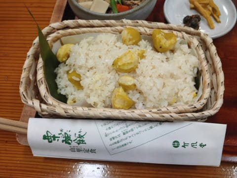

（実はこっちがメインだった！？？）

…しかし．

予定通り，11月14日に横手・熊の湯が

オープンするなら，早くも残り1か月．

もう一か月で，志賀高原が滑れるように

なりますよ～っ！

今日も山の上は結構冷え込んでたので．

シーズンインが早くなってくれるといいな…

## 💬 コメント一覧

### 💬 コメント by (ゆーき)
**タイトル**: Unknown
**投稿日**: 2020-10-12 08:34:17

あれ、私の待望の、焼額山第一高速は、

見てこなかったんですか！？

ま、何もないと思うけどw

### 💬 コメント by (equipe)
**タイトル**: 志賀高原情報
**投稿日**: 2020-10-12 11:29:03

先日の「ぼっち」～の楽しいひと時

ありがとうございました。焼額山　整地巡礼ご苦労様でした。シーズンに向けワクワクしてきました。

### 💬 コメント by (アイス)
**タイトル**: Unknown
**投稿日**: 2020-10-12 20:56:16

Skier_Sさん

はじめまして

もうすぐスキーシーズンインですね

毎年Skier_Sさんの天気予報楽しく拝見させてもらってます(^^)

冬は志賀でスキー

夏は各地でダイビング

自分は静岡からですが

冬は志賀

海は沖縄です

Skier_Sさんほど回数は行けませんが

今後とも宜しくお願いします(^^)

### 💬 コメント by (下手の横好き)
**タイトル**: Unknown
**投稿日**: 2020-10-12 23:15:08

こんばんは、初めてコメントします

本日のブログ内容と関係のない話で大変恐縮なのですが、bluestersxが好みだという方のブログを狙い撃ちして読み漁っております。

というのも私はbluesterのsとsxをかれこれ6年ほど履いております。そろそろ買い換えるかなと思っていたところ、bluesterはもう生産していないとのこと…

Sさんのように四郎さんまで用意しているはずもなく。

ここ2年ほどスノーボードに浮気していたこともあり、スキー板に関しては浦島太郎状態です…

シーズン滑走日数は15日程度のエンジョイスキーヤーなのですが、ハイスピードでも安定感のある小回り板が欲しいと考えています。

Sさんのブログから候補はfischer rc4 yellow baseかなと考えているのですが、他にもおすすめがあればお聞かせいただけないでしょうか。

身勝手なコメント申し訳ありません。

### 💬 コメント by (Skier_S)
**タイトル**: もうそろそろシーズンイン！
**投稿日**: 2020-10-13 00:25:58

＞ゆーきさま

第一高速を見に行くには，車から降りかなり歩かないといけないので…（マジレス）．

いや，でもホントに私の知らないうちに第1高速再建設してたらすごいですね（笑）．

＞equipeさま

土曜は一日お世話になりました～！！

夜までご一緒でき，むちゃくちゃ楽しかったです．

また，お店での体験は別途レポートを書こうかと思っています…

ありがとうございました！

＞アイスさま

初めまして～！コメントありがとうございます！

もうすぐ待ちに待ったシーズンが始まりますよ～！

冬に志賀高原にいらっしゃるなら，ぜひ焼額へ．

土日なら，かなりの高確率で私を発見できるかと（笑）．

＞下手の横好きさま

コメントありがとうございます～！

私は16，17SXは四朗君まで揃えましたが，その前の13，14SXも含めると

SXを6台，計7シーズン乗り続けてしまったので，私も後継機に悩んでます…

今のところ，SX，それもVARビンディング付きに近い，

グリップ強め，旋回力強烈，反発が早い板としては，

・2021 FISCHER RC4 Pro

・2021 SALOMON S/RACE RUSH P80（どうやらカタログ落ち，一部店舗のみ入荷）

・2021 VOLKL RACETIGER SL（Worldcupじゃないほう）

でしょうか…

SALOMONは2020モデルは2021モデルよりも硬く重い感じがするので，

2021モデルがおススメ．

FISCHERも，2020モデルのRC4 SC Yellowbaseでも十分いいですが，

2021モデルの方がさらに完成度が高いです．

2020シーズンモデルのVOLKL RACETIGER SL DEMOと2021モデルのRACETIGER SLは

ほぼ同じなので，これはどっちを買ってもいいです．

今履いていらっしゃるSXがVARビンディングじゃなく，TLビンディングモデルなら，

板の動かしやすさという点ではVOLKLの板が近いような気がします…

VOLKLも悪くないです．

### 💬 コメント by (アリス)
**タイトル**: 志賀高原の紅葉
**投稿日**: 2020-10-13 08:10:51

Skier_S様

やはり志賀高原の紅葉いいですね。

私も毎年スキーシーズンが始まる前に志賀高原の紅葉見物に行っています。

特にジャイアントと奥志賀の紅葉が好きです。

秋の志賀高原ってガラガラなんですよね。

関東の人だと紅葉は、日光か塩原のイメージが強いのですが私は志賀高原が一番です。

でもなぜか宿泊は志賀高原を避けて、万座か草津なんです。

### 💬 コメント by (AK)
**タイトル**: Unknown
**投稿日**: 2020-10-13 19:42:06

私もちょうどその日志賀に紅葉見に行ってました。

下ってくるレヴォーグにもしやと思いましたがやっぱりS様でしたか、今シーズンは降雪に恵まれるように祈ります。

### 💬 コメント by (Skier_S)
**タイトル**: 志賀高原の紅葉はいいよ！
**投稿日**: 2020-10-14 01:06:59

＞アリスさま

志賀の紅葉，いいですよ～！

ジャイアントの紅葉は見に行ったことが無かったです．

秋の志賀高原，今年はGoToトラベルがあったからか，

結構混んでましたよ～！

でも，日光とかに比べるとガラガラですが（笑）．

＞AKさま

あら…志賀ですれ違っているとは！！

まさかLEVORGを発見されているとは思ってませんでした（笑）．

### 💬 コメント by (下手の横好き)
**タイトル**: Unknown
**投稿日**: 2020-10-14 08:24:53

おはようございます。

丁寧なご回答ありがとうございます。

salomon  race rush p80プレートすごく興味が湧きました。だいぶ気持ちが傾いております！

Volklは小回りが得意だけど軽さがあるイメージだったため、高速での安定感が気になり敬遠していましたので完全に盲点でした。

今週末神田へ足を運んでみます。

スキー用品新しくする時のワクワク感は異常です…

### 💬 コメント by (Skier_S)
**タイトル**: ＞下手の横好きさま
**投稿日**: 2020-10-15 01:30:09

SALOMONのS/RACE RUSH SL P80はいいですよ！

SXの正当後継機だと思います．

Volklは，SXとはちょっと違う乗り味ですが，良く回ってくるし

高速安定性も意外とあります．

軽い分，SXより楽です．

重厚な方が好きなら，SALOMONですね～！！

スキー用具は，何を買うか悩んでいるうちが一番楽しいです（笑）．

### 💬 コメント by (ikkun)
**タイトル**: Unknown
**投稿日**: 2020-10-23 21:33:05

(  -_・)?志賀を行く前に我が新潟にも来たんですか？どこかは気になります( *´艸｀)てかいよいよseasonインまで少しですね🎵嬉しいような厳しさも😱💦  しかも小布施も近いかも( *´艸｀)

### 💬 コメント by (Skier_S)
**タイトル**: >ikkunさま
**投稿日**: 2020-10-24 01:18:22

今回はちょっと長岡まで足を延ばしたついでに，

帰り道の途中に長野＆志賀経由で回ってきました…

シーズンインまであと1週間ちょい．

もうすぐです！

