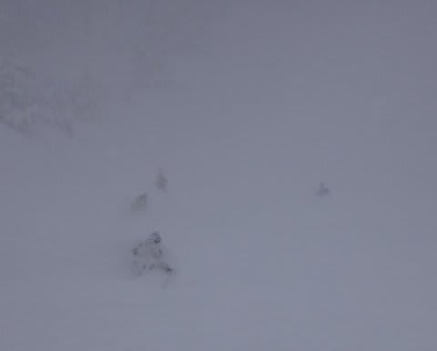
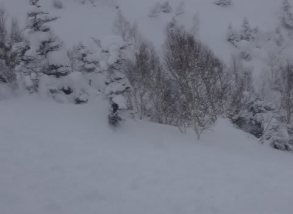

# 2月1日の志賀高原，詳細レポート…終日吹雪くも，冷え冷えパフパフデー！

📅 投稿日時: 2015-02-03 00:24:16

ということで．

昨日，速報レポートしましたが．

日曜はですね～．

…パフパフパウダーデーでしたっ！！

いやー．

なんだか，今シーズン．

パウダーに恵まれてる気がする…

とりあえず．

朝，車を動かそうとした時点で…

…なんじゃこりゃ．

…

…車を発掘するのは，ちと大変だけど．

この時点で，本日の腰パフは確定！

…あとは，風が強めなので，ゴンドラが動くかどうかが

心配なんだけど…

ゴンドラが無事動いて，車が埋もれるほどのパフパフを

たらふく満喫できるのか？？

あるいは，圧雪コースしかないリフトしか滑れないのか？？

はたして…

と，心配しながら向かった焼額．

さて，その結果は…っ！？

やった～っ！！

焼額は第1ゴンドラは通常運転．

風に弱い第2ゴンドラも，減速運転ながら動きました～！

＃…奥志賀ゴンドラは動いてないみたいだけど．

これはやはり，

昨日，「第2ゴンドラの根性の無さは，神田に行ったSkier_S並みでは？？」

と言われたことに腹を立てて，意地でも動いてやる！

と，気合を入れたからに違いありません！←いや，違いありまくりだから

んで．

ゴンドラで山頂に登ると…

朝イチの山頂の気温は-15度と，よく冷えてますよ～．

ゲレンデに出てみると…

小雪がちらつき，ちょっと視界は悪めとはいえ．

圧雪コースは，圧雪の上に10cmほど軽い雪が乗っており．

…うむ．

これは，新雪を楽しみに，オリンピックコースに行かねば！！

…と，向かったオリンピックコース．

今日は早朝営業のファーストトラックが開催されなかったので，

ノートラック状態っ！

積雪は，太もも～腰パフ！

では，いただきまーすっ！！！

うはぁ！！

腰パフっ！！！

顔に，顔に雪がかかるよ！

どひゃひゃひゃひゃ！！！

こ，これは．

シアワセだ～っ！！！！

オリンピックコースを1時間ほど楽しむと．

結構蹴散らされてきたので．

次はあまり人が入らない，エキスパートコースへ移動っ，と…

うをー！

こっちはまだまだ新雪パフパフ！

これでもかっ！！！

いやいやいやいや．

もう．

パフパフ祭りっ！

昼近くまで，もうホントにおなか一杯

新雪を楽しみましたっ！

で．

昼前まで新雪コースを楽しんだら，

今度は圧雪コースを楽しむわけですが…

うーむ．

視界は良くならないなぁ…

でも，昼間の積雪はそれほどなく，圧雪コースは荒れることなく

きれいにフラットなまま！

いや，視界がちょいと悪めなのは惜しいけど．

今日は圧雪バーンも楽しめるなっ！

そうそう，

ゴンドラは，いつも通り午前10時半ごろ，ちょっと並んだものの…

11時前にはガラガラになり．

平均待ち時間1分程度…って感じでしょうか．

で．

午後は，さらに風が強くなり．

あららら？

第1ゴンドラも減速運転になっちゃった…（涙）

ちと残念．

で，いつもならゴーストタウン化してしまう日曜の午後．

今日は，いつもより人は多めだったかな…

でも．

人を避けることなく滑れる，快適な人口密度．

コースは，さすがに午後遅くはちょっと荒れたとはいえ．

サラサラの気持ちいい雪質で，ひどいコブコブに

なることもなく

結構なハイスピードで飛ばせるコンディションが続き…

天気が悪いなりに，楽しめた一日だったのでした！

いやーー．

金曜日の高温で，どうなることかと思ったけど．

ゲレンデの雪質は，まだまだ最高の状態をキープしてますよ～！！！
