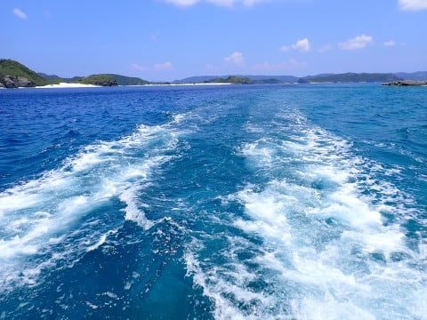

# 2024年8月，今年も座間味で親子ダイビング！その15…ダイビング2日目，ダイビング3本目スタート！早くもこれが今回のラストダイブ

📅 投稿日時: 2024-09-11 00:33:53

ということで．

本日は，[9月のエルニーニョ監視速報](https://www.data.jma.go.jp/cpd/elnino/kanshi_joho/kanshi_joho1.html)

発表の日です！！

（[気象庁，エルニーニョ監視速報ページ](https://www.data.jma.go.jp/cpd/elnino/kanshi_joho/kanshi_joho1.html)より）

気になる発表の詳細を見てみましょう…！！

先月の速報では，11月，12月の

ラニーニャの発生確率が60％でしたが．

（先月8月9日発表の資料）

最新の資料を見ると，11月，12月の

ラニーニャの確率が

70％に上がってます！！

とりあえず．

ラニーニャの確率が高くなり，秋から

冬にかけては，冷えて雪が多い可能性が

高まってきましたよ…！！

…ただ．

ラニーニャって，秋冬は冷えるけど…

春が来るのが早く，春の気温が普段より

上がるんですよね…

なので，春スキー期間が短くなる可能性も

高いということなんだよな（涙）

とりあえず．

1月以降はラニーニャの確率も低くなり，

この下の予想グラフのように，海水温が

上がってラニーニャが弱まっていく傾向が

見えるので…

秋から初冬はラニーニャで冷えて．

春にはラニーニャが終わって，春が普段より

気温が上がらないでいてくれるという

いいパターンになるといいんだけど…

果たして．

この冬は，スキーヤーにとって恵みの

冬となるのか…！？？

次の3か月予報の発表は9月24日14時．

この日を待って，11月から12月が

冷える予報になっていることを

願いましょう…！

…という，ほぼこれで普通のBlog記事くらいの

長さがあるんじゃないかと思うような

かなり長い前フリの後は本題へ．

今日も座間味のダイビング旅行記です～！！

ーーー

（[前回はこちら](e9fd1b430f66a9b800d2f0c32cbbfd44b.md)）

ってなことで．

ボートは本日のラストダイブ，3本目の

ポイントへ向かって移動しますが…

なんと．

このダイビングが，早くも今回の旅行の

ラストダイブ（涙）

休みの都合上，今回は3泊4日が限界

だったけど…やっぱり3泊で中2日は

短い…

1日3本潜っても，最大6本しか

潜れないよ（泣）

で．

今回の旅行のラストダイブのポイントは…

2本目と同じ，阿嘉島そばのポイント，

「儀名」です．

他のダイビングボートも結構来てますね…

ここもかなり透明度がいいですよ…！

準備ができた人から，順次エントリー！

続けて私もエントリーしますが…

いや．

やっぱり水がクリアだ！！

かなりの深度まで潜っても，

ボートの底面がくっきりきれいに

見えてる，この透明度の良さ…！！

ってなことで．

まずは目的の根に向かって移動を

開始しますが…

さすがに1年ぶりのダイビングとはいえ．

2日間で6本潜って完全にカンを取り戻した

らしい娘．

安心して見てられる…というどころか，

すでに貫録を感じさせる何かがあります…

で．

移動中は，家族に何かがあった時に

対処できるよう，私が大体一番最後で

移動していくのですが．

なぜか他の全員の後ろ，私の目の前になる

ところに，アオウミガメさんが突っ込んで

来ました…！！

なぜ，わざわざ団体の中を横切るように

突っ込んでくるんだ？？

人に慣れすぎだろ～！座間味のウミガメ！！

私はタンクをたたく指示棒とか，

ホーンをもっていないので．

目の前の誰かを呼ぶことができず．

他の誰も気づかないまま，

アオウミガメさんは悠々と私の

目の前を横切っていきました…

しかし．

そんな自分だけのアオウミガメさんとの

邂逅を味わう間もなく…

また目の前のサンゴの間で，別のアオウミガメ

さんがくつろいでるのに遭遇！！

…だから，慶良間はウミガメさんが多すぎるん

だってば…！

そして．

こいつも警戒心をどこかに置いてきているのか…

かなり近づいても動じることはなく

堂々とサンゴをガジガジし続けてます

また，みんなで取り囲むようにして

見ていたら…

しばらくして，居心地が悪くなったのか．

呼吸をしに行ったのか．

ウミガメさんは泳ぎ去っていきました…

さて．

ウミガメさんも堪能したし．

移動しましょうか…

と，移動を開始した直後．

今度はまたすぐ目の前に，3匹の

ウミガメさんが…！！

慶良間，ウミガメ密度高すぎ！！

こいつもアオウミガメさんですが．

ちょっととぼけた感じの顔してますね…

そしてこいつもムチャクチャ近寄らせて

もらえます…！

3匹のうち1匹は，ダイバーに囲まれて

いたたまれなくなったのか，

泳ぎ去っていきましたが…

あとの2匹は全くダイバーを恐れることは

無く．

みんなに愛想を振りまいています…（？）

娘も思う存分写真を撮ってましたが．

全く逃げる気配もなく，好きなだけ

写真を撮らせてくれるという

サービス精神満載のウミガメさんたち

でした…

ってなことで．

思わぬウミガメ3連続，計5匹の遭遇で

ちょっと寄り道しましたが．

このポイントの最初の目的地の

根にやってきました…！

うん．

ここもきれいな感じで，かなり楽しめそうな

根ですね…！！

([続く](ea705fe857a7ecc83bbe117a2963a9d03.md)）

## 💬 コメント一覧

### 💬 コメント by (1kamakura)
**タイトル**: Unknown
**投稿日**: 2024-09-11 05:04:44

江戸の秋

今年のスキーシーズン、長く冷え冷えである事をお祈りします🙏

ウミガメさんの亀口密度が高い海ですね〜💙

カメさんのお顔が可愛いこと。

写真で癒されています。

透明度、半端ないですね。

もうラストダイブですか。

悲しいですね。

ダイビングしたら飛行機に乗れないのって何時間だっけ？

全て忘れた江戸の秋です😭

### 💬 コメント by (Skier_S)
**タイトル**: ＞江戸の秋さま
**投稿日**: 2024-09-12 22:18:45

ウミガメさんだらけでした…！

それも異常にダイバー慣れしています（笑）．

ダイビングしてから飛行機に乗るまでは，24時間の間隔をあけることが推奨されてます…

