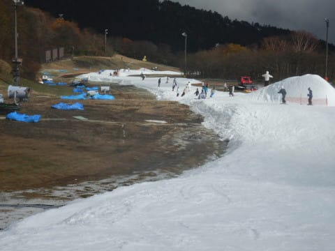
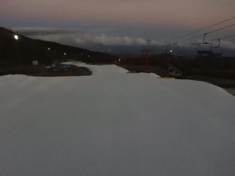

# 2020/11/3(火・祝）のイエティ詳細レポート！…コース幅はちょっと広がったかな．思ったほど混まなかったよ

📅 投稿日時: 2020-11-05 02:47:16

ということで．

昨日速報レポートした，火曜の祭日のYeti．

今日は詳細レポートです！

…まず．

朝．

オープン9時前を狙って，リフト券売り場に

やってきますが…

あれ？

まだ誰も並んでない？

…と思ったら．

なに？？？

祭日は朝10時オープンなの？？？

…ということで．

祭日のYeti．

料金は土日料金で，駐車場も1200円取られますが．

オープン時間は10時

なので，ご注意下さい（涙）

とはいえ．

この日は9時にやってきた人があまりにも

多かったからか（？）

ちょいと早め，9時半ごろには営業開始

してくれて．

朝いちばんのシマシマをGet！！

うはーーー！

シマシマ！

ちょっと柔らかめだけど，シマシマっ！！

…と，2本ほど，いい感じのフラットバーンを

楽しんだけど…

雪が緩めだったので，シマシマが長持ちせず，

すぐに荒れちゃったのが残念…

あさイチはガラガラで，ゲレンデには

日も射していましたが…

数本滑ったところで，人が増え始め…

10時過ぎには，リフト待ちも伸びて

来ちゃいました（涙）

まぁ，それでも普通の土日に比べれば

リフト待ちは少ないですが…

そして．

オープン翌日の土曜日に比べれば，

心持ちコース幅は広がったかな？

ただ，コースが広がったぶん，ちょっと

薄くなった部分ができてきたのか…

わずか数か所だけど，ちょっとだけ

穴が開きかけているところが…

とはいえ．

コース真ん中の部分は，ちょっと茶色く

なりかけているくらいで，致命的に

穴が開くこともなく．

ラストの急斜面部分だけ，ちょっと石が

浮きかけてヤバいところがある程度．

…ここは，途中から造雪機の雪を入れて，

穴が開かないようにしてました…

まぁ，日が射さず，雪が融けなかったので，

コースにぽっかり穴が開いちゃうようなこともなく．

雪質も多少しっとりしたものの，ザブザブには

ならずに済み．

板の滑りは終日良かったかな～．

この日のリフト待ちは，昼前のこのくらいが

ピーク．

軽井沢の20分待ちに比べれば，

なんと恵まれていることか…

いつもは午後に混むイエティですが．

この日は珍しく，午後の方が人が少なく，

多少波は合ったものの，午後のリフト待ち

平均はこんな感じで，平日並みの空き具合！

午後3時を過ぎると，飛び乗りに近い

時もありました！

いやー．

焼額常連メンバーから激込み長蛇の列の

軽井沢の写真を送られてきて，

Yetiの方が待ち時間が少なくていいよな…

と思いましたが．

リフト待ちは短くても，コースが狭くて，

コース上の人口密度が高いので．

リフト待ちが長い軽井沢と，

コースが狭くて人だらけのYetiと．

どっちがいいのか，究極の選択ですね…！

（私はリフト待ちが短い方がいいけど…）

ってなことで．

夕方のコース整備前の16時ごろになると，

リフト待ちは短かったものの．

相変わらずコースの人口密度は高めで．

コースはちょい荒れ気味だったのでした…

そして．

16時からはコース整備タイム！

17時まで，コースへは立ち入り禁止になり．

圧雪整備が入るわけですが…

当然のごとく，

シマシマハンター←シマシマハンターってなに？？

の私としては，圧雪整備後のシマシマは

一番乗りせねばならず．←それ，義務なの？？

前に誰もいないシマシマバーンへ，

一番乗り！

前に誰もいない，ピカピカシマシマバーンを

美味しくいただきました～！

あぁ…今日は，このシマシマバーンの

クリアラップ1本だけで，

Yetiに来た甲斐があった…（感動）

だけど．

この日，ナイターにやってくる人は，

昼間より多く…

ちょいと緩めの，柔らかい雪だったので．

コースはあっという間に荒れてしまい（涙）

リフト待ちも，最大5分待ちと結構あったので．

午後7時にはおとなしく切り上げたのでした…

まぁ，ナイターはちょっと混んだけど．

休日と考えれば，昼間はそこまでひどく

リフトは混まなかったし（コースは混んだけど），

曇っていたので日差しで雪がドロドロに

融けることもなかったので．

まぁまぁ楽しめた一日でした～！

…ってなことで．

昨シーズン，緊急事態宣言でスキー場が

強制終了されたときには，果たして

2021シーズン，無事にスキーができるのか…？

と心配していましたが．

今のところ，みんなフェイスマスクあるいは普通の

マスク着用で，なんとか無事にシーズンスタート

できてますね…

しかし．

冷静に考えると．

全員マスクしてスキーしてる

ってシュールな絵ですよね．

去年の今頃に戻って．

「来年は，スキー場に行くと全員マスクして

　滑ってるんだよ」

と言っても，誰も信じないだろうなぁ…．
