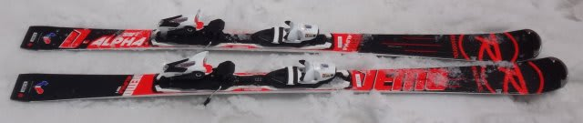
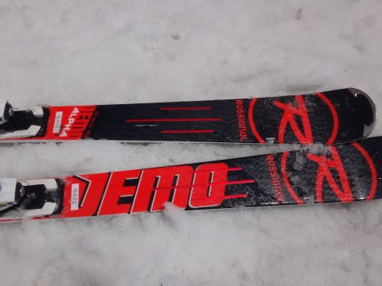
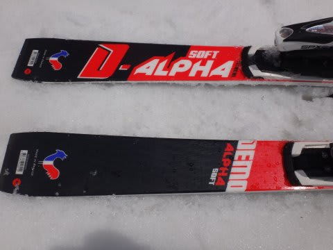
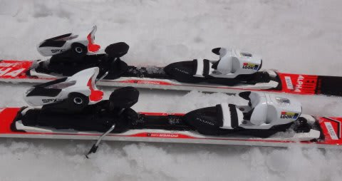
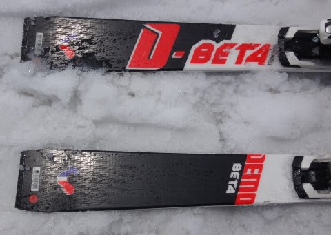

# 2017シーズンモデル，スキー試乗レポート第13回…ROSSIGNOL編その2

📅 投稿日時: 2016-06-04 03:14:29

🏷️ カテゴリ: [スキー板試乗](c0bd8048615710cee890e403a36cc9a2b.md)

まだ，2017シーズンモデルのスキー板の

試乗インプレッションが続くわけですが．

本日のレポートの板からは，

試乗会場は[4月30日の熊の湯](e53d53cc538b67b728af80a65653feb03.md)になります．

コースは廊下だったけど，気温が冷えて

かなり締まったいいコンディションで試乗できました…

で．

今回は，ロシニョール編，2機種です．

では，どうぞ～！

○ROSSIGNOL DEMO ALPHA SOFT 167cm

基礎オールラウンド．

…とはいえ，長さ167cmだと小回りベースです．

基本的に，R21プレートのDEMOα R21から，ビンディングとプレートを

変えただけらしいこの板．

ガッチリ強いR21プレートのDEMOα R21に比べ，かなり優しい

板になっています．

もともと優しいDEMOαソフトですが．

今シーズンモデルより，トーションが弱くなったのか？

あるいはエッジのチューンナップか？

エッジグリップが弱くなり，

ずらしやすくなった気がします…．

今シーズンまでのDEMOαソフト同様，

傾けただけでトップとテールのエッジがしっかり効いて，

エッジに乗ったレールターン的にターンが始動します．

荷重は土踏まずより心持ち後ろ，くるぶし下．

ここを抑えて行くと曲がっていきます．

しかし，噛ませて滑れば切れていくけど，

エッジの食いつきは優し目になり，

ずらそうと思えばいとも簡単にずらせる

動かしやすさを感じました…

DEMOα R21に比べればかなり優しく感じ，

むしろDEMOβの方に近いな…と思うほど，

エッジが頑張らなくなった感．

板を良く動すこともできるし，長さも167cmであれば，

エッジに乗っても比較的小さな半径で曲がるので．

小回りが調子よい板です．

強く仕掛けていくと，板がたわんでいくよりも

エッジが緩やかに逃げていく感じ．

…ただし，これはエッジの仕上げが結構効いている

のかも…？？

○ROSSIGNOL DEMO BETA 166cm

基礎オールラウンド．

ビンディング＆プレートが同じってこともあり，

DEMOα SOFTに近い特性を感じます…

DEMOα R21とDEMOαソフトより，

DEMOαソフトとDEMOβの方が近い感じ．

エッジもグリップするし，ずらしていった時の

コントロール性もいいです．

荷重ポイントはくるぶし，

押さえればグリップ，抜けばずらし．

αソフトよりは柔らかいのか…

ずらしもグリップもどちらもやりやすく，

ずらしのコントロール性の良さが

なんとなくオガサカっぽい感じ…

そこそこのスピードまでは十分エッジに乗って

安定して滑っていけるのに，いつでも自在に

すっと板を動かせます．

166cmはR13とラディウスも小さく，良くたわむし，

ずらしもやりやすいので，どちらかというと

小回り専用機かな～．

ガンガンのトップスピードでは，ちょっと弱さを

感じるかも．

でも，普通のゲレンデ域のスピードでお気軽に

滑るなら，グリップもするし，ずらした時の

コントロール性も高いし．

ガンガン攻めるつもりがない人が，気楽に乗れる

ショートベースオールラウンドとして良いのでは

無いでしょうか…
