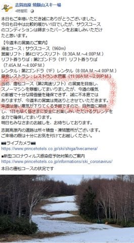
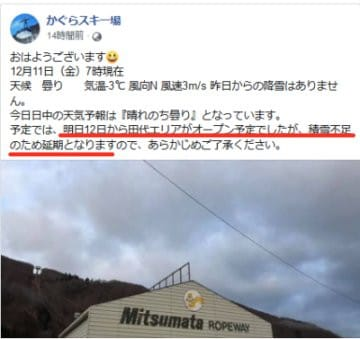
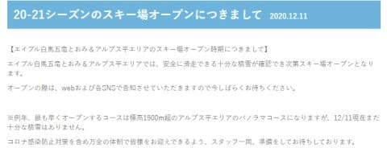
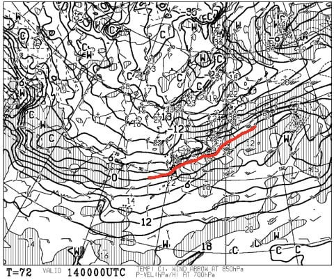
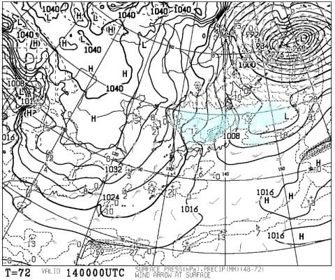

# また明日・明後日の週末で焼額滑ってます…

📅 投稿日時: 2020-12-12 00:04:22

ということで．

昨日…というか，今朝の記事で．

残念ながら，本日はそれほど人工雪が打てなさそう…

と書いたわけですが．

…どうやら，

　明日土曜の焼額，第2高速リフトの

　オープンはきわどい感じ…（泣）

という予想は当たり．

残念ながら，焼額山は

今週末の第2高速リフトの運転を諦めた

ようです…（涙）

（[焼額山スキー場Facebook](https://ja-jp.facebook.com/yakebitaiyama/posts/3491662724262382?__tn__=-R)より）

がががーーん．

ショック～…

まさか，雪の降り始めが早かった今シーズン．

オープンから2週連続4ロマしか滑れないとは…（泣）

12月10日を過ぎた週末に4ロマだけの営業って…

過去10シーズンさかのぼって調べてみたけど，

実は初めてのことのようです（泣）

オープン時に雪不足で苦しんだ昨シーズンも，

焼額オープン2週目の12月14日週末には，

ちゃんと2高が動いてたし．

かの雪不足に悩んだ2016シーズンだって，

オープン2週目の12月12日には2高が

動いてました…！

それどころか，過去10年間だと，

12月10日を超えた週末には

2ゴンが動いていることの方が

多いくらいでした…（泣）

まさか，こんな雪不足スタートに

なるとは…！

そのおかげで，今週末からオープンする

予定だった，かぐらスキー場の田代エリアも

オープンしないし…

（[かぐらスキー場Facebook](https://www.facebook.com/snowkagura/posts/3350830515044245?__tn__=-R)より）

白馬山麓も軒並み今週末のオープンを

諦めたようです（涙）

（[白馬五竜ホームページ](https://www.hakubaescal.com/winter/information/2020/12/11/20-21%e3%82%b7%e3%83%bc%e3%82%ba%e3%83%b3%e3%81%ae%e3%82%b9%e3%82%ad%e3%83%bc%e5%a0%b4%e3%82%aa%e3%83%bc%e3%83%97%e3%83%b3%e3%81%ab%e3%81%a4%e3%81%8d%e3%81%be%e3%81%97%e3%81%a6/)より）

そして，土日の予想も，概ね昨日の通りで．

12日土曜：朝から終日曇り．時折雪が舞うかも？

　気温はそれほど冷えない．

　昼間はわずかにプラス気温．

　人工降雪は早朝にわずかに動かせる程度で，

　人工降雪の積み増しもあまりない．

　朝イチは人工降雪が圧雪された締まったバーン，

　午後は急斜面は下地のちょっと硬い

　ところが出てくるか…

13日日曜：運がよければ，朝までに

　1cmほど天然雪が積もるか？

　終日曇り，時折積もるほどではない

　雪がぱらつく．

　天然雪が1cmでも積もっていれば，

　朝は柔らかめの最高圧雪！

　天然雪が無ければ締まった圧雪．

　昼間はギリギリ0℃前後．

　雪は終日締まった状態をキープ．

というところで．

積雪の積み増しはなさそうです（涙）

まさか，今シーズンがこんな雪不足で

始まるとは思わなかった…（激泣）

でも．

14日の月曜は…

やっぱり，冷えそうですっ！！

そして，地上天気図は見事な

冬型！！

13日の夜から14日の朝にかけて…

西風なので志賀はドサドサ積もらないけど，

新潟や白馬のスキー場は，

そこそこの積雪がありそうな感じ！

…でも．

はっきり言わせてもらうと．

1日…いや，2日遅いよ（涙）

これが，もう2日早ければ，この週末は

かなりのスキー場とコースがオープン

するはずだったのに…

とりあえず．

今週末はちょっと残念な感じですが．

あと4時間後に出発で，いつも通り

焼額で滑ってます～！！

…って．

また3時間ちょいしか寝られない…（泣）

PS．そういえば，今週末は志賀高原の一の瀬スキー場で，

　事前申し込み不要，身分証明書があれば飛び入り参加

　可能な，[オガサカスキーの試乗会](http://shigakogen.co.jp/wp-content/uploads/2020/12/%E3%82%B7%E3%83%BC%E3%82%BA%E3%83%B3%E3%82%A4%E3%83%B3%E8%A9%A6%E4%B9%97%E4%BC%9A.pdf)がありますよ～！

## 💬 コメント一覧

### 💬 コメント by (ikkun)
**タイトル**: Unknown
**投稿日**: 2020-12-12 07:44:32

おはようございます❗あれだけ早いとこうなる？ですかね？ 本日我がスキー場安全祈願あるのです  飲めませんがね(泣)週明けは雪予想になっていますので「ほどほど」の積雪をと 昨日善光寺にお参りしてきたのでした( *´艸｀) あもう来てらっしゃるかな？(笑)

### 💬 コメント by (Skier_S)
**タイトル**: ＞ikkunさま
**投稿日**: 2020-12-12 22:51:37

週明けは，積もると思いますよ…！

ほどほどに収まらず，かなり降りそうです(笑)．

