# 2016/2017シーズンオープン2日目！11/27(日)のアサマ2000は…曇り時々雨（涙）．

📅 投稿日時: 2016-11-28 00:32:26

🏷️ カテゴリ: [2017スキー滑走日記](c7d777cecfc91bdf0fa464ad62c6d49ab.md)

てなわけで．

1泊2日のアサマ2000．

今日は，日曜日のアサマ2000のレポートです～．

朝，前の日から，ちょっと小雨っぽい雨が

降ったようですが．

アサマ2000へ登る道は…

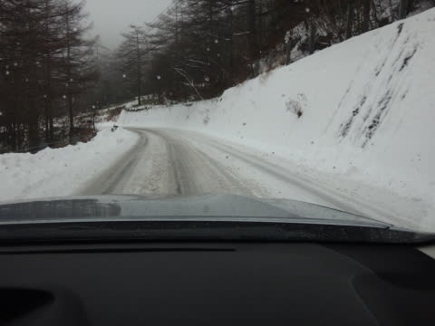

うむ．

相変わらずの雪道です．

で．

スキー場へ到着すると…

…

なんじゃこりゃ！！

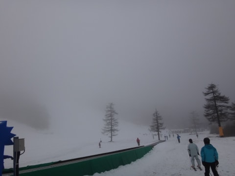

ゲレンデが，見えない！

…駐車場はガスってなかったのに．

リフトでちょっと登ったところから，

ゲレンデ全面が，

見事にガスに覆われてるんですが…（涙）．

ただ，雨は降ってないので…

ガスっていても，雨よりはイイっ！

雨がザーザー降ってるのに比べれば，

ガスくらい許す！←と，自分を必死にごまかす

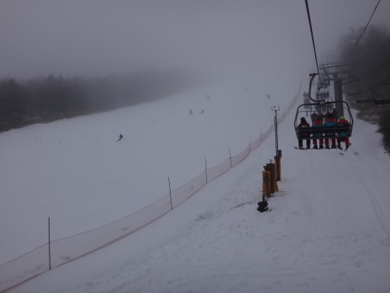

…しかし．

雨の天気予報だし．

さらに，ゲレンデ全面ガスっているというのに…

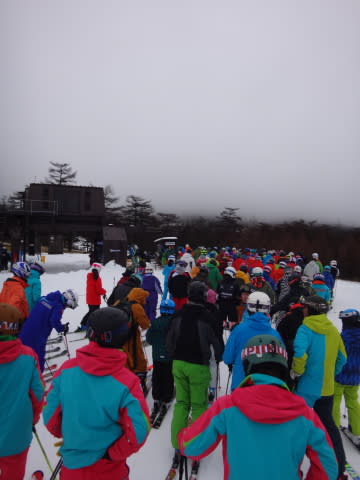

なぜ，朝イチから，リフトは6-7分待ちなの

ですか？

朝早くは雨もぱらついてたから，

今日はガラガラだろうなぁ…

と，思っていたのに…

朝イチから，午前中いっぱい

リフト待ちはずっとこんな感じなんですが（泣）．

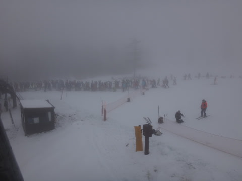

リフト待ち10分弱で，

1時間でリフト4本しか乗れません（涙）．

そして…

ゲレンデも，コースが見えませんね（泣）．

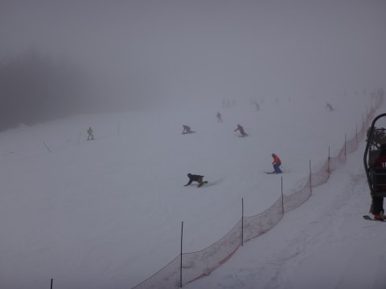

せ，雪面のコンディションが

良くわからない…（悲）．

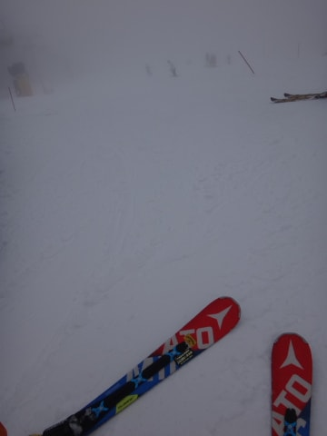

ただ．

午前中は．

私の日ごろの行いが良かったおかげで．

…そうです．

大事なところなので，大きな声で

言っておきますが．

私の行いの良さのおかげで

雨が降らずに済みました！

…ガスっているけど…

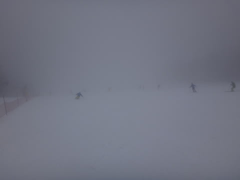

リフト待ちは長いけど…

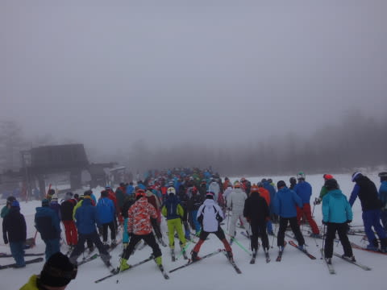

でも．

午前中は，雨に降られることなく

滑れたのだ！

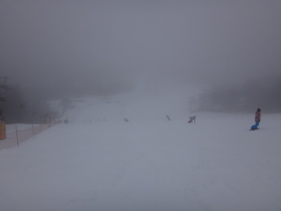

良かった，ということにするのだ！

…って感じで．

ガスの中滑っていた午前中．

11時過ぎごろになると．

おや？

ガスが晴れてきましたっ！

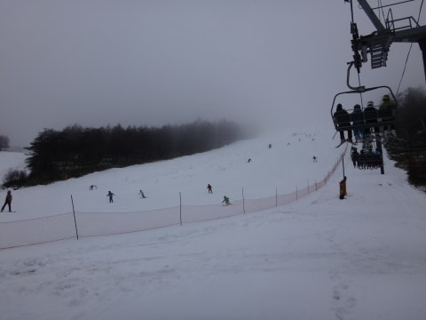

…しかし．

これまで，ゲレンデ全面を見渡せなかったので

気づきませんでしたが…

…人口密度，高いよっ！！

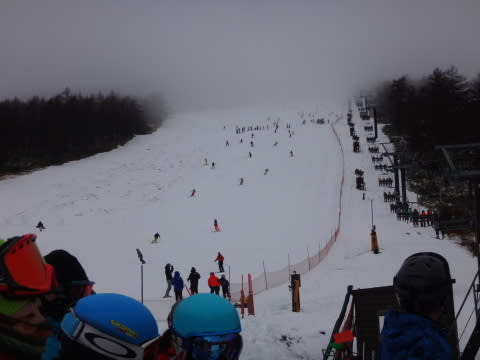

視界が良くなって，やっとスピード出せる！

と，思ったのに．

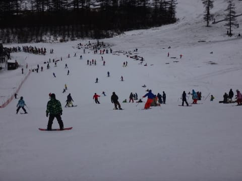

…朝イチと違って，結構ボーダーも多くなり．

うーむ．

気持ちよく飛ばすのは，無理だな…

…

で．

ガスが晴れてきたというのは．

あまり良くない傾向だな…

この天気で，ガスが晴れてきたということは．

…

…

やっぱり，来たか（涙）

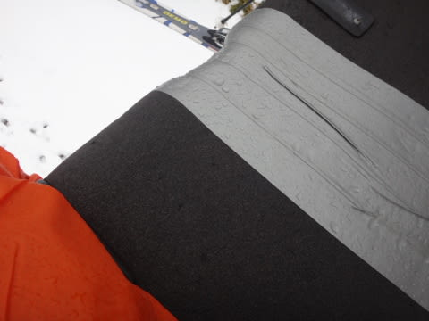

…ってことで．

12時ちょっと前．

予想通り，雨がパラパラと降り始めてきました…（泣）．

ずっと降り続けるわけでは無く．

降ったりやんだりを繰り返し，

降ってもパラパラ程度で，

そんなに強い雨ではなかったのですが…

おかげで…

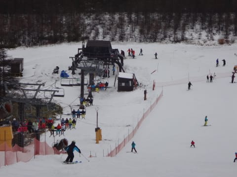

うむ．

午後1時過ぎには，リフト待ちはほとんど

なくなりました！

ふははは．

これで飛び乗り状態でぐるぐるできるのだ！←普通の人は帰るってば

…だけど．

雨が降ってきてから，

リフト待ちは減ったけど．

…意外とゲレンデの人は減らなかったなぁ…

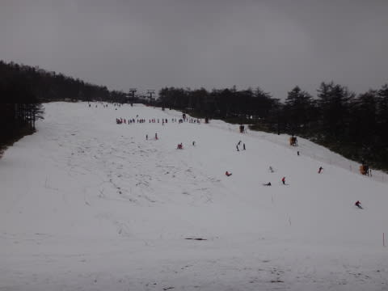

雨が降り始めてから．

雪は水を吸って重くなっていき…

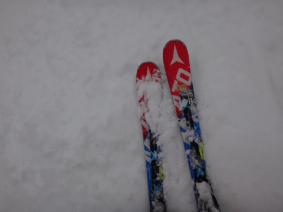

そして，午後2時過ぎには．

あらら？

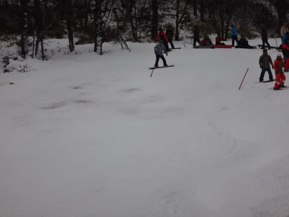

うーむ．

コース上ごく一部ですが．

ちょっと雪が薄くなった部分も…

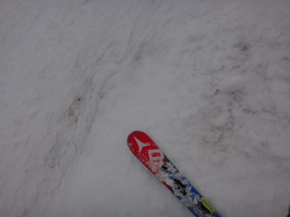

って感じのゲレンデですが．

雨が降っていても．

雪が薄くなっても．

滑り続けようという人が，こんなにも

いるというのは．

褒めるべきかあきれるべきか…←お前もその一人でしょ

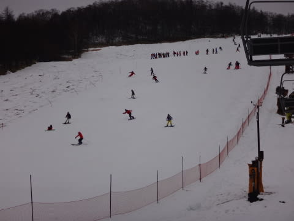

コース状況は，写真からはわかりにくいですが．

昼ごろからは，そこそこ荒れたバーン．

でも．

雨のおかげで，カチコチバーンにならなかったので．

昨日よりは滑りやすかったかな～．

って感じで．

2時半からは，完全待ち時間0のリフトに

飛び乗り続け…

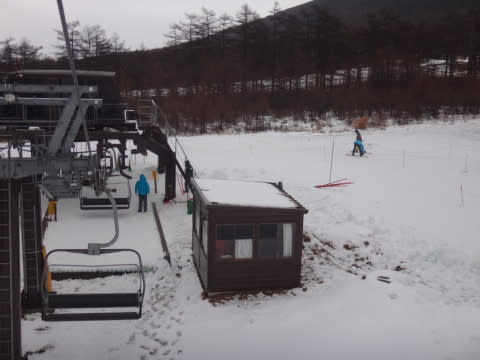

午後3時のリフトストップまで，

滑り続けました～！！

ということで．

雨の予報に関わらず，意外と人が多かった

日曜日のアサマ2000．

雨が降ったのは午後だけ，それも時折

降ったりやんだり程度だったし．

雨のおかげでツルツルアイスバーンに

なることもなく．

かといって，雨で雪が薄くなってブッシュ

だらけになったりすることもなく．

まぁ．

予想よりは，良かったかな～．

でも．

これで私にとっての，今シーズンのアサマ2000は終了！

来週からは，ついに．

焼額がオープンするので．

志賀高原通いが始まるのだ！

PS

帰路は完全にウェット．

雪は消えており．凍結無しで

下山できました～！

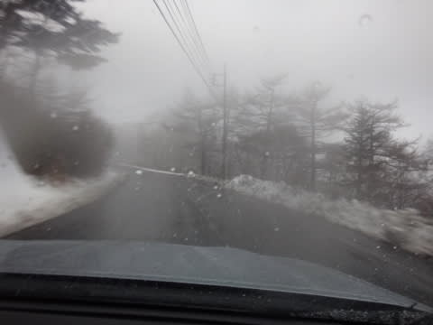
