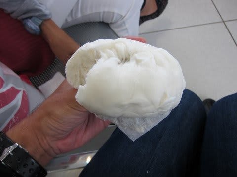
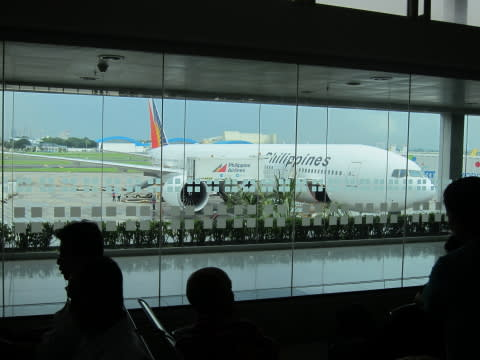
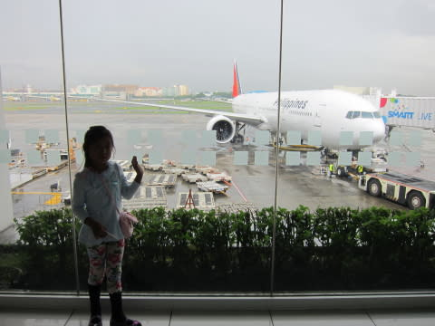
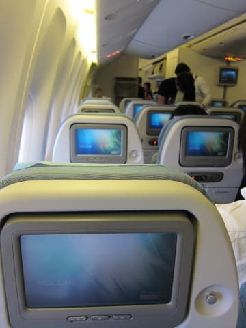
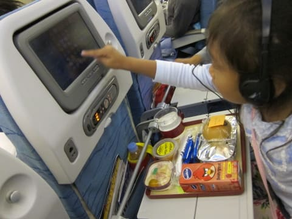
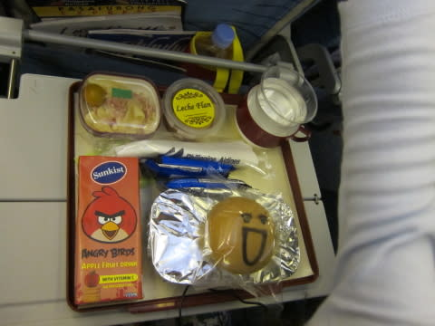
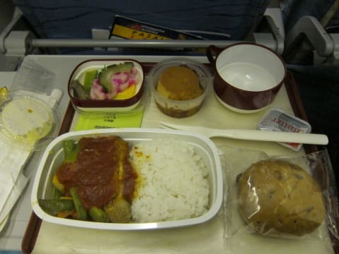
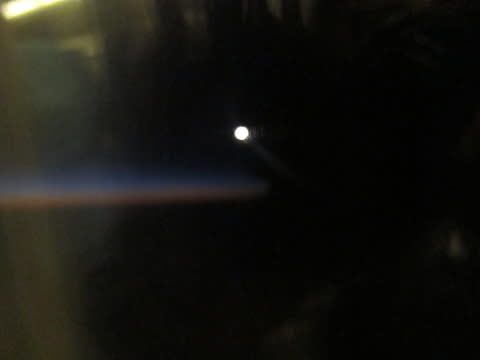
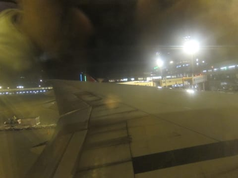

# 2013年11月　フィリピン・オスロブ　子連れでジンベエを見るぞっ！　ファイナル

📅 投稿日時: 2014-08-12 00:41:21

🏷️ カテゴリ: [ダイビング日記](ce3a7a8d424d112fce83ee85c81a0e344.md)

ということで．

7時間という，ありえないほどに長い乗り継ぎ待ちも，

映画を見おわると，あと残りは1時間半！

実際は出発30分くらい前から搭乗開始なので．

実質，残り1時間…

あとは，軽～く食べ物をつまんだり…

（結構いけた，売店の肉まん）

飛行機を見ていたりすると．

ついに搭乗時間がやってきました！

いやーーー．

…出発前に危惧していた，乗り継ぎ時間7時間．

かなり無謀かな，と思っていたけど．

まぁ，実質ターミナル移動やら搭乗時間やらで，

6時間弱の待ち時間．

無料のネットワークに繋ぎ放題だったし，

食事2回と，ナウシカ様降臨で，無事やり過ごせました…

ということで．

娘はようやく待ちに待った飛行機に乗れるので，

疲れた様子も見せずに，大喜びで飛行機に向かっていきました…

で．飛行機に乗ったところ…

をを！

行きのセブ直行便は，エンターテイメントシステムが

ついてなかったけど．

この飛行機にはちゃんとついてるじゃないかっ！！

娘は，楽しみにしている飛行機のお弁当（機内食）が出て，

ゲームもできるので大満足．

…で．

これがチャイルドミールなんですが．

前回のタイと言い，フィリピンと言い…

アングリーバードが流行ってるのかな？？

（にこにこパンが楽しい感じ…）

大人の我々も，早めの夕ご飯といった感じの

機内食を食べると…

今日は朝2時起きで，空港ではほとんど

寝られなかったので．

ぐっすりでした．

（機内からの夕暮れと月）

で．

ぐっすり寝て．

気づいたときは，もう成田到着…

ほぼ定刻通り，夜8時過ぎの到着でした．

いやー．帰ってきたよっ！！！

…とはいうものの．

まだまだ家は遠いのだ．

無事帰国手続きを済ませ，駐車場には夜9時．

…私はさらにここから3時間の運転が控えているのだった…（涙）．

ということで．

熟睡の妻と娘を後ろに乗せて運転すること3時間．

帰宅は12時過ぎ…

朝2時から，夜12時までの長～い移動を終えて，

無事帰宅したのでした…

＃次の日の仕事がつらかったのは言うまでもない
