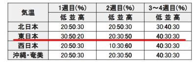

# 志賀高原の2023年コースは2022年と変更一切なし．そして11月8日あたりから気温が上がりそう（涙）

📅 投稿日時: 2022-11-04 04:18:22

🏷️ カテゴリ: [日記](cc4b5682fb7b8b144980957a978653fb0.md)

えー．

祭日だというのに．

寂しく一日，家で仕事してたSkier_Sです(涙)

そして，まだ仕事が終わらなかったのに

もうこんな時間…（泣）

しかし．

本日は，軽井沢とウイングヒルズ白鳥も

オープンしましたね～！

志賀常連の特派員も，何人か軽井沢で

滑ってきた人がいたようで．

朝のうちはガスってたけど…

じきに晴れて，昼間は晴天だったようです！

…コース幅は，イエティと変わらない感じ

ですかね…

ただ…

リフト待ちはやっぱりイエティより長そう．

でも，今日はせいぜい10分待ち程度だった

らしく，そこまで混まなかったみたいです…

いいなぁ…

天気も良かったみたいだし．

今日，滑りに行きたかったなぁ…(涙)

で．

これから数日間は，当初予想よりは

冷え込みが弱くなりましたが…

11月4日の夜と，5日の夜は，横手山なら

人工降雪機が動かせるレベルなんじゃ

ないかな～

ただ，当初予想だと6，7日も冷えそうな

感じだったのが，この2日間はそこまで

冷えない予想に変わりました(涙）

6，7日の850hpaの赤い0℃線，

東北まで上がっちゃってるので…

横手山でも人工降雪機を動かすのは

難しそうな感じ…（泣）

やっぱり，まだ横手山のオープンは

厳しいかな…

そして．

その後の気温がどうなるかを，2週間予想

で見てみると…

うむ．

水色矢印の5，6，7日あたりは冷える

予想になってるけど．

その後，赤矢印の8日以降は，

平年より気温が上がり，最大3度ほど

高い気温になりそう…（泣）

ちなみに，本日公開された1か月予想でも，

11月4日から10日までの第1週は平年より

低めの可能性が30％と，ちょっとだけ

冷える確率が高そうだけど．

11月11日から17日までの第2週は，

平年より高い確率が50％と，

かなり気温が上がりそうな予想です…（泣）

まぁ，18日以降はそこそこ冷えそうな

予想なので，そこはちょっと安心ですが…

でも．せっかく積もらせた横手山の人工降雪は

この高温でやられちゃいそうだし．

15日ごろまでは高温が続きそうなので…

熊の湯の19日オープンも厳しいかも？？

うーん．

このグラフにもあるように，10月25日ごろに

異常に冷えたけど…

やっぱり，冷えるのはそこじゃなかったんだよ…

11月中旬に冷えてほしかった…

ってなことで．

話題は変わって．

本日，志賀高原索道協会のページが冬仕様に

変わっていて．

そして，[2023年度版デジタルパンフレット](https://shigakogen-ski.or.jp/e-book/2022-23)が

公開されてました～！

（[志賀高原索道協会ホームページ](https://shigakogen-ski.or.jp/winter/news/2022/11/post-21.html)より）

で．

このパンフレットに，2023年度版

ゲレンデマップが載っていたので．

例年通り，穴が開くほど詳しく見たわけ

ですが…

とりあえず分かったのは．

2023シーズンの志賀高原のゲレンデは，

2022シーズンと全く変わらない

ということが分かりました…

まぁ，修繕工事してないから諦めてたけど．

西舘中級コースはクローズしたままだし．

評判が悪いブナ平下部の七曲りもそのまま

のようです（ちょい涙）

でも，廃止になったリフトやコースは

内容なので，そこは一安心…

ってなことで．

今シーズンは，一応昨シーズンまでと同じ

リフト，ゲレンデが楽しめそうです．

あとは，11月後半の冷え込みに期待して．

今シーズンも12月第1週から焼額ゴンドラが

滑れるように祈って踊りつつ，

志賀高原のシーズンインを待ちましょう…！

## 💬 コメント一覧

### 💬 コメント by (つか)
**タイトル**: Unknown
**投稿日**: 2022-11-05 10:10:01

タンネの森のリフトを平日動かしてほしい

横の移動が困難です

### 💬 コメント by (Skier_S)
**タイトル**: ＞つかさま
**投稿日**: 2022-11-06 00:56:25

そうですよね…タンネの森止まると，一の瀬と高天ヶ原間の移動が結構めんどくさいですよね…

今のところ，タンネの森が平日運休と出ていないので，平日も動いてくれると信じたいところです．

