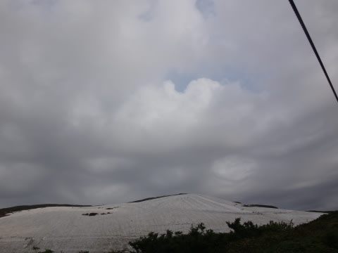
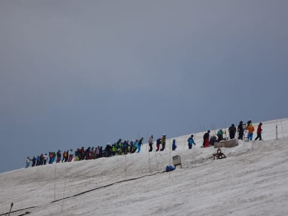
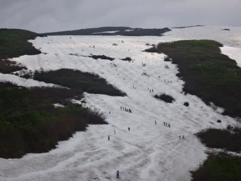
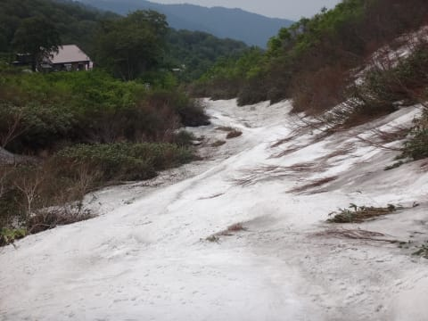

# 6月14日の月山速報…曇り時々晴れ．そこそこ混んでたかな…

📅 投稿日時: 2015-06-15 01:49:07

えー．

山形を出たのが夕方5時過ぎだったので．

もう，日付変わってからの帰宅でした…（涙）．

ってことで．

今日も帰宅が遅かったので，速報モードで．

あー．

朝はちょいと雲が多めの天気だったけど…

んでも．

午前中は，日が射したり曇ったり．

大斜面のコブも，滑りいい感じかな～．

今日もリフト待ちはほとんどなかったけど．

Tバーはえらい混んでましたね…

大斜面も，昨日より人は多めだったかな．

…とはいえ．

リフト待ちは無かったし．

激混みかぐらに比べれば，全然楽勝．

ってことで．

今日もひたすらリフトぐるぐるして，

大斜面のコブを満喫してきたのでした…

しかし．

大斜面を終わった後の，コースの一番下の部分．

そろそろやばそうな感じ…

もうそろそろ，コースが切れるか？？

来週は藪漕ぎが入るかも…

ってことで．

詳細レポートは，また明日！
