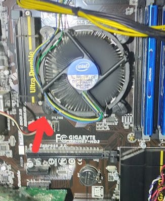
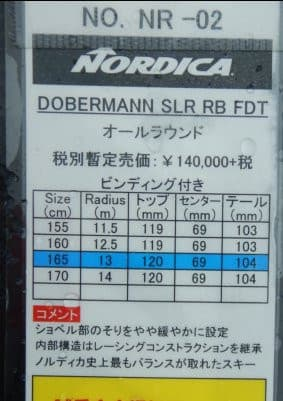

# 2022シーズンモデルのスキー板，試乗レポートその15…NORDICA Dobermann SLR RB FDT

📅 投稿日時: 2021-07-03 07:42:01

🏷️ カテゴリ: [スキー板試乗](c0bd8048615710cee890e403a36cc9a2b.md)

ここ1か月ほど．

このBlogを書いている我が家のメインPCの

反応が遅くなり．

ブラウザでネットを見ても，画面が出てくる

のに時間がかかったり，Youtubeの動画が

コマ送りになったりしたのですが…

Windowsのリソースモニター見ても，

ネットのスピードが出てないっぽく．

「うーん．ネットが混んでて遅いのか…」

と諦めていたんだけど．

本日．

タスクマネージャのパフォーマンスを見た時．

「え！？負荷が高いとき，クロックが500MHz

くらいまで落ちちゃってる！？？」

ということに気づきました…

負荷が低い時は上の写真みたいにちゃんと

3.3GHzで動くんですが…

負荷を上げるとクロックがみるみる下がって

行きます…

これは，典型的なCPU冷却不良の現象だな…

と，PCのカバーを開けてみてみると．

CPUファンの矢印で示したピンが外れて，

CPUファンがCPUから浮いた状態に

なってました…(涙)

このピンをググッと押し込むと，

無事，負荷99％でもクロックが

3.3GHz以上で動くようになり．

速度も復活しました～！

CPUが遅くなってたので，ブラウザの描画

処理が間に合わず，ネット速度が遅く

なってたみたいに見えてたのね…

たまたま全負荷でのCPUクロック速度

見なきゃ気づかなかった…

いや，ウェブもサクサク見れるようになり．

快適な状況に復活！

…まぁ，自作PCあるあるですな．

ってなことで，本題へ．

今日も2022シーズンモデルのスキー板

試乗レポート．

今回は，ノルディカ編です．

では，どうぞ～！

○NORDICA Dobermann SLR RB FDT 165cm

基礎小回り用

昨年と同じ名称のこの板．多少マイナーチェンジ

したのかな…？

履いた感じ，どっしりとした足元の重さと，

安定感を感じます．

板自体もしっかりと硬さはあり，全体的に

手ごわそうな感じを受ける板ですが，

滑ってみると踏み応えに粘り感があり，

ググッと圧が溜まるようなたわみが

でます．

この重さと粘りのあるたわみ感で，

雪面に張り付くような，ずっしりとした

安定感のある小回りができます．

荒れた雪でも板が叩かれり，

きょろきょろしたりすることなく，

雪面にピシッと貼りつきながら

怒涛の安定感で滑って行けます．

…この板，雪面への貼りつき感が半端ない！

粘りのあるフレックス感があるので，

スピードを出して行けば行くほど

たわみが出て行き，ガンガン切れた

ターンができていきます．

かなりの安定感があるので，荒れた

春雪でガンガンスピードを出しても

大丈夫！

というか，荒れた斜面でスピードを

出してもかなり安定していて，

荒れた斜面を蹴散らして，雪面に

貼りつくようにターンをしていきます．

ただ，この板の求めるスピード域は

ちょっと高め．

低速でずらそうと思ってもあまり楽しくない

板です．

安定感があるのでスピードを出したくなるし，

スピードが乗ってくると，サイドカーブに

乗ってキレキレで曲がれる板．

板自体の反応も早いです．

フレックスは強めなので，ガンガン小回り

というより，普通ならミドル程度のターン弧

がちょうどいい感じの板でしょうか．

ラディウスが小さすぎたり，フレックスが

弱すぎて，スピードを出すと小回り強制

マシンになる小回り板もありますが．

この板はスピードを出しても勝手に

板が回りすぎることもなく，ミドルから

小回りまでターン弧を好きに調整して

滑ることができます．

板が強いので，硬い深いコブは

ちょっと手ごわいかもしれないけど，

硬い板にありがちな，フラットバーンしか

滑れないような手ごわさは無く，

そこそこの浅いコブくらいなら突っ込め

そうだし，春雪の荒れた斜面でも，

その安定感で気持ちよくかっ飛ばせます！

さらに小回り強制マシンでもなく，

長めのミドル～ショートまで，

ターン弧が比較的自由に作れるので，

体力があってスピードを求める人が，

オールラウンドに使う小回りベースの

板としては，かなりイケる板なんじゃ

無いでしょうか…

## 💬 コメント一覧

### 💬 コメント by (m&t m)
**タイトル**: Unknown
**投稿日**: 2021-07-03 09:38:31

お久しぶりです♪

仕事大変そうですね・・・

我々もアサマで試乗しました。Sさんにはちょっと物足りないかもしれませんが、我々には丁度良かったです♪

次期候補トップなのですが、値段が高過ぎです・・・

安くなったら買いたいなあ

あと、今の板もSLRですが、この板も同じ名前です

### 💬 コメント by (Skier_S)
**タイトル**: ＞m&t mさま
**投稿日**: 2021-07-04 02:49:28

お久しぶりです～！

この板，私にとって物足りないことは全く無く，かなりスピード耐性・

安定感に優れるい板だと思います．

小回り板として，一つの購入候補です…

ただ，確かにお値段は高いですよね（笑）．

### 💬 コメント by (ikkun)
**タイトル**: Unknown
**投稿日**: 2021-07-04 15:46:31

３時～のヒノマルソウル観賞の後 横の中古屋さんにまさにこれかな？ありました(笑)  一時は買い掛けたメーカーでしたなあ

しかもまさにこれかな？

### 💬 コメント by (まーくん)
**タイトル**: Unknown
**投稿日**: 2021-07-04 22:57:42

お久しぶりです。

今年の1月にこの2020年モデルを購入しましたが、まさに同じ感想でした。

それまでは憧れでSLのFISモデルを乗っていましたが、オーバースペックな板に乗って初めて乗れない状態とはどういうことかを身を以て知った感じです。

重い板からの乗り換えだったので、私には物凄く軽い板で安定感抜群という最高の板状態ですが、これでも相場よりは重めなんですね…

板の試乗記は見てて面白いですし、自身の板選びの参考になるので今後も楽しみにしてます！

### 💬 コメント by (Skier_S)
**タイトル**: 今日は更新お休み
**投稿日**: 2021-07-05 03:50:29

＞ikkunさま

え？来シーズンモデルがもう中古屋さんに…！？

＞まーくんさま

お久しぶりです～！

この板は，2020モデルから安定してしっかりとしたいい板ですよね…

しかし，SLのガチ競技用は手ごわいですよ．．

なぜかHEADのe-SL RDやDynastarのSL板は乗りやすいんですけどね…

Nordica のSL競技用からの乗り換えだと，Dobermannn SLRは確かに軽く感じるかも…

### 💬 コメント by (ikkun)
**タイトル**: Unknown
**投稿日**: 2021-07-05 13:06:43

お疲れ様です いやいや古いmodelですよ❗38000円だったです(笑)

### 💬 コメント by (Skier_S)
**タイトル**: ＞ikkunさま
**投稿日**: 2021-07-06 02:04:41

ですよね…びっくりしました

