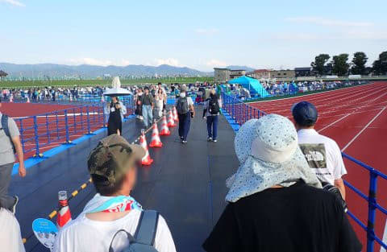

# この週末は長岡花火大会を見に行ってきた

📅 投稿日時: 2024-08-05 00:51:27

長岡まつり大花火大会…

日本3大花火大会と言われ，

有料観客席だけで34万枚のチケットが

売り切れ，人口27万人の長岡市に

すさまじい観客が集まる…という花火大会．

なにぶん大混雑で，駐車場に入るのに

1時間，駐車場から会場までのシャトル

バスに乗るのに1時間，バスを降りてから

さらに会場まで歩くのも大変…

とか，帰りも駐車場にたどり着くのが大変で，

さらに駐車場から出るのに1時間以上

かかる…とか言われていて．

行きたいけど，行けないよね

と思っていたところ．

今回，長岡の花火大会会場そばに住んでいる

方々のありがたいお誘いにより，渋滞やら何やらを

心配せずに花火を見れる…というチャンスを

頂けたので．

土曜日帰りで，長岡花火大会を見てきました～！

いやーー．

しかし．

すごかった…長岡花火大会．

いろんな意味で…

電車が普及している首都圏じゃなく，

バスや車が移動手段メインの場所で

30万人以上の人を移動させるすさまじさといい，

そのオペレーションの洗練具合と言い．

さすが歴史のある花火大会…みんな慣れてる…

とりあえず．

今回取った観覧場所は，陸上競技場フィールド．

19:20スタートですが，17時ごろに会場入り．

フィールドの芝生で座り心地もよく．

ぎゅう詰めじゃなく，一人当たり結構ゆったり

できて，寝転がるスペースがとれるくらいの

感じ．

そして…

花火が始まるまでの2時間ほど．

みんなビールやらなにやら飲んで

盛り上がってますが…

日帰りで帰りも運転しなくてはいけない

私は我慢して，暗くなるのを待ちます．

あぁ…ビールが飲みたい…

で．

19:20，打ち上げ開始！

いやーーー．

最初からスケールのデカさに圧倒…！

陸上競技場は，河原の観客席より

打ち上げ場所から遠いけど…

このくらいが，全体を目の前で

見ることができてちょうどいい場所かも！？

スケールのでかさと，次から次へ続く

大玉連続の花火に圧倒されつつ，

いや…

これが2時間以上続くの？？

と，感動してみていると…

最初のうちは良かったけど．

風向きがちょっと向かい風という

こともあり…

なんだか，だんだん花火の一部が煙に

隠れて見えなくなってきたんですが…

だんだん盛り上がってくるけど…

花火の輪郭が煙でぼやけてきて．

惜しい．風向きさえ…

風向きさえ，向かい風でなければ…！！

煙でぼやけて見えないのが惜しい…っ！

そして．

連続ものが続くと，煙でせっかく開いた花火が

全く見えないものもあったりして…

（この花火のうえにも開いている花火があるけど

見えてない…（涙））

ちょっと惜しい感じではあったものの．

それでもこんなのが2時間以上延々と続く

すごさに圧倒！

とりあえず，

混雑ゆえに，自分たちは絶対見ることは

無いだろうと思ってあきらめていた花火大会．

実物をたっぷりと，この目で拝むことが

できました…！

長岡で準備してくださった皆さん，ありがとう

ございます…

しかし．

この花火大会は，30万人以上が

遠くから見に来るだけの価値はある…

また来年も行きたいな…と思いつつ．

実質2時間ちょいの花火を見るために，

往復550km．運転時間10時間．

月山が往復1000km，運転時間14時間とはいえ，

朝8時から午後4時まで8時間滑れることを

考えると，

関東から見に行くタイムパフォーマンスが

いいとは言えないなぁ…

できれば花火が10時間．せめて5-6時間

続いてくれるといいなぁ…！！←無理だから．

一般的に，花火以外の観光と組み合わせるのが普通だから

とりあえず．

来年は泊りで行って，ビールを飲みながら

花火を見て，ゆっくり観光したいな…

と思った，Skier_Sだったのでした．

（そんな暇があるのか？）

## 💬 コメント一覧

### 💬 コメント by (1kamakura)
**タイトル**: Unknown
**投稿日**: 2024-08-05 07:23:15

江戸の秋

コロナ前に私も長岡花火を観に行きました。

夫が新潟支社に単身赴任していて、その会社の長岡支社の屋上で見せてもらえました。

大きな花火大会ですよね〜。

フェニックスという花火がメインイベントですよね。

帰りは新幹線で新潟市へ戻りました。

新幹線も大混雑。

駅の外に整列させられて、だいぶ待ち、自由席に座る事ができてラッキーでした。

### 💬 コメント by (副院長)
**タイトル**: Unknown
**投稿日**: 2024-08-05 08:48:51

HNKで見てました。去年？見に行った嫁によると、トイレが大変だとか。それと、比較対象が、月山とは、S様らしい。

### 💬 コメント by (ダウンヒル)
**タイトル**: Unknown
**投稿日**: 2024-08-05 12:35:52

長岡...

かの有名な、あの御方が居られる地...

楽しみにしている、あの選手権がまた開催されたのでしょうか?

疼いてしまいます...（笑）

### 💬 コメント by (富山県民)
**タイトル**: Unknown
**投稿日**: 2024-08-05 12:55:54

こんにちは。

お久しぶりです。

長岡花火に行かれたのですね。

私は花火大好き人間です。

私も長岡花火に行きました。

2日目の8月3日に富山から日帰りで行きました。

私のチケットは左岸北エリアでした。

私は新潟県上越市にあるJR犀潟駅まで車で行き犀潟駅に車を停めて犀潟駅から長岡駅まで電車に乗り長岡駅から花火会場まで歩きました。

長岡駅からかなり遠く約50分歩きました。

今年の長岡花火もかなり凄く得にフェニックス花火は圧巻でした。

帰りは花火会場から長岡駅まで歩き長岡駅から犀潟駅まで電車に乗り犀潟駅から自宅まで夜通し車を運転して帰りました。

途中で眠くなったために２回仮眠したので帰宅は朝５時頃になりました。

来年の長岡花火は土曜日と日曜日開催なので2日間堪能できそうです。

新潟県には長岡花火の他にも柏崎花火大会と片貝まつり花火もお勧めです。

長岡、柏崎、片貝は越後三大花火と言われてます。

ちなみに日本三大花火は大曲（秋田県）、土浦（茨城県）、長岡（新潟県）です。

私は大曲の花火にも行く予定です。

### 💬 コメント by (まうちゅう)
**タイトル**: Unknown
**投稿日**: 2024-08-05 21:54:16

まさか長岡まで行って花火だけ観て帰ってきたなんて

Skier_Sさんにはあり得ないですよね？

（とみんな思っているはず。）

私も毎年恒例の選手権を楽しみにしています！

### 💬 コメント by (ヒサフミ)
**タイトル**: Unknown
**投稿日**: 2024-08-05 23:48:07

付箋回収回を楽しみに待ちます!

### 💬 コメント by (Skier_S)
**タイトル**: なんだか期待されてるけど…
**投稿日**: 2024-08-06 00:32:22

＞江戸の秋さま

ビルの屋上から見れたんですね！特等席じゃないですか！

しかし，帰りの長岡駅がすごいことになるみたいですね…

私は幸い，地元の方に送迎してもらえたので渋滞知らずで行き来できました…

＞副院長さま

女性の方は，トイレ確かに大変だと思います…

男性はタイミングで混んでる時もありますが，そこまでひどくなかったです．

今回はビールを飲まなかったけど，ビール飲んでたら2時間以上の花火打ち上げ中

トイレ我慢できなかったかも…？

＞ダウンヒルさま

長岡のエキップさんも，花火の日は花火の観戦準備やら何やらでおそらく営業してないので，

残念ながら物欲には負けていません（笑）

＞富山県民さま

お久しぶりです～！

長岡に来てらしたんですね！駅から左岸まで，徒歩だと50分もかかるんですか…

いや，しかし．フェニックスはすごいですね．

フェニックス以外もすごいんですが…

来年は土日開催なので，1泊2日で2日連続観戦かも…！

大曲の花火もすごい混むと聞いているので，気を付けて見に行ってください…

＞まうちゅうさま

ふふふ．

残念ながら，エキップさんは土曜は営業してなかったんですよ…

土曜日帰りだったので，無事物欲に負けずに済みました（笑）

いや，最初はエキップさんに寄っていこうかとも思ったんですけど…

＞ひさふみさま

エキップさんは土曜は花火を見に来た人と一緒に観光案内をしていたようなので，

土曜は休業でした～！

無事，私のお財布は守られました．

### 💬 コメント by (富山県民)
**タイトル**: Unknown
**投稿日**: 2024-08-06 07:26:19

こんにちは。

長岡まつり大花火大会ですが以前は無料席もありましたが今は全て有料席になりました、

来年は1泊2日で2日間長岡花火を見ようと思ってます。

それと私は長野県の花火大会は諏訪湖花火大会、全国新作花火競技大会、

長野えびす講煙火大会に行ったことがあります。

### 💬 コメント by (べー)
**タイトル**: Unknown
**投稿日**: 2024-08-06 10:45:13

Sさん

6月に長岡の某選手権会場視察に行きまして、社長が「宿の手配やチケットの確保が大変なんですよね～」って言ってました。

あとその際にブーツ1足と小物の在庫は減らして来ましたので、残り在庫の一掃をお願いいたします(笑)

期待してます～

### 💬 コメント by (美恵子)
**タイトル**: Unknown
**投稿日**: 2024-08-06 14:29:32

長岡出身の私ですが、今は関東にいるためチケットやっと手に入れた❗やったー

やはり、フェニックスですね

今年のフェニックスは、今までとは違う

あれ見たら、暑い中、今までの苦労が、無くなりました

迫力が違うなぁ

最後まで見れなかったが、

駅までの、誘導も素晴らしい❗

この暑いなあ、準備に苦労した関係者

本当にありがとう

### 💬 コメント by (よろしく千萬あるべし)
**タイトル**: Unknown
**投稿日**: 2024-08-06 15:56:45

NHKのBSで視聴しました。おなじみの「フェニックス✕ジュピター」ですが、BGMをかけるというアイデア、しかもこれ以外にはない平原綾香のジュピターという選曲。舞台裏を「プロジェクトX」でやってほしいと考えるのは迂生だけではありますまい。「フェニックス✕ジュピター」考案の功績は大、というほかありません。

### 💬 コメント by (Skier_S)
**タイトル**: なぜかこの記事コメント続出
**投稿日**: 2024-08-07 00:47:42

＞富山県民さま

私も来年は土日と聞いて，1泊2日で2連続で見たいのですが…

来年は娘が受験生なので行けるかどうか（涙）

＞べーさま

をを！！！エキップさんに行ってきたんですね…！

いやー．エキップさんのブーツ履くと，滑りが変わりますよ…！シーズンインが楽しみですね！

…しかし，残り在庫一掃って…いくらかかるのやら…

＞美恵子さま

長岡出身ですか！

フェニックスはさすがに見ごたえありました．ありすぎました．

でも，フェニックス以外もみんなすごかった…

また来年も見たい！

＞よろしく千萬あるべしさま

いやー．

フェニックスはなかなかの見ごたえでした…

でも，あれはテレビで見るのもいいけど，ぜひ実物をご覧ください．

さらに迫力が1-2ケタ増します．

屋外でも音響も素晴らしく，あれだけ広い会場でも結構いい音でびっくりしました．

音楽も素晴らしいし，花火も素晴らしいですよね…

### 💬 コメント by (富山県民)
**タイトル**: Unknown
**投稿日**: 2024-08-07 16:37:02

Skierさん、こんにちは。

Skierさんは長野県の花火大会は行かれたことはあるのですか?

私は長野県の花火大会は諏訪湖花火大会、全国新作花火競技大会、長野えびす講煙火大会の3か所に行きました。

### 💬 コメント by (Skier_S)
**タイトル**: ＞富山県民さま
**投稿日**: 2024-08-08 03:31:34

長野県の花火，行ったことはないです…

諏訪湖花火大会とかは行ってみたいのですが．

なにぶん混雑があまり好きじゃないもので…

でも，富山県からわざわざ長野の大会まで行くってのは，花火ハンター（？）ですね！

### 💬 コメント by (富山県民)
**タイトル**: Unknown
**投稿日**: 2024-08-08 14:29:09

こんにちは。

おっしゃるとおり私は花火ハンターです。

今年は長野県の花火大会には8月15日に諏訪湖花火大会、11月23日に長野えびす講煙火大会に行く予定です。

長野県でお勧めの花火大会は諏訪湖花火大会と全国新作花火競技大会と長野えびす講煙火大会の3ヶ所です。

特に諏訪湖花火大会はお勧めです。

長野えびす講煙火大会も晩秋の夜空に開く花火が綺麗です。

全国新作花火競技大会も諏訪湖花火大会と同じ諏訪湖で開催されますが今年は中止（非開催）です。

### 💬 コメント by (Skier_S)
**タイトル**: >富山県民さま
**投稿日**: 2024-08-08 21:37:03

花火ハンターでしたか…

諏訪湖花火大会は行ってみたいのですが，なにぶん混みそうで…

えびす講のほうは，もうスキーシーズンなので，花火よりスキーに行っちゃいます(笑)．

もうすぐ諏訪湖花火大会ですね．楽しんできてください！！

