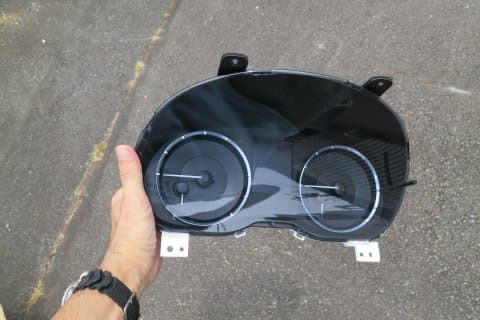

# 我が家のLEVORG 2.0GT-S，早くも初車検！

📅 投稿日時: 2021-07-30 03:24:48

🏷️ カテゴリ: [車](cba0e8330b3f2ded7c1addfacc75d4547.md)

えー．

早くも，[あの日々](ecdca7ac058e50b9e3a2a3ae04e18b623.md)から早くも3年．

我が家のVMG LEVORG君，この7月でついに初車検を

迎えました…

買って帰った日にバラバラにされた，

あの日からもう3年経ったのか…

これまで乗った車は，大体1度目の車検の

ころには10万kmくらい走ってしまうけど．

今回のLEVORG君，

コロナのせいで，初車検までの走行距離，

約75800km．

私の車としては，

記録的なほど走行距離が少ないですね．

これなら今回のLEVORG，5年目の車検も

超えさせられるかな…？？

…いろいろ出かけられないのは辛いけど．

経済的にはありがたいかも…

ってなことで．

LEVORG君，初の車検のために，ディーラー

さんにもっていったわけですが．

ディーラーさん「初車検で7万5000kmですか…

　やっぱり走ってますね…」

私「…今回は記録的に少ないんですけど…」

ディ「とりあえず，見せてもらいましたが，

　こんな感じの見積もりになります」

私「…では，いつも通りこの見積もりから

　要らないものは切りますね」

ディ「え…ああ．はい．」←たぶん，「いつも通りだな…」と思っている

私「エンジンカーボン除去剤，下回り錆止め，

　エアコンエバポレータクリーニング，

　エンジンルームクリーニング要らないです．

　スタッドレスから替えた時に自分でやってるので，

　タイヤローテーションもしないでください」

ディ「はい…」

私「…あ，今回は珍しくF/Rデフオイル交換が

　見積もりに入ってますね…！」

　（いつもは見積もりから抜けてるのに…）

ディ「はい．いつもお願いされるので」

私「でも…今回は走行距離が少ないので

　いらないんですよ…

　あと，いつもなら1度目の車検で替える

　プラグもエアクリーナーエレメントも，

　今回は替えなくて大丈夫なんです…」

ディ「あ，そうなんですね…」

私「ということで，無料のアイサイト点検，

　エンジンオイル＆オイルフィルター交換，

　ブレーキフルード交換，

　あとはエアコンフィルタの部品だけください」

ってなことで．

走行距離が少なかったので，いつもの

1回目車検で交換する部品が減ったぶん，

車検代が安く上がり．

経済的には良かったのですが．

前回のLEGACYでは15万km走っても，

まだ半分近く残っていたブレーキパッド．

このLEVORGはパワーがあって楽しくて，

ついつい攻めて走ることがあるからか．

今回の7.5万km時点でフロント残6mm，

リヤ残5mmと半分くらいに減ってますね…

でも．

7.5万km走って，購入時からの生涯燃費

13.1km/L．

燃費がいいとは言えないまでも，

このクラスのパワーの車では悪くないし．

そして．

[雪道では抜群の安定度](cba0e8330b3f2ded7c1addfacc75d4547.md)だし．

何より速い．

山道を走っていた時，

後を走っていたかなり速いバイクに

追いつかれるかな？

と思ったときも．

S＃モードにすれば，コーナーの立上り

加速でバイクをぐっと引き離していけた

のが驚き…

ブレーキングでしっかりフロント荷重すれば

驚きのフロントグリップで車が回頭するし．

車が安定しているので，コーナー出口が見えれば，

横Gがかかっている領域から無造作に

アクセルオンできます．

アンダーステアが出ない！

（オーバースピードで突っ込むとアンダー出るけど）

4WDの強烈なトラクションで，

VSCも効かず加速していきます…

昔乗っていた某社の4WDだと，

ブレーキングでステアリングを切っても

フロントヘビーでフロントがアウトに

逃げていくアンダー気味だし．

そこからアクセルを入れても，

「これ，リアにトルクほとんどかかって

　ないよね…」

という救いようがないアンダーが出たけど．

やっぱりスバルの4WDは面白い…！！

で．

S#モードにしないで走っていたときは

アクセル踏んでからのターボラグが

デカすぎて．

「左足ブレーキングじゃないと速く走れないかも…」

と思ってたけど．

S#モードにすると．シフト制御だけじゃなく

ウエイストゲートの制御も入って

いるんだろうと思わせるラグの少なさ．

普通に右足ブレーキングで，リニアトロニック

任せで十分速いわ…これ．

いや．S＃モードで山道を攻めるのが

楽しすぎる…

（燃費はむちゃくちゃ悪化するけど（涙））

うむ．

このLEVORG．

やっぱり5年以上乗っちゃうかも．

…うん．

5年以上乗る．

乗るんだ．

新しいLEVORGなんて買わないぞ～！！

新型LEVORGのB型で2.4Lが出ても，

買わないぞ～！！

（最後は自分に言い聞かせるように）

## 💬 コメント一覧

### 💬 コメント by (ikkun)
**タイトル**: Unknown
**投稿日**: 2021-08-01 11:27:36

えー………買わないぞ➰て言いながら……羨ましいのです

私し軽トラオンリー「乗用車買えば🎵」懐の中を知らないって怖いです❗って誰に言ってるってお話し私(笑)    私しも欲しいレボーグではあります 冬には目立ちますよね❤️

### 💬 コメント by (Skier_S)
**タイトル**: ＞ikkunさま
**投稿日**: 2021-08-02 02:48:31

軽トラオンリーですか…

でも，雪道は軽トラ4WDが実は一番無敵だったりします．

LEVORGは，新型になってからかなりお高くなったので，なかなか買えない車に

なっちゃいました…

### 💬 コメント by (いちと)
**タイトル**: Unknown
**投稿日**: 2021-08-02 07:18:23

仕事関係なく7万キロで走ってない方とは驚きです

スタッドレスタイヤは、何年持つのでしょうか？

我が家XC60で、車検で5万キロオーパーで迎えましたが、ディーラーで2番目の走行距離らしいです

一番は仕事で使っている人らしく11万キロらしいです

こちらはスタッドレスタイヤでこの夏も走って冬に交換予定です

### 💬 コメント by (Skier_S)
**タイトル**: ＞いちとさま
**投稿日**: 2021-08-03 02:15:58

1シーズン，志賀高原往復だけで2万km近く走りますから（笑）．

スキーだけで年間2.5万kmは走ってます．

夏の旅行を含めると，例年は3万km以上コンスタントに走ります…

スタッドレスは普通は2シーズン，大体4.5万kmくらいですね．

コロナの今回は走行距離が短かったので3シーズン

もちました～！

