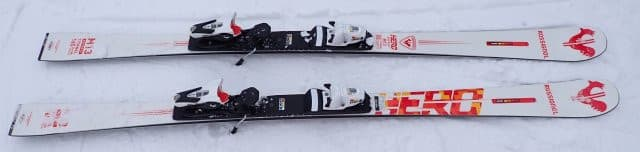
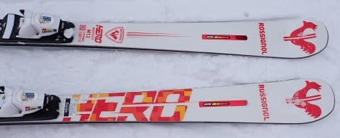
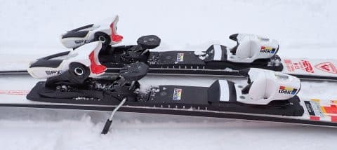
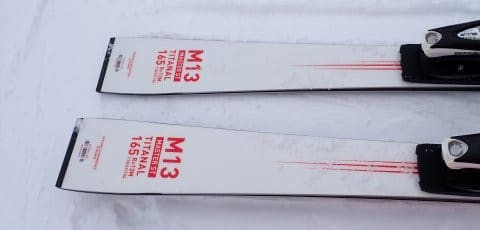

# 2024シーズンモデルのスキー板，試乗レポートその6…ROSSIGNOL HERO MASTER ST M13

📅 投稿日時: 2023-05-25 03:53:08

🏷️ カテゴリ: [スキー板試乗](c0bd8048615710cee890e403a36cc9a2b.md)

今日も朝9時から昼休みもなく

えんえん会議が8本続いたけど．

最後の会議を何とか夜7時半に強引に

終わらせて．

そこから都内へ繰り出し，

本日は実に久しぶりに飲みに行って，

終電で帰ってきました…

そして，終電で帰ってきて酔っぱらって

いるというのに．

さらに一仕事やっつけて，こんな時間（涙）

もう4時近いよ…（泣）

この時期，4時を過ぎると明るくなってくるん

ですよね…

それでもBlog更新．偉い！！！

今日も2024シーズンモデルのスキー板の

試乗レポート．

今回はロシニョール編です．

では，どうぞ～！

〇ROSSIGNOL HERO MASTER ST 165cm

SL，基礎小回り用

SL板をゲレンデ用にマイルドに仕上げたという，

HERO MASTERシリーズの小回り版の板ですが…

競技用SLモデルのHERO SLのR=12に比べれば，

サイドカーブもちょっと変わっているみたいで

R=13mにラディウスが大きくなってます.

基礎スキーヤーを狙っているVIRAGEシリーズ

との狙いの違いがよく分からないのですが．

とりあえず滑ってみると…

おっと．

これは，結構張りが強い板ですね～！

でも，コア材が強くてたわみが出にくいと

いうより，メタルが強い感じの，たわみが

出るけどたわんだ分板に圧が溜まって，

それがビョンと返ってくる感じの，

ばね感が強い板．

ばね感がかなり強く，返りがむちゃくちゃ早い

ので，ターンマキシマムを過ぎてからの板の

返りが結構強く，スピードを出していくと

反復横飛び系のターンになって行きます．

板のRやたわみでまわって行ってすっと

切り替えられる…

というより，

溜まった圧が解放される反動で切り替えて

いくタイプの板．

これは…かなりの小回りスペシャルです．

スピードを出していくと，結構忙しく

なっていきます．

角づけをしないで行くとそこまで忙しく

ならないけど…

小回り板だと思って圧を掛けていくと，

ビョンビョン反動をもらって，かなり

ピッチの早い小回りになっていく板．

弧を深くして回って行くというより，

上体をフォールラインにキープしたまま，

板が左右に吹っ飛んでいくような

キレキレ小回りが得意．

…というより，板がそういう小回りを

自動的にさせてくれます．

うーん．

この板で，あんまり大回りとかミドルターンとか

やろうと思いませんね～．

完全小回りに特化された，小回りスペシャル．

でも．最初に書いたように，フレックスは強く，

そしてグリップもかなり強いので．

スピード耐性は高いです．

かなりのスピードを出した中で，

かなりピッチの速い攻めた小回りが

できるような板．

ずらして滑ろうとか，低速でゆっくり

滑ろうとか，そういう板ではないです．

もう，完全に小回りに特化しているので，

これ一本で何でもできる板じゃないけど…

既に他の板を持っていて，小回り専用に

特化したスペシャル板が欲しくて．

反復横飛び系の反応が早い元気な板が

好きな人は，この板は選択肢に入れて

いいと思います…

## 💬 コメント一覧

### 💬 コメント by (northfox)
**タイトル**: Unknown
**投稿日**: 2023-05-25 12:59:34

私もこのSTを試乗しましたが手強く感じました。

自分の脚前では無理！と一本滑っただけで返却したような。

別の試乗会でSTと同じR22プレート+SPX12のVIRAGEを乗ってみたのですが、STとは対極のオールラウンドに感じました。すっかり欲しくなってしまい今は物欲と戦っているところです^_^;

### 💬 コメント by (Skier_S)
**タイトル**: ＞northfoxさま
**投稿日**: 2023-05-26 01:48:37

手強かったですか…

私にとっては面白かったですが，あまりにも小回りスペシャルすぎて，

これは疲れる板だ…と思いました．

VIRAGE良かったんですね！ぜひ物欲に負けてください！！（笑）

