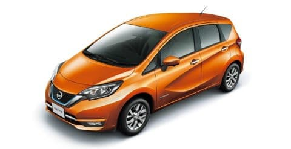

# NISSAN，NOTE e-POWERに試乗してみた

📅 投稿日時: 2017-08-15 02:10:40

🏷️ カテゴリ: [車試乗](c07dec5709d34bd74e1f6cb9c8291061b.md)

ここしばらく．

座間味リアルタイムレポートが

続きましたが．

…またダイビングネタばっかり続くと，

「徒然スキーヤー日記」としての

存在意義を問われるので．

今回はちょっと前に試乗した，NOTE e-POWERの

試乗レポートをお送りします…！←車ネタでも

スキーヤー日記としての存在意義が問われるのでは？？（ツッコミどころ）

えー．

ほとんどの方が知ってると思いますが．

今年マイナーチェンジしたNOTEに

新しく追加された，「e-POWER」．

この車．

電気自動車のリーフのパワートレーンを組み込み．

高価なバッテリーの代わりに，

発電用エンジンを載せ，エンジンで発電した

電気で走るという…

そう．エンジンは車輪につながっておらず，

純粋発電用で．

駆動はすべてモーターで行うという，

「発電機付き電気自動車」とでもいうべき，

シリーズハイブリッド車．

＃シリーズ式というと，DF50を思い出す…←分かる人にしか分からんし，

多少なりともバッテリーがあるので，発電量制御で速度制御するDF50とは違う

とりあえず，珍しい物好きの私としては，

一度は乗ってみたい車だったので．

しばらく前に，NISSANのディーラーに行って，

試乗してきました…

（日産自動車HPより拝借）

試乗車のグレードは，e-POWER X．

e-POWERの3種類のグレードのうち，

真ん中のグレードですね．

まずは，運転席に座ってみて．

内装ですが…

うーむ．

まぁ，e-POWERで+35万円高くなって180万円くらいの

車ですから．

価格相応の内装でしょうか…

決して，高級感をそそるとか．

お値段にしてはがんばってるな，という感じではなく．

まさに価格相応…といった感じ．

でも．

システム起動して，走り出すと．

その印象は一変！

まず，アクセルの踏み出しで…

アクセルラグの全くない，アクセル踏んだ分

その瞬間から出てくる太いトルク！

トルコンスリップやらCVTプーリーの油圧

コントロールやらのラグが全くなく，

すっと車が前に出る気持ちよさ！

うーむ．

3リッターオーバーの車でも，これだけ

アクセルに忠実にスタートする車，無いぞ．

そして，定速走行からアクセルを踏み足した場合でも，

その瞬間から，ロックアップ解除のラグや

変速ショックなく，すっと加速を始める

レスポンスの良さ！

…これは．

変な3Lクラスより，ずっといいじゃないか！

何にしろ，アクセルに対するレスポンスの良さと，

アクセル開度が60～70％程度の領域で走っている際の

上質さは，これは激しくクラスを超越してます…

エンジンの遮音，防振も，このクラスとしては

かなり良すぎる出来．

エンジンOn/Offもそれと気づかぬうちになされてるし，

エンジンが掛かっても，3気筒と思えぬ振動の無さ．

最近の3気筒エンジン，よくできてるな…

エンジン音も良く遮音されていて，急加速時に

エンジンがうなることもないので，車内は高級車に

近い静粛さ．

いや．これはなかなか…．

…ただ，街乗り領域のアクセルのレスポンスの良さに

比べると，ちょっと残念に感じるのが．全開時のパワー感．

1.2t越えの車重が効いてるのか，アクセルベタ踏みにしても，

200PSオーバーの車のような，パンチのある加速をするわけでは

無いですので，そこらへん誤解無きよう．

ただ，全開加速のような激しい加速を使うことは

普段はほとんどないだろうから．

絶対的な加速度を求めず，街乗り領域での

アクセルレスポンスの良さと，段付きやラグの無い

上品な加速感＆静粛性については．

これは，クラス標準を激しく超えていて．

…なるほど，e-POWER，それほど期待してなかったけど．

なかなかやるじゃないか…

と，脱帽．

で．

この車のセールスポイントの一つなのが，

「ワンペダル運転」．

走行モードを，NORMALモードから，

Sモード，またはECOモードにすると…

アクセルペダルを戻すと強い回生ブレーキがかかる

ようになり，完全停止まで行けるので．

ブレーキペダルを踏む必要がなく，

アクセルだけで運転できる…

というものなのですが．

こいつを試してみたところ…

ふむ．

アクセルをちょっと踏み込んだところに，

加速も減速もしないコースティング領域が取ってあり．

そこより踏み込むと，踏み込んだ量加速，

そこより戻していくと，戻しただけ減速…

という感じなんだな．

アクセルを完全に戻しても，急な減速をするわけで

ないですが，街乗りでは十分な減速量が発生するので．

街乗りだと，完全ワンペダルで問題なく

運転できますね～．

完全停止後も，アクセルを踏まないと停止し続けます．

ただ，停止後に一旦ブレーキを踏んだあと，

ブレーキを外したら，

アクセルを踏んでなくてもクリープするという，

ちょっと謎な仕様でした…

でも．

ペダルを踏み変えないで運転できるのは

意外と楽だし．

ワンペダル運転している間は，減速は

回生領域で行われるから．

燃費もいい領域に収まるので，

ワンペダル運転，イイかも…

…って，電気駆動ならではの加減速に関する

インプレッションばかりになりましたが．

それ以外に気になるハンドリングに関しては…

山道を走ったり，コーナーを攻めたわけで

ないので，それほど評価はできませんけど．

街乗りに合わせこんだのか，据え切りや

低速でのステアリング操作の軽さを

重視したっぽい，インフォメーション感に

ちょいと欠けるステアリングフィール．

そして，1.2tを超える車重からくる，

ばね上のゆったり感．

このあたりを考えると，コーナーが続く山道を

ガンガン走って楽しい感じじゃないかな～，

という気もしますが…

ただ，コーナー脱出の加速感は良さそうなので．

うーむ．

これはもう少し走ってみないと何とも…

って感じで．

加速感＆静粛性については，BRレガシィ君より

上かも…と，思ったe-POWERですが．

残念なことに，4WDが無いし．

モーターの高負荷が続き，さらに回生が使えない

連続高速走行では燃費があまり良くなく．

高速道路の走行が走行距離の8割近くになる

私の場合は，現在のLEGACYより燃費がわるく

なっちゃうかも…

ということで．

我が家の購入候補には上がりませんが．

日産が言うように，間違いなくクラスを超える

高級感がある，アクセルレスポンス＆静粛さを

もたらす，e-POWER．

これ，NOTEじゃなくて，もう少し高級車に載せても

いいんじゃないかな～．

## 💬 コメント一覧

### 💬 コメント by (葛飾のS)
**タイトル**: 同感
**投稿日**: 2017-08-15 06:51:39

車好きとしてこの車は試乗しないと、買う気もないのに近所のディーラーさんに行ってきました。

走行感はなかなか面白く、ケチをつけるなら後ろの座面が小さいので広く感じるんだけど長時間はきついかな。

今後セレナに乗るとか言っていたような気が(かなり怪しい情報)します。

### 💬 コメント by (Skjer_S)
**タイトル**: 葛飾のSさま
**投稿日**: 2017-08-16 01:34:49

NOTE e-POWER，試乗されてきたんですね…

私もディーラーで「セレナに乗るかも」という

噂を聞きましたが…

このモーターで，あんな重い車動かせるのかな…？？

低速時は問題ないだろうけど，

ギア比を落とすと高速走行がちょいと心配です…

