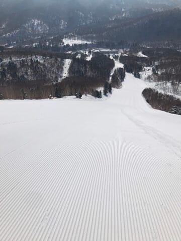

# 3月10日(月)の志賀高原スキー場特派員情報！…晴天，雪よし，ガラガラの最高の1日だったみたい

📅 投稿日時: 2025-03-11 08:50:38

ダメだ…

月曜はダメだ．

昨日も深夜0時前に帰宅後，

死ぬほど眠くて，また気づいたら

床で寝てました…（泣）

なので，今日は朝更新！！

ホントは日曜の志賀高原の詳細レポートを

書きたいところだけど．

時間が無いので，昨日月曜の志賀高原，

特派員レポートで…

まず．

月曜は．

朝からいすっきり晴れで，一日ずっと

すごいいい天気だったみたいです…！！

横手山からの景色，すごいいいですね～！！

そして，朝イチの気温は-7℃とそこそこ

冷えて…

朝イチ，最高のシマシマじゃないですかっ！！

そして，人がいない！

うがーー！！

こんなガラガラの晴天の最高シマシマ，

滑りたい…！！

ただ，この日はちょっと気温が上がった

みたいで，

日差しも強く，気温もプラスだったので…

日がよく当たるコースの雪はちょっと

しっとりしてきたみたいだけど．

ザブザブになるようなことはなく．

何にしろ人が少なく，ラストまでコースは

完全フラットなままで．

天気も良く，最高の一日だったみたいです…！！

…あぁ…

もう一日早く，この天気だったらよかったのに…

とりあえず，志賀はまだまだいいコンディション

みたいですが…

それも明日までかな…

12日の午後から天気が崩れ始め，

夜は液体が降りそうなので…

うーん．

そして，また日曜にも液体が降りそう…

この月曜みたいな天気と雪がずっと

続いてくれないかな…（願望）

すみません．時間が無いので，

コメント回答はまたのちほど…！

## 💬 コメント一覧

### 💬 コメント by (富山県民)
**タイトル**: Unknown
**投稿日**: 2025-03-12 04:33:48

こんにちは。

3月10日は志賀高原に限らずどこのスキー場も快晴だったそうですね。

土日が天気が悪くて月曜日や金曜日が快晴だと悔しいですね。

今週末は天気が悪そうなので今週末はスキーはお休みしたいと思います。

今シーズンは最後に八方尾根に行きたいと思ってます。

### 💬 コメント by (Skier_S)
**タイトル**: ＞富山県民さま
**投稿日**: 2025-03-13 01:48:13

今週末はお休みが正解かもしれません…

ただ，日曜の志賀は雨じゃなく雪になりそうなので，そこまでひどくないかも，と期待していますが．

