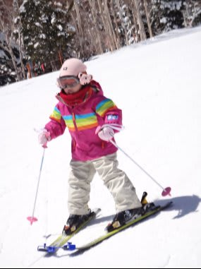
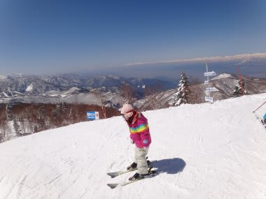

# 娘＠4歳　初スキーから1年

📅 投稿日時: 2012-04-10 01:23:41

🏷️ カテゴリ: [スキー雑談](c1f9d2cb7478308da16419928ea3945e9.md)

「試乗レポートはどうしたっ！」

…って声が聞こえてきそうですが．

今，鋭意執筆中ですので．

今しばしお待ちを…

さてさて．

もう4月になっちゃいましたが．

昨年3月に[初めて一人でスキーができるようになった](ef37cc7d9e89a9024b6505cba0aa5ff82.md)我が娘＠4歳

この3月でスキー暦が1年になったわけですね．

あー．

もう1年か…

早いなぁ．

とりあえず．

今では．一の瀬はメインバーン上部とパーフェクターを除けば，

ダイヤモンドも山の神も全部滑れるようになりましたし．

天気さえ良ければ一人で焼額第1，第2ゴンドラを

滑って下りれるようになりました．

＃天気が悪くて視界が悪いと急斜面を怖がる(;_;)

…まぁ，体力の面から，ゴンドラは一日4本程度が限度みたいですけど．

で．

これまでは，

あまり脚力のない4歳児のことですから．

スキーの先っぽをつなげる[トライスキー](ee1fe22aee6c9eafdf693254a70b223be.md)を使っていたわけですけど．

でも．もうスキー暦が1年になったことだし．

娘も「スキーの先のやつ，取って滑りたい」

と言ってることだし．

外してみますか…

さて．

外して無事すべれるのか…な…

おい．ちょっとまて！勝手に滑り出すな！こけるぞっ！

あれ？

あらららら？

いきなり普通に滑れちゃったよ…

いつものウェーブも…

普通に乗り越えちゃったよ．

あの～．

今日はじめてトライスキーを外したはずなんですけど…

いきなりこんなに滑れるとは．

もう，リフト2本目からは普通にいつものトップスピードで滑るようになっちゃいましたね…

あー．

子供の習得の速さには驚くばかり…

私もこのくらい速くスキーが上手くなりたいものだ！

## 💬 コメント一覧

### 💬 コメント by (雪上の翁)
**タイトル**: Unknown
**投稿日**: 2012-04-11 19:57:34

ん～ 素晴らしいです(^-^)/

バランス感覚がかなり良い感じ。

「余裕」が感じられるボーゲンですね。

将来が楽しみですね～

（＾＿＾）☆

### 💬 コメント by (Skier_S)
**タイトル**: 子供の上達は早いです
**投稿日**: 2012-04-11 23:43:57

まぁ，レジャースキーヤーとしてスキーを続けてくれれば

父親として満足です．

将来もスキーを続けてくれるのかなぁ…

いつまで一緒にスキーしてくれるかな，

と心配してます．

