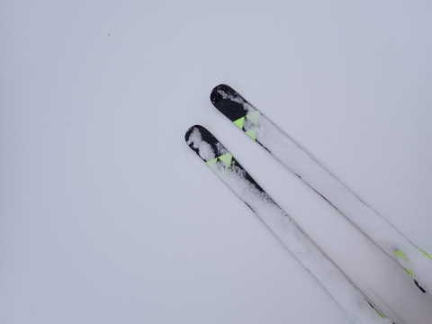
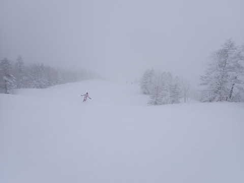
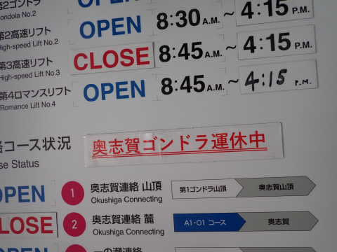
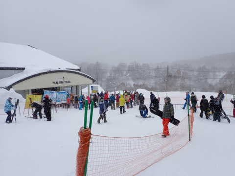
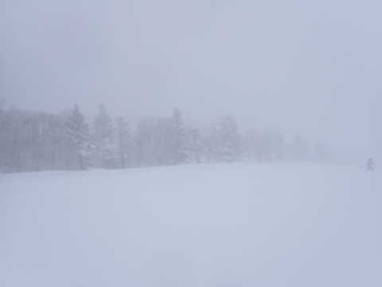
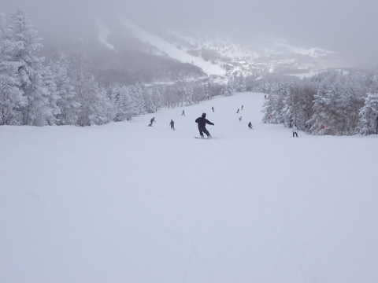
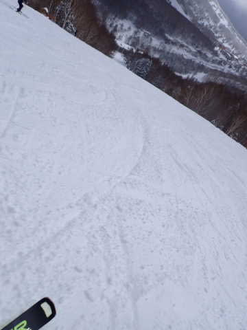
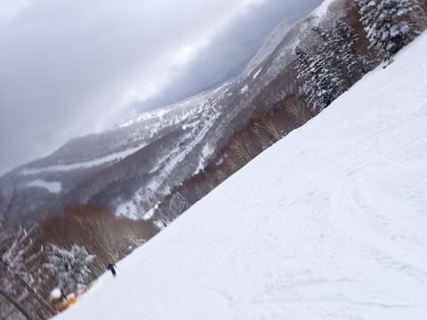
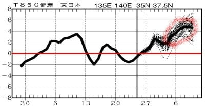

# 2023/2/26(日)の志賀高原スキー場速報レポート！…朝の積雪20cmの軽いパウダー，寒かったけど雪質最高の一日

📅 投稿日時: 2023-02-27 01:21:25

ってなことで．

本日も志賀高原で滑ってましたが，

帰宅したのは深夜0時近く…

だもんで，いつも通り本日の志賀高原，

速報モードにて！

で．

今朝は予想以上に積雪があり，

朝の積雪20cm以上！！

圧雪バーン上にも，5～10cmの

軽いパウダーが乗っていて…

あさイチは，コース全面冷え冷え

新雪バーン！

所によっては新雪が深めのところも

あったけど，雪は軽めなので底付き

する滑りやすい新雪！！

ただ…

朝は結構風が強く，吹雪気味の天気で，

かなり寒かったです…

そして…

焼額は全リフト運転してたけど，

強風のせいで，奥志賀ゴンドラや

高天ヶ原，東館ゴンドラなどは運休に

なっていたようです…．

あ，昼には風が弱まり，奥志賀は午後2時頃

運転再開してました．

で．

天気があまり良くないにもかかわらず．

意外と人がいて…

焼額第1ゴンドラは，朝10時～11時くらい

まで5分待ちくらいで，第2ゴンドラは結構

待ったようです…

あ，昼からはゴンドラ・リフトともほぼ

待ちなしでした！

午前中は時折かなり強く雪が降ることも

あり．

最高気温も-10℃を越えない寒い一日で，

昼過ぎまで雪が降り続けてましたが…

午後2時過ぎには，雪は止んで，

時々薄日が差すタイミングも！

でも，冷え冷えのおかげで，終日

雪質は志賀のトップシーズンの，最高

粉雪でした～！！

GSコースなどは午後は荒れてきたけど．

パノラマやサウス，唐松コースは最後まで

大回りができるコース状況でしたよ～！！

…と，今日は寒かったものの，その

おかげで終日最高の雪質で．

かなり楽しめました～！！

で．

明日の27日(月)は，このいい雪で

さらに晴れるので，楽しめそうですが…

28日(火)は晴れて気温が上がるので，

雪が緩みそう…（涙）

そして．

そのあとは…

…

…

…うん．

これは見なかったことにしよう…

もしかしたら．

これほどの冷え冷え雪で楽しめるのは，

今日が今シーズン最後だったのかもしれない…

## 💬 コメント一覧

### 💬 コメント by (a-island4138　ゆうさん)
**タイトル**: Unknown
**投稿日**: 2023-02-27 15:39:44

Sさんお疲れ様です。　日頃の行いが良かったから結果が良かったのでしょうね❄　私は長年の夢はお預けで来シーズンを待つことにします。　私も本日、明日と瑞穂ハイランドでスキー🎿楽しんでいます。

こちらは、ガリガリ君ソーダみたいなバーンですよ＼(^o^)／

### 💬 コメント by (副院長)
**タイトル**: Unknown
**投稿日**: 2023-02-27 20:27:59

日曜日、ラストの3高で、上がりましたが、S様はお帰りになったと聞きました。また、来週よろしくお願いします。

で、今日、月曜日は、申し訳ありません、サイコーでした。五竜からの友人と、午前中は、ヤキビ、奥志賀、午後は横手で富士山まで見せておきました。

### 💬 コメント by (レインボー75)
**タイトル**: Unknown
**投稿日**: 2023-02-27 21:15:38

月曜日の志賀高原情報

昨日の新雪が圧雪されて、おそらくシーズン最後の勘違いバーンかと。

そして初めて狂暴なアール30の板(183cm)に挑戦。こんな老人に履けるのか？

硬い！ワンターン目に外足がとられたけど、直進性抜群。荒れた奥志賀エキスパも気にならない感じ。でも、ターンにちょっとのミスがあると、結果に表れてしまう手ごわい板。正しいターンの練習には最適かなと。重いので疲れたのか、昼食後は足が売りきれて膝が曲げられない有り様。

私のようなか弱い老人には、朝の一番で快感を得るための板かなあ。

明日はアール25を使ってみよう。でもこれはもっと重い。悩ましすぎます。(どうでもいい悩みですよね)

### 💬 コメント by (Skier_S)
**タイトル**: 明日から気温が上がるよ
**投稿日**: 2023-02-28 00:28:51

＞ゆうさんさま

瑞穂ハイランドは楽しめてますでしょうか．今日は気温が上がったものの，

天気も良く楽しめたんじゃないでしょうか…

明日は気温が上がって，完全春スキーになっちゃうかも．

＞副院長さま

なんと．

昨日はこの私がラストまで滑らず切り上げました…（涙）

いや．

最後まで滑りたかったけど，家族スキーだったので，家族サービス優先で…

＞レインボー75さま

私の借りた188cmのR30はかなり良く曲がって滑りやすかったですよ…！

今日は天気も良く楽しめたようですね…

でも，明日から気温が上がって，雪が緩み始めてきそうです…

2日はまた1日ちょっと冷えてくれそうだけど，その後3日からまた気温が

上がりそう（涙）

日曜のあれだけの冷え冷え雪は，今シーズンラストかも…

