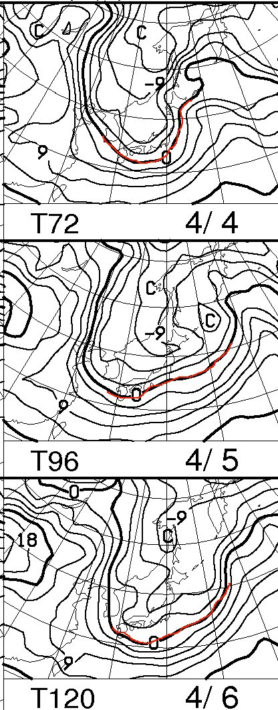
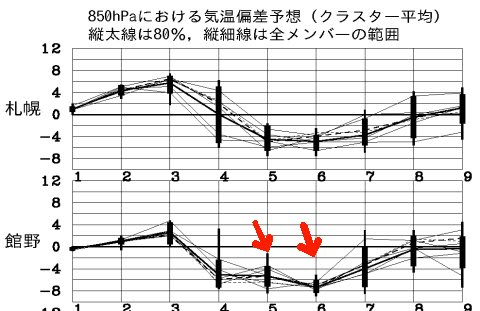
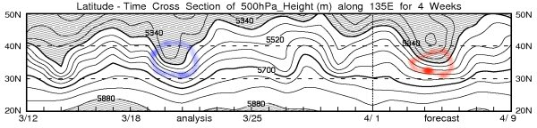
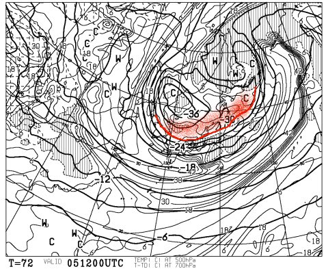

# 定例！この週末の志賀高原は…をを！4月にしては，良さそうな冷え冷えコンディション

📅 投稿日時: 2014-04-03 02:45:12

えー．

4月に入り．

予想通り，天気予想の読者が一気に

減ってしまっている今日この頃ですが．

皆様いかがお過ごしでしょうか．

…で．

この今週末ですが．

うーん．

来ますね．

来ますよ．

そう．寒気が．

…冷えますよ～！！

こーんな感じで．

金曜日の4日から，土曜5日，日曜6日とも．

850hpaの0℃線が日本の南まで下がってます．

んで．

志賀高原には，マイナス6度線がかかっているので．

朝イチの山頂は，マイナス10度近くまで冷えそう！！

4月だというのに…

いい感じの冷え具合！

んで．こんな感じで…

この土日は，平年比4度から8度冷えそうですね～．

そして，500hpaの高度線も…

赤くマークしたように，5400m以下の網掛け部分が，

北緯35度くらいまで下がってきてます！！

…これは．

青くマークした[21日が，ありえない冷え冷えの吹雪](ed4ce5b5a0603a79b18d7c47ceb687ccc.md)になり，

次の日が最高の冷え冷えになったことからわかるように．

5400m線がこのくらいまで下がると，冷え冷え雪が結構積もる

目安になります…

これは．

4日夜から，冷え冷えのいい雪が降り続き．

5日の朝の志賀高原．

けっこういい雪が積もっていそうな予感！

さらに．

さらに，だ．

5日の500hpa図を見ると…

ををを！

また，来た！

来たよっ！！！

この時期としてはありえない，上空のマイナス30度の寒気が．

やってきますっ！

これは…結構な雪の目安．

…でも，志賀高原は西風になりそうな感じなので．

ドサドサとは積もらないでしょうけど．

冷えたいい雪がちらつく一日になるかな～．

日曜も，冷え続けて．

雪がちらつく一日になるかな～．

ってことで．

あったかい…というより，暑かった先週とは打って変わり．

土曜：前日から降り続いた雪が積もって，マイナス10℃近くにまで

　冷え込み．朝はこの時期としてはありえない，冷え冷えの

　新雪がつもってるでしょう．

　時々雲が切れて，雪がやんだり薄日が差したりするか

　もしれないけど．基本的に雪がちらつく一日．

　寒いよ！昼間もマイナスでしょう．

　午後に向かって，ちょっと雪が荒れていくかな．

　雪が荒れると，下地のアイスバーンが出てくるかも．

日曜：この日も冷え冷えの一日．

　朝は，うっすら新雪に圧雪がかかった，快適大回りバーン．

　朝のうちは曇り～小雪がちらつく，って感じかな～．

　午後はもしかすると日が射してくるかも？？

　この日も終日冷え冷えで，昼間も氷点下．午後までいい雪質を

　キープ！

　すっきり晴れないかもしれないけど．

　4月としては，これだけ冷えていい雪質だったらGood

　じゃないかな？？

…って感じで．

焼額第1ゴンドラが営業する，最後の週末．

悔いが残らないように，滑りまくるのだ！
