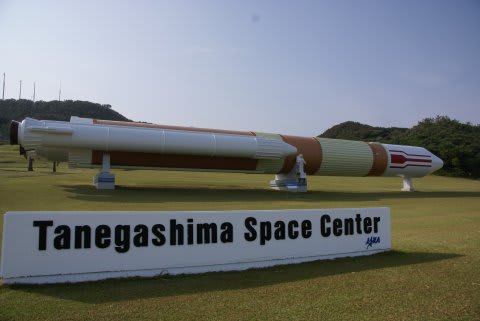

# うむ？今週末はJAMSTECの一般公開か…

📅 投稿日時: 2013-10-11 03:13:49

🏷️ カテゴリ: [日記](cc4b5682fb7b8b144980957a978653fb0.md)

…今日は帰宅が遅いので，

記事を書いている暇がないので，小ネタでも…

＃と思って書いてたら，いつもの記事と同じくらい長くなってる…(;_;

えー．

私は，いろんな研究施設の一般公開を見るのが好きでして．

これまでに，JAXAつくば宇宙センター一般公開やら…

(閉鎖環境適応試験設備．宇宙長期滞在の訓練用の設備．

このほか，撮影禁止だったので写真が無いけど

ISS「きぼう」の管制室とか，組み立て途中の人工衛星の実機とかが

見れました…)

種子島宇宙センターやら，

港湾空港技術研究所やら，

(世界最大の津波発生装置)

(自由に波を発生させられる超巨大模型)

(滑走路の構造を研究するための飛行機の模擬車輪)

その他，いろんな研究設備の一般公開があると，結構見に行ったり

しているのですが．

今週末は横浜の[JAMSTEC(海洋研究開発機構)の一般公開](http://www.jamstec.go.jp/j/pr/public_open/yokohama/2013/index.html)があるじゃないか！

JAMSTEC横浜は，これまで行ったことないなぁ…

地球シミュレータが見れるし，いろいろ面白そうなセミナーもあるし．

子供向けには，ミニ水族館とかお魚タッチプールとかもあるみたいだし．

行ってみようかな～．

…でも，今年の[JAXAつくば宇宙センター](http://fanfun.jaxa.jp/event/detail/635.html)の一般公開．

10月19日か…

Yetiのオープンと重なってるので行けないなぁ…．

ちと残念．
