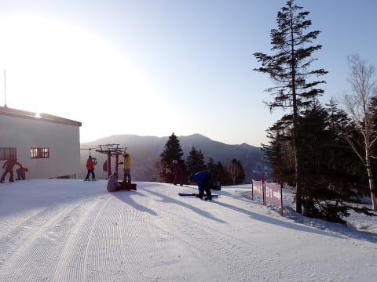
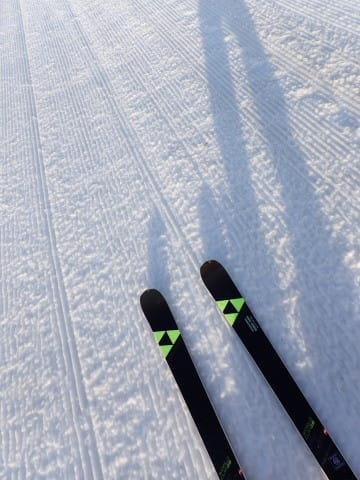
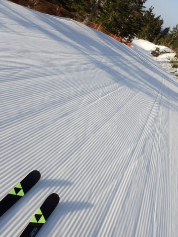
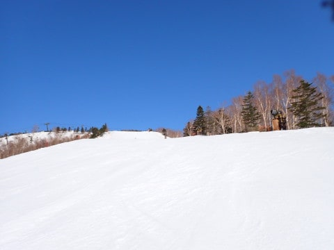
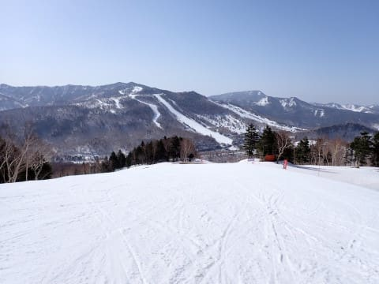
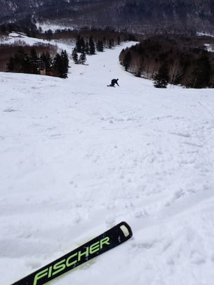
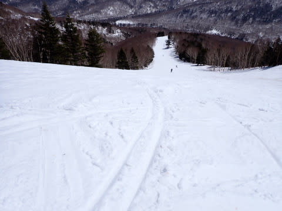
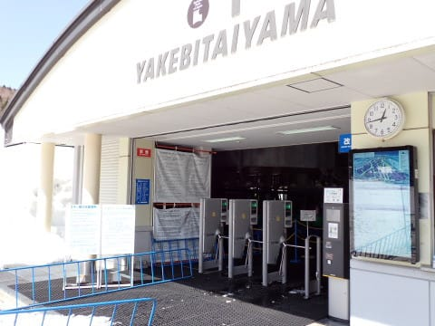
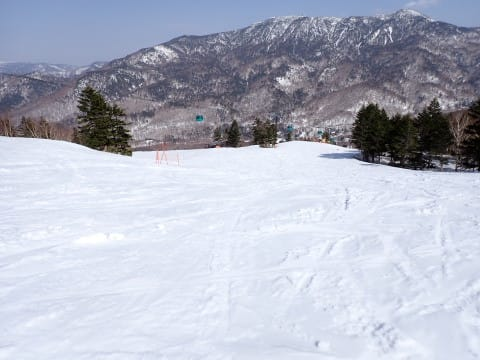
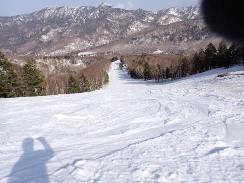

# 2024/4/14(日)の志賀高原焼額山スキー場の速報レポート！…気温は夏かと思うほど暑かったけど，早朝はかなりGood！午後は雪は緩んだけどガラガラでそこまで荒れず

📅 投稿日時: 2024-04-15 01:40:46

🏷️ カテゴリ: [2024スキー滑走日記](c453f687e8a0f05679e95831d0a02cd0c.md)

ってなことで．

今日も営業終了まで滑り倒してきて．

その後洗車やらなにやらやって帰宅後

片付けをすると，いつも通り深夜

パターン…（泣）

今日は朝5時前起きで早朝から滑ってた

ため，かなり眠いので．

明日の仕事もあるし，今日も帰宅日

恒例の速報モードにて，本日の

志賀高原のレポートです！

えー．

まず．

さっきも言ったように．

本日は朝6時スタートの焼額の

早朝営業から滑ってきました～！

6時営業開始のゴンドラで，まだ

昇ったばかりの朝日に照らされた

ゲレンデに出ますが．

早朝はそこそこの人がいて，営業開始を

待っていた人は50人を余裕で越えて

ました…

で．

早朝から気温はプラスで，かなり暖か

かったけど．

明け方に冷え込んだのか，早朝の

ゲレンデはかなりカリカリの硬め

バーン！

早朝から，GSコースとパノラマ・サウス

コースの2本のコースが滑れて人が

分散するので，人がいないクリアな

コースが滑れます！

硬いのが嫌いな人は辛いかもしれないけど，

今朝はスピードが乗る硬め斜面を，

周りに誰もいないので安心してかっ飛ばせ

ました～！！

営業開始後から1時間，朝7時くらいには

雪の表面が緩んでちょうどいい感じに

なってきて．

晴天の中，こんな無人の快適バーンを

滑れるとは…！！

焼額限定券なら，一日券でも早朝から

滑れるから，絶対早朝から滑るべき！！

今日は朝にかなり硬くしまったバーンに

なったからか．

気温が高い晴天だったわりに，

10時くらいになってもバーンはそこまで

ひどく荒れず，気持ちよく大回り

できるバーンコンディション！！

…そして，人がいない…

さすがに10時を過ぎてくると，

バーンもところどころ荒れ始めて

来て，標高が低い部分は板の滑りが

悪くなってきたけど．

滑りが悪いのはゲレンデ下部の一部

だけで．

大体のところは板が滑ってくれたし．

今日は昼間は15℃を越えるという，

標高2000ｍなら7がつくらいの気温じゃ

ないか？という異常高温で雪が緩んだ

ものの．

人が少ないからか…

昼になってもバーンの荒れはせいぜい

この程度．

全然問題なく大回りできるレベル！！

そして．

今日もゴンドラ・リフトともに飛び乗りの

ガラガラだし…

早朝はちょっと人がいたけど，8時を過ぎると

むしろ人がいなくて寂しいくらい．

GSコースも，午後になってもそれほど

バーンが荒れなかったので，無人コースを

飛ばしたい放題！

早朝営業が始まると，午後3時半という

早めの時間に営業終了となる焼額山ですが…

営業終了時間のラスト1本でも，バーンは

そこまで荒れてませんよ！！

…でも，このパノラマコース，右端の

コースぎりぎりのところ，そろそろ土が

出始めてきましたね…（泣）

ってなことで．

本日も早朝6時から営業終了の15時半まで

9時間半．

トイレ休憩以外休まず止まらず

滑り続けてしまいました…

で．

焼額山は，まだオープンしている

コースは幅いっぱい滑れますし．

雪はたっぷりありますよ～！！

GSコースも数か所，雪が薄く

なってきているところもあるけど…

おそらく，来週までは全く問題なく

滑れそうです！！

ただ…

高温が続きそうなので．

再来週のGW前半は微妙．

おそらく滑れると思うけど…

うーん．

これからGWまで，平年並みでいって

くればいい感じで滑れそうだけど．

今のレベルの高温が続けば…

再来週のGW前半は，何とかぎりぎり

滑れるかな…というレベル．

せっかく，思いのほか多かった3月の

積雪でいい感じになってくれたので．

なるべくなら高温が続かずに，

せめて平年並みになって，GWまで

滑れることを祈るばかり…

ってな感じで．もう深夜2時近く（泣）

今日は早朝から起きてて眠いので，

もう寝ます…

おやすみなさい…←速報と言っておきながら，かなり長い

レポートを書いてるからじゃないの？

## 💬 コメント一覧

### 💬 コメント by (横須賀のウルトラセブン)
**タイトル**: セブン二人は４時間
**投稿日**: 2024-04-15 05:24:26

ヤケビの春スキーはホント最高ですね！この時期に

２キロを超えるコースをノンストップで滑りきれ、

混雑のストレスがないので、真冬のトップシーズン

よりいいと思います◎僕たちは体力不足で、Sさんに

怒られそうな10時で終了(;^_^A～セブン家は既に

スキー予算を使い切り、「春スキー雪はあるけど金が

ない」状況ですが、終了宣言はまだです！！

### 💬 コメント by (Skier_S)
**タイトル**: ＞横須賀のウルトラセブンさま
**投稿日**: 2024-04-16 02:04:42

いや…焼額の春営業，1ゴン早朝営業とか最高ですよね！

6時から10時まで4時間も滑れば（普通の人なら）十分満足できるかと…

まだまだ雪があるので，ぜひまだまだ終了宣言せずに滑りに来てください１

