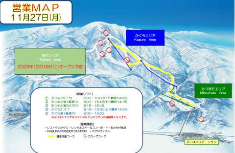
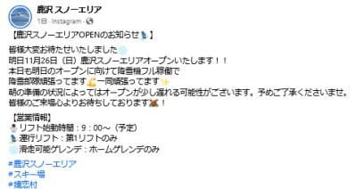

# やはり今年も開催，物欲選手権！…今回はスキー場で開催？？その3

📅 投稿日時: 2023-11-27 04:56:05

ってなことで．

大量な宿題やらやらねばならぬことがあり，

スキーに行けなかった今週末は，

家で仕事やらタイヤ交換やら，いろいろ

してました…

で．

26日の日曜にオープンしたかぐらスキー場．

オープン日はゴンドラ故障でみつまた

エリアだけの営業でしたが…

ゴンドラが直って，月曜からは

かぐら～みつまたまで営業するようです！！

（[かぐらスキー場ホームページ](https://www.princehotels.co.jp/file.jsp?id=408281)より）

そして，

鹿沢スノーエリアも26日にオープンしたようですね…

（[鹿沢スノーエリアFacebook](https://www.facebook.com/kazawasnow/posts/pfbid02m1PeGDRnBb5qdudaXt24e4KQeM4zCuchcxiytqify6r1yrCySK1cMa6QU4ttS2Yol?ref=embed_page)より）

また，29日からしばらく，少なくとも12/3までは

冷えそうなので…

これからも次々スキー場はオープンしていくと

思います…！

今週末は，かなりのスキー場がオープン

するんじゃないかな？？

…ってなことで，本題へ．

本日は，前回から2週間お待たせしてしまいましたが，

[前回の続き](e6de5809ea7fb10f1da1039545df17a42.md)の物欲選手権．

実は前回で終わらず，いったいこれから

何が起こるのか？

これが今回のラストです！

ーー

アナウンサー　「ということで，

　『第1回 スキーヤーの物欲を刺激する

　のがうますぎる危険なスキーショップ

　社長と対決して，物欲にまみれた

　スキーヤーが買い物をせずに我慢できるか

　選手権』

　でしたが．

　3セット持ってきた試乗板のうち，

　2セット購入するというSkier_S選手

　の大敗で終えました！」

解説「…あれ？」

アナウンサー「何かありましたか？」

解説「…ちょっと待ってください」

アナウンサー　「なんでしょうか？

　お店じゃないから，ブーツもウェアも

　ないので，これで終わりのはずですが…」

解説　「いや…

　なんだか，何かを予約してるよう

　なんですが…」

アナウンサー　「え？予約…？」

解説　「鈴木社長が特別に個人で

　輸入した，Skier_S選手が

　今履いているHEADブーツに使える

　フォーミングインナーがあるという

　話を以前からしていたようですが…

　どうやら，このフォーミング作業の

　予約をしているみたいですよ…！！」

アナウンサー　「ええ？？

　ブーツのフォーミングインナー

　ですか…！？」

解説　「それもインナーだけじゃなく…

　ブーツシェルも抑えにかかって

　ます…！！」

アナウンサー　「え？今，Skier_S選手が

　履いているHEADブーツに使える

　フォーミングインナーなんじゃ

　ないんですか？」

解説　「どうやら，今履いているのと

　全く同じHEADの RAPTOR WCR3を

　もう一つ買って，それにフォーミング

　するようです…

　バカだ…これはバカだ…」

アナウンサー　「な，な，な，

　なんということだ～！！

　同じブーツをもう一足買うとは！！

　さすが物欲代魔王の名に負けない

　見事な負けっぷり！

　3本目の板は買わずにかすかな理性を

　見せたと思ったら，

　それを越えるぶっ飛びの大敗です！！

　新ブーツとフォーミングインナーという，

　板よりずっと高い大物に行って

　しまった～！！」

解説　「これは…私の予想すら

　大きく超えました…

　まだ今のHEADブーツを2シーズンしか

　履いてないのに，また同じブーツを

　買うとは…

　それもフォーミング付きで…

　すごい…

　すごい大敗すぎる…

　ありえない…」

アナウンサー　「それも，今持って

　いるブーツと全く同じブーツを

　もう1セット買うとは，

　普通の人ならなかなかやらない

　見事な負けっぷり…っ！！

　さすが，物欲の神！

　これが物欲だという模範を人々に

　示しています！」

解説　「いや．それ，悪の模範ですから」

アナウンサー　「2シーズン履いたら

　インナーがかなりへたるので，

　インナー買い替えはわかりますが…

　まさかブーツ本体まで買い足すとは！！

　もう，物欲の神としか言いようが

　ないですね！！板尾さん！！」

解説　「神って…

　負けてるのに称えてどうするんですか」

アナウンサー　「今回，これまで

　使っていたHEADブーツのシェルが

　[かなり歪んできていた](e1f002012636820e67f6e0047c9d3f736.md)というのもあり，

　シェルごと買うことにしたんじゃ

　ないでしょうか？」

解説「どうやらそのようですが…

　しかし，Skier_S選手が持っている

　ブーツに使えるHEAD純正

　フォーミングインナー，日本国内

　では販売していないものを，

　わざわざ個人輸入するとは…」

アナウンサー「やはり鈴木社長，今回も

　Skier_S選手の物欲ポイントの突き方，

　見事すぎますね～！！！

　見事にSkier_S選手の物欲を加速

　しています！！」

解説「というより，基本的に勝負に

　なってませんね．

　鈴木社長の圧勝というより，

　Skier_S選手が自ら負けに行っている

　としか思えませんね…」

アナウンサー　「ということで．

　今回，板2セットにブーツ＆フォーミング

　インナーという．

　自ら負けに突っ込んでいく形で，

　これまでの選手権の敗戦額の

　最高値を更新するという見事な

　負けっぷりを見せてくれたSkier_S選手．

　次回はどんな負けっぷりを見せて　

　くれるのでしょうか？

　また次回をお楽しみに！！」

解説　（これ，すでに公式にも

　単にSkier_S選手の負けっぷりを

　見る選手権になってたんだ…）

## 💬 コメント一覧

### 💬 コメント by (愛読者)
**タイトル**: Unknown
**投稿日**: 2023-11-27 12:05:04

Sさんはもはやエキッブさんの広告塔ですからね。SAJデモよりずっとファンの物欲を刺激しまくりますから。HEADからもアドバイザー料をもらってもいいくらいですよ。ちなみ私はSさんに憧れてWCR140Sを買いました。HEADの選手用のフォーミングインナーすごく気になります。もっと早くに公表してくれたらよかったのに...

### 💬 コメント by (カンタロス)
**タイトル**: Unknown
**投稿日**: 2023-11-28 06:39:12

Sさま、こんにち。

安定（？）の負けっぷりですね（笑）

これにくらべたら私が買ったG9FIS-W 188センチ19MODなんか可愛いもんです。（と、物欲に負けた自分を正当化（笑））

### 💬 コメント by (Skier_S)
**タイトル**: コメント回答遅れました
**投稿日**: 2023-11-29 04:22:57

＞愛読者さま

今度は私が他人の物欲を刺激していますか（笑）．

HEAD純正のフォーミングインナー，もしかしたらまだエキップさんに

残ってるかも…

＞カンタロスさま

もう，安定の負けっぷりです．

いや，でも大物の板を行っちゃった人は，私のことをとやかく言えないはず…（笑）

