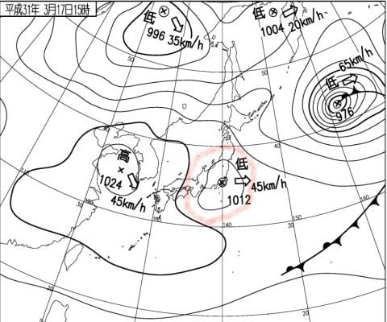

# 2019/3/17(日)の志賀高原スキー場，速報モード…冷え冷え＆最高雪質の一日！朝は晴天なれど，昼前から曇り，時折雪の天気

📅 投稿日時: 2019-03-18 03:04:04

🏷️ カテゴリ: [2019スキー滑走日記](c3e4496fc0fb7f9c17ff21214a35b1ace.md)

日曜のいつものパターンですが．

本日も帰宅は日付が変わった後で．

それから洗車やら洗濯やらなにやら

やっていると，もうこんな時間…（涙）

ってことで．

日曜深夜恒例，いつも通りの速報モードでの

ゲレンデレポートをやるわけですが．

その前に，

うげげげげ！？？

なにか，恐ろしいものを

見てしまったのですが…

うぎゃーーーーー！！

なんだ，これは！！

21日木曜の850hpa気温，グラフの

上を突き抜けそうなほどの高温に

なりそうなんですが…（泣）．

そして．

21日の地上天気図を見ると…

降水域が志賀高原にか

かってますよ…（涙）

これは．

来ます．

液体が空から落ちてきます（激涙）．

歌っても踊っても，どうにかなる

レベルではなさそう（涙）

金曜以降は，平年並みの冷え込みに

戻りそうなので…

…これは，木曜午後からの雨で融けた雪が．

金曜以降にアイスバーン化

しそうな感じ…（泣）

金曜は雪がぱらつきそうなので．

金曜の雪で，アイスバーンが隠れて

くれればいいんだけど…

とりあえず．

志賀高原でも+10℃くらいに

なってしまいそうな木曜日．

天から降ってくるのが，液体では

無いように．

みんなで祈り，踊りましょう！！←気温10℃で雪が降ってきたら，それは物理現象を超越した奇跡だから

という，悲しいニュースのあとは．

今日の志賀高原の速報レポートです！

えー．

まず．

昨晩夜遅くまで飲んでいたにも

かかわらず．

日が昇る前から，早朝営業の

ゴンドラに乗って，山頂に向かう

わけですが．

…本日の焼額の早朝は．

真冬並みの最高級のシマシマ

バーンでした～！！！

朝のうちはピカピカ晴天で．

雪質も，トップシーズンの，最高

冷え冷え雪！！

最高！

シアワセっ！！！

…と，思っていたら．

午前9時過ぎから，曇り空に

なっちゃいました（ちょっと残念）

うーむ．

すっきり晴天は，朝のうちだけだったか…

で．今日は．

ジャイアントから…

サンバレーまで，いろいろ

遠征した一日でしたが．

標高が一番低いサンバレーまで，

真冬の最高雪質でしたよ～！！

それどころか．

昼過ぎには，結構な勢いで

雪が降るタイミングもあり…

ゲレンデに雪が積もっていきますが．

一の瀬付近では．かなり冷え冷えの，

いい感じの雪が積もっています！！

いや…

3月下旬になろうとしているのに．

このゲレンデコンデションは，

恵まれてるわ…

この日の午後は結局，

雪が降ったり，

ガスが出たり，

そして時折日が射すという．

目まぐるしい天気でしたが．

ゲレンデ全体に雪が良くて．

いやーーーー．

良かった．

かなり恵まれた一日でした…

また明日，詳細レポートやります～！

PS.今日は小雪＆曇りのち晴れの予想だったのに…

　実際は晴れのち曇り＆雪の天気で．

　予想，外しました（泣）．

　…あとで実況天気図を見てみると．

　金曜段階では予想されてなかった，

　こんな低気圧が発生してやがりました…

　これは，予想が外れるわけだ…！←予想を外したことを正当化しようとしている

## 💬 コメント一覧

### 💬 コメント by (パパは初心者)
**タイトル**: Unknown
**投稿日**: 2019-03-18 12:22:47

お疲れ様です。

前泊して土曜は早朝から娘と頑張ってました。お会い出来ず残念でした。

ゴンドラでご一緒した方に朝の道路状況を聞き、遅くとも7時半には志賀の坂は登れ！とのアドバイスでしたが、、、ハードル高！

来季はさらに1時間早起きかな、、

### 💬 コメント by (kato)
**タイトル**: Unknown
**投稿日**: 2019-03-18 14:10:37

今シーズンは３月のコンディション良いですね。土曜日にイチゴンから何度かお姿お見かけしました。次回は月末に行く予定です。もしお会いできたらよろしくお願いします。

### 💬 コメント by (若杉勲71)
**タイトル**: Unknown
**投稿日**: 2019-03-18 19:11:22

今日はレインボークラブ員が、ヤケビ、奥志賀に感動したあと、横手で再感動してきました。私は憧れの妻（私の勝手のためなかなか会えないため）を湯田中に連れてきました。明日からゆみりんご夫妻化します。今日はみんなて猪鍋でーす。しっかり休養なさってください。

### 💬 コメント by (若杉勲71)
**タイトル**: Unknown
**投稿日**: 2019-03-18 21:57:13

書き忘れました。ほ○だ、か○う、ご夫妻が不在の志賀。オリンピックポールポジションは、当然のごとく我がレインボークラブ員。私が不在でももっと腕の、失礼、足の立つ会員がやってくれました。

でも、あの二組には、スキーに関しては全てにおいて勝てません。あんなふうにかっこ良すぎるようになりたいものです。

### 💬 コメント by (cedar164)
**タイトル**: Unknown
**投稿日**: 2019-03-18 22:38:09

ダイヤモンドナイターで2月に引き続きご一緒させていただいた子連れスキーヤーです。

銀のお札ありがとうございました。さっそく魔除けに子供たちのヘルメットに貼りました。

一番下の娘（5歳）も「Sさんに会いたい！」と叫んでいるので、来年しっかり仕込んで連れていきます。

夜勤明けでも「瞬間移動」すれば土曜のナイターと日曜一日滑れるんだと気づかせてくれたSさんとSさんのブログに感謝です。

また来年お会いできますように…

### 💬 コメント by (Skier_S)
**タイトル**: 今週も冷え冷えにならないかな…
**投稿日**: 2019-03-19 02:20:08

＞パパは初心者さま

今回はお会いできませんでしたね…

こちらも早朝から滑っていたのですが．

今シーズンの志賀はこれで終わりですか？？

まだまだGWまで滑れる志賀高原ですよ～！！

＞katoさま

この週末はお会いしませんでしたね…

でも，イチゴンから見られてたんですね（笑）．

これだけいいコンディションが毎週続いて

欲しいところですが，残念ながら今週は雪が緩みそうです（涙）．

＞若杉さま

今日は良かったんですね…

で，奥様も志賀にいらっしゃったんですね．

一週間ほど滞在されるんですか？

ポールポジション競争はしばらくお預けですね（笑）．

でも，お二人でゆっくり滑るのもいいものかと…

＞cedar164さま

ダイヤナイターではお世話になりました～！

土曜は遠征したので，どこかでお見かけするかな，

と思いましたが．

お会いできませんでしたね…

また次の機会に，下の娘さんともお会いできればと

思います．

また来シーズン，お会いしましょう～！

### 💬 コメント by (はやと)
**タイトル**: Unknown
**投稿日**: 2019-03-19 21:34:30

はじめまして、昨シーズン１ゴン山頂でＧｏｋｕさんとご一緒のところをお声掛けさせていただきました者です。いつもブログを拝見していますが、特に週末天気予想は役にたっています。そして昨日焼額に日帰りで行って来ました、毎週末と言う訳にいかずシーズンに何回かの志賀高原なので、天気予想を見ながらタイミングを計っていましたがＳさんの予想通り大当たりでした（行った甲斐が有りました）。

私より若いと思いますが、無理（仕事の）しないようにして下さい。これからも期待しています。

### 💬 コメント by (Skier_S)
**タイトル**: ＞はやとさま
**投稿日**: 2019-03-20 01:58:14

お久しぶりです～！

月曜，志賀に行かれたんですね．

大正解だと思います．

3月下旬と思えないいいコンディションだったかと．

今シーズン，まだ志賀高原にいらっしゃる機会は

ありそうでしょうか…

また志賀高原でお会いしましょう～！

