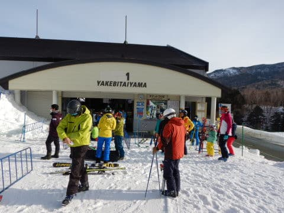
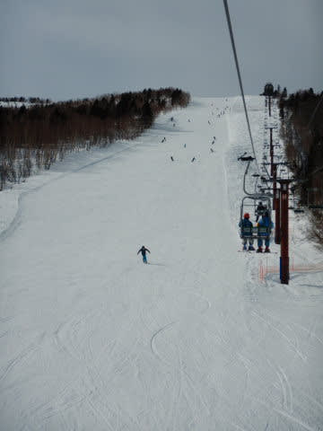
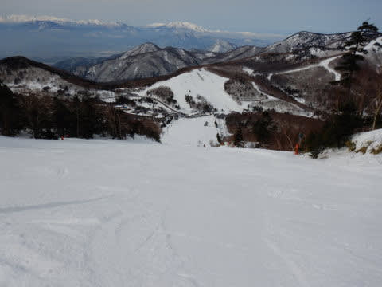

# 2020/2/15(土)の志賀高原スキー場は…晴れたけどゲレンデは完全に春（涙）こりゃ3月末から4月ごろのゲレンデだよ（泣）

📅 投稿日時: 2020-02-15 22:02:02

🏷️ カテゴリ: [2020スキー滑走日記](c282e9230de179e245c7334eabeb0a3b3.md)

ということで．

いつも通り本日も志賀高原にきていますが…

…

…春ですねぇ…

…

って．

まだ2月中旬ですがな！！！

普通なら，トップシーズン真っ盛りの，

凍死するほど寒い日々が続く時期ですがな！！

何で，朝からプラス気温なんだ！！！

…とても2月の志賀高原と思えない…（涙）

あぁ…先週とは違いすぎる…

ってなことで．

果たして，本日の志賀高原はどんな感じ

だったかというと．

まず．

朝，志賀高原に登ってくる道．

雪はほとんど解けてなくなってますが．

…スキー場近辺は，ところどころ

雪解け水がテュルンテュルンに凍った

テュルンテュルン道路だったので，

ご注意を…！！

テュルンテュルンで車を滑らせながら，

いつも通り焼額にやってくるわけですが．

今日は営業開始時に待ってる人はそれ程

多くなかったかな…

そして．

山頂に出ると…

晴天！！

…ってか，ちょっと春霞がかかったような

感じで…

で．

あさイチの山頂の気温．

0℃ですか…（涙）

山頂で，さらに朝イチで0℃とは…

とても2月とは思えない．

今日は一体何度まで上がるんだ？？（戦慄）

でも．

一応朝イチのゲレンデはシマシマっ！！

一応，朝早くは氷点下まで落ちていたので．

朝イチはそこそこしっかり締まった

シマシマっ！！

…ではあるものの．

ちょっと表面が崩れていくような

シマシマで．

1本目，2本目は良かったけど．

3本目，4本目くらいになっていくと．

表面が崩れてコロコロになり．

思ったほど楽しくない感じに…（涙）

ただ．

朝からぐんぐん気温が上がり．

さらに，天気が良いので，

発生したコロコロは，殺人コロコロとは

ならずに．

踏むと潰れていく，春の重い雪の

カタマリになっていき…

さらに，コース上の人口密度も増えていったので．

朝イチはフラットだったゲレンデが．

春の重い雪のように荒れていき．

あっという間に，3月末の真昼間のような，

重い雪の凸凹バーンに…（涙）

えーと．

今，2月なんですが…

普段なら，-10℃以下の極寒に

震える時期なんですけど！？？

景色も，晴れているのに．

すっきり遠くが見通せる冬の晴れではなく．

完全に春霞のかかったような，

春の景色です…（泣）

日差し＆高温のため．

朝から春のやわらか雪になってしまったので．

午前10時の段階で，ここまで荒れてしまい

ました…

…厳しい．

これは厳しい…

…

…

…あれ？？

ここは…奥志賀！？？

なぜ，焼額以外に？？

そう．

北斜面の奥志賀なら，焼額よりマシかも…

と思って，奥志賀はエキスパートコースにやってきましたが．

うむ．

朝10時過ぎでは，まだしっかり締まった

いい感じのフラットバーン！！

さすが北斜面！！

人もそんなに多くないし．

これはいい感じ…！！

と．

しばらく楽しんでましたが．

…どうやら，今日の高温＆晴天をなめては

いけなかったようです（泣）

北斜面の奥志賀も．

11時を過ぎてくると…

あう（涙）

ダメです…

奥志賀も，昼頃には完全に荒れ荒れ斜面と

化してきました…

うーむ．

北斜面の奥志賀がこの時間で

ダメになるとは…っ！！

…

…

あれ？？

ここはどこだ！？？

ってなことで．

焼額の呪いが一回解けてしまったので．

歯止めが効かなくなったのか．

今度は一の瀬にやってきました！

西斜面で，朝日が全く当たらず．

さらに人工雪で下地を作っている

一の瀬．

意外と今日は，ここが行けるんじゃないか…？？

という読みです．

…が．

一の瀬上部も…

もう，ちょっと荒れてきてますね（涙）

バーンは，こういう感じの，

人工雪のツルツル下地が見えるところと…

雪が削れた粉が溜まったような，

こんなザラザラ雪のカタマリとが．

まだらに入り混じった，

ちょいと快感度低めのバーン…（泣）

ただ，バーン下部はフラットで

硬く締まって滑りよかったかな！！

ってなことで．

アウェイ感を感じながら他のスキー場の

様子をちょっと覗いて行ってみましたが．

再び午後1時ごろ，心休まるわがホーム

ゲレンデ，焼額に戻ってきました…

焼額はちょいと人は多めで，

やっぱり荒れてます…(涙）

第2高速沿い，唐松コースや…

第3高速沿い，イーストコースは，

午後になっても比較的フラットでしたが．

もう．

なんてったって．

2月中旬のはずのこの時期．

昼間の気温は最高+5℃程度まで

上がり…

なんで，こんな4月みたいな重い雪で

滑らなきゃならないの？？？

[あのパフパフを滑ったのは火曜日](eb5e765a7a9284caa3a421648c1741c87.md)

それから中3日でこんなになってしまうとは…（激泣）

コース全面，ぼこぼこになっていき．

そして，夕方になると．

それが冷えて，硬くなっていきます…（涙）

いや…

これ．

2月のゲレンデ状況じゃないよ…（泣）

まぁ．

でも．

今日は晴れてくれただけ

良かったよね…

と．

日が暮れるまで，凸凹バーンを

滑り続け．

いつも通り，営業終了まで滑り倒した

のでした…

…

…

…が．

あれ？？

なぜ，営業終了したはずなのに，

また一の瀬に！？？

…そう．

本日の焼額の営業終了は16:15．

だけど．

一の瀬ファミリークワッド，16:50まで

の営業に伸びたので．

久しぶりの瞬間移動っ！！

一の瀬ファミリーは，下地が完全人工雪で

硬かったので．

荒れていたものの，そこまでの

凸凹にはなっておらず．

硬い下地の上に，ちょいと凸凹した

感じのバーンで．

16:50のラストの最後まで．

延長戦を滑り倒したのでした…

ってことで．

とても2月とは思えない，朝からずっと

プラス気温の，まるで春のような本日の

志賀高原でしたが．

…明日は朝から，本日より気温が高い上に．

ゴンドラも減速運転の可能性が高い．

強い南風の，強風荒れ気味の天気となり．

そして…

朝から一日中，時折液体がぱらつくという．

2月中旬としてはありえない，

悪天候3連コンボがやってきそうです…（涙）

とても2月中旬とは思えない…

…せめてもの救いは．

土砂降りにはならず．

時折ぱらつく程度の降りにとどまりそう，

ってところか…

あぁ…

まだ，2月中旬なのに…（涙）

PS．こんな中．本日も．

一の瀬で新たに20000mゴールドホルダーが

誕生したのでした…

おめでとう，michiさん！！

## 💬 コメント一覧

### 💬 コメント by (mae)
**タイトル**: おめでとうございます!!
**投稿日**: 2020-02-15 22:21:52

michiさん

20000メートルの聖地、一の瀬ファミリーで20000メートル達成おめでとうございます。

しかもトイレにも１回行って、昼間だけでの達成はまさに快挙ですね。

そして仲間の応援も励みになりましたよね。

昔、私が達成した当時は、LINEも無く、知り合いも、kon sukeさんくらいだったのでそれは寂しく孤独なチャレンジでしたよ(^^;

20000mゴールドホルダー　おめでとう！!

### 💬 コメント by (今回はホームアサマ2000特派員m&t)
**タイトル**: Unknown
**投稿日**: 2020-02-15 23:13:16

ヤケビ本日は春雪だったみたいですね。

アサマの第2ゲレンデは下地アイスバーンのため春のような天気でしたがハードパックされたような感じでした。

第2ゲレンデには20000mの方々のようにある種クレージーなスキーヤーが多く、スイスイ滑っているので、バスツアーのボーダー達が甘く見て上がって来たものの一度で撃沈して居なくなるようなゲレンデでした。それからアサマは所々地面が出てきてしまい、ポールで規制が入っています。3月末まで営業出来るのか・・・。

アサマからの報告でした!

### 💬 コメント by (ほっぽ)
**タイトル**: 横手山
**投稿日**: 2020-02-15 23:17:41

Ｓさん

今日は幻なのか、エキスパでＳさんとご一緒させて頂きました。(^^;

私は午後横手に瞬間移動しましたが、こちらは第二より上は全面アイシーで滑りやすかったですよ。

惜しいのは全てのリフトが１６時で終了することｆです。

http://www2.tokai.or.jp/nana_hoppo/

### 💬 コメント by (michi)
**タイトル**: Unknown
**投稿日**: 2020-02-16 05:08:03

S様

応援ありがとうございました🙇‍♂️

今まで13,000〜14,000mくらいが最高でしたので20,000mは未知の世界でしたが、やると決めたら後に引けずひたすら滑り続けていました（笑）

しかしこんな滑りを何度もされてる方々は凄いと実感しました😰

これからは布教活動に励みます😊

mae様

コメントありがとうございます😊

今回はいろいろ条件が良かったと思います。

仰るとおり、孤独との戦いでしたが、LINEで仲間のみんなが応援してくれたり、現地にかけつけてくれたことが支えになりました。

ホントにありがとうございました🙇‍♂️

kon suke様

昨日はありがとうございました🙇‍♂️

これを9日連続なんて信じられません😅

今日からは布教活動に励みます！

### 💬 コメント by (ゆーき)
**タイトル**: Unknown
**投稿日**: 2020-02-16 07:17:48

けっこう同じところにいましたね、午前奥志賀、その後焼額山第一一本滑って、だめこれは、、、と、一の瀬、寺子屋と行きましたが、寺子屋は、ツルンツルンのガチガチで、その後は高天ヶ原、タンネ、そして最後は一の瀬、、、バスでホテルに戻ったので、、、

そして今日は今のところ晴れてる、さっき天気予報見てたら、意外と志賀高原には、雨雲がかからないかもと期待しています

### 💬 コメント by (しんちゃん)
**タイトル**: 祝20000ｍ!!
**投稿日**: 2020-02-16 23:27:09

毎週20000ｍゴールドホルダーが誕生してきている今日この頃。なんてすごい人ばかりなんだろう。

michiさん、ほんの少し応援に駆け付けましたが8時間もぶっ通しで滑り続けるなんて凄いです。20000m達成おめでとうございます。

Konsukeさんはいつもこれだけ滑っているなんて、まさに神の領域ですね。

### 💬 コメント by (Skier_S)
**タイトル**: 今日はダメだった…雪がかなり融けたよ
**投稿日**: 2020-02-17 02:02:56

＞maeさま

はじめのころ，一日15000mを超えると

「あぁ，滑ったなぁ…」と思っていたのに．

Skilineが始まり，一日20000m越え滑っている人がいるのを

見た時はひっくり返りました…

今は20000mチャレンジもメジャーになりマシtね(笑)．

＞m&tさま

今週はアサマ2000ですか…

しかし，アサマ2000ももう雪が薄くなってきているんですね（涙）

3月は激烈な大雪になることを祈りましょう…！

＞ほっぽさま

土曜は珍しいところでお会いしましたね(笑)．

でも，この土日は先週とえらい違いで残念です…

＞michiさま

私も昼間だけで20000mを超えたことは無いので，

やっぱり昼間のみ20000はすごいですよ(笑)．

しかし，チャレンジにお付き合いした時，

かなり速かったので着いていくのが大変でした…

＞ゆーきさま

今日はパラパラ降りましたが，それほどひどくならなくて

良かったですね…

私は今日はヤケビ⇒一の瀬⇒高天⇒一の瀬⇒ヤケビでした．

＞しんちゃんさま

次はしんちゃんが20000mチャレンジの番ですよ…(笑)

### 💬 コメント by (michi)
**タイトル**: Unknown
**投稿日**: 2020-02-17 06:14:29

しんちゃん様

コメントありがとうございます。

天気やコンディションに恵まれました😊

始めるまでは不安でしたが始めたら止まらずに滑るだけです（笑）

しんちゃんの方が速いはずなので持久力があれば行けると思います。是非チャレンジしてください👍

