# この週末．スキーシーズンが終わったのに，また志賀高原に行ってきた…そう，恒例のタケノコ狩り！

📅 投稿日時: 2018-06-12 01:41:45

ってなわけで．

この週末．

志賀高原のスキー営業は終わっているというのに．

また志賀高原へ行ってきたんですね～．

注：スキーシーズンはまだ終わっていないので，お間違え無く

…そうです．

例年恒例となりつつある，初夏の風物詩．

[Gokuraku Skier](http://red.ap.teacup.com/gokurakuskier/933.html)さんプロデュースでの，

ネマガリ竹のタケノコ狩りに

行ってきました～！

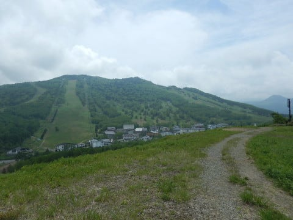

…この時期になって，また志賀高原に行くなんて．

いったい，どんだけ志賀高原が好きやねん…

と，ツッコミを入れたくなるところでしょうが．

今回は，志賀高原に忠誠を誓う方々が，

なぜか12人も集まってしまい．

みんな，志賀高原が好きだなぁ

と思ってしまうほどの，焼額朝礼メンバー全員集合の，

一大イベントと化しました（笑）

日曜悪天候予想で急遽土曜に変更になったけど…

日曜開催だったら最大17人集まっていたという…

ってなわけで．

朝8:30，いつもの焼額ゴンドラ開始時間に

集合した，←狙ってこの時間を集合時間にしたのかな？？

焼額朝礼常連の，20000mクラブゴールド＆シルバー会員12人．

雪のないゲレンデを歩いて…

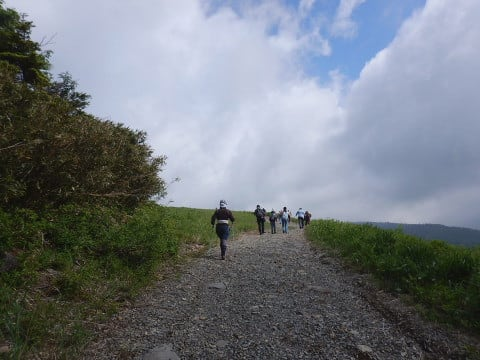

焼額の白樺コースが見えるところに

やってきましたよ…

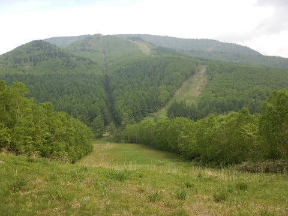

やっぱり，みなさん焼額を愛しているのですね（笑）

で．

ネマガリ竹．

クマザサと呼ばれることも多い，チシマザサの

タケノコなので．

こーゆー笹薮に入らないと，採れません…

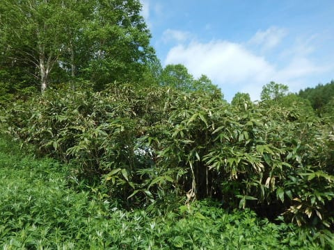

いざ，焼額朝礼メンバーよ，

笹薮へ，突入だ！

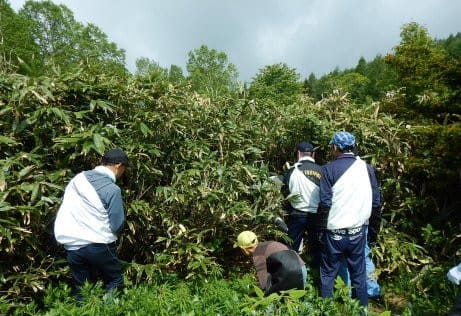

笹薮をかき分けかき分け…

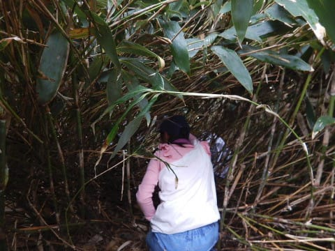

奥へ進んで行くと…

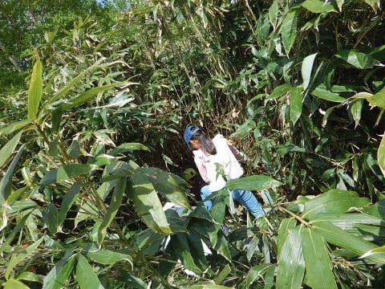

こういう感じのところの…

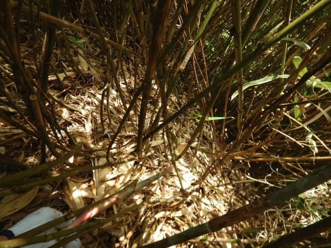

足元に現れる，タケノコちゃん！

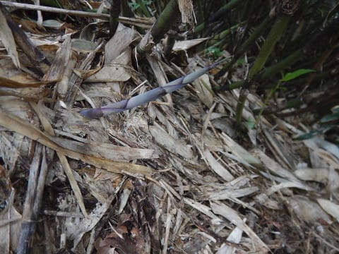

これをひたすら採って行くわけですね．

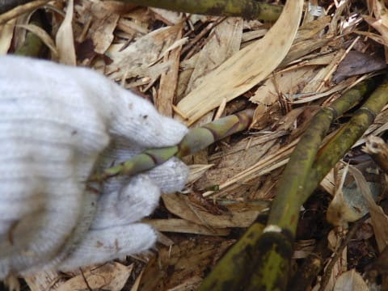

もう，笹薮のあちこちで声が聞こえますが…

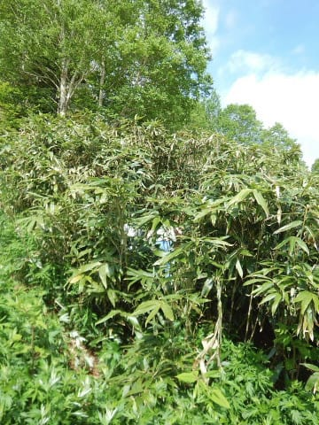

笹薮の中，2mも離れると見えなくなるので．

誰がどこにいるのやら…

って感じで，笹薮の中を，

まさに文字通り這いずり回ること，1時間ちょい．

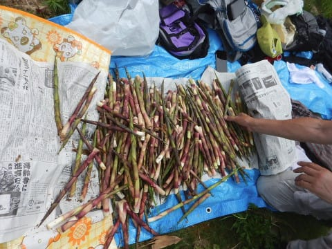

12人もいるので，大量に採れました～！！

…しかし．

さすが，20000mクラブゴールドメンバーを複数含む，

20000mクラブ会員たちだけあって．

みんな，ガチです．

休むことなく滑り続ける人たちばっかりですから．

スキーの時と同じように，皆さん休むことなく

笹薮をひたすら徘徊していたのが，

「あぁ，やっぱり…」

感があって良かったですね←あなたも1時間ひたすら這いずり回ってたでしょ

ってな感じで．

タケノコを採り終わったら，またゲレンデを歩いて．

車のところまで戻ります…

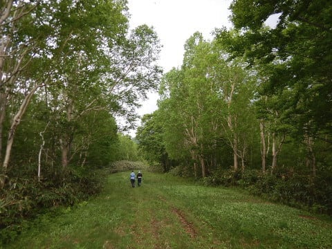

そして．

ここからが，本日のイベントの本番．

大量に採れたネマガリダケを．

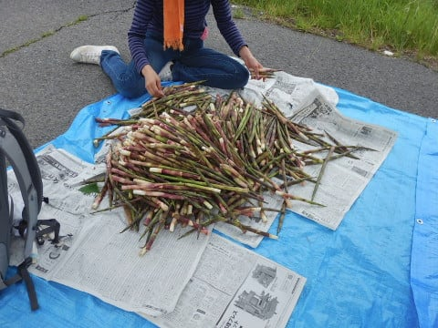

人海戦術で，剥く！剥くのだ！

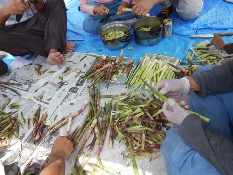

これだけ大量にあると，剥いて

切るのに，これだけの人数でも1時間近く…

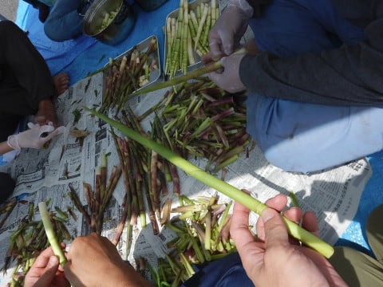

その合間に．

一部のタケノコは，皮を剥かずに

じかに炭火であぶるのだ！！！

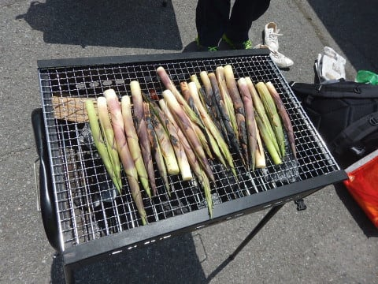

…そうです．

香ばしくて，サクサクホクホクしてるのに

みずみずしいという．

採りたてならではの最高においしい．

焼きタケノコ！

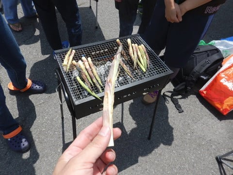

うまーーーーい！

採りたてをその場で焼いて食べる，

このうまさ！！

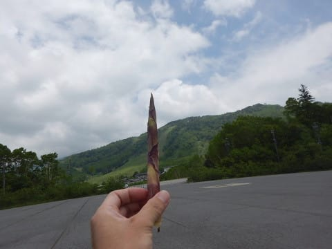

そうこうしている間に．

剥き終わったタケノコで，

タケノコ汁をつくるのだ！

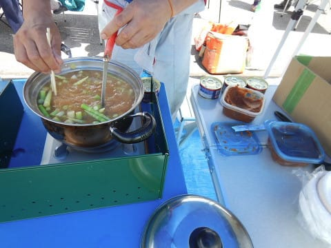

タケノコをさっとゆで，信州味噌を入れた

後に…

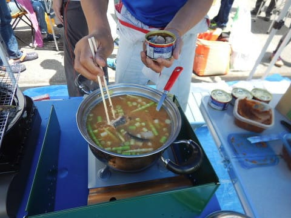

そうです！

サバ缶投入！

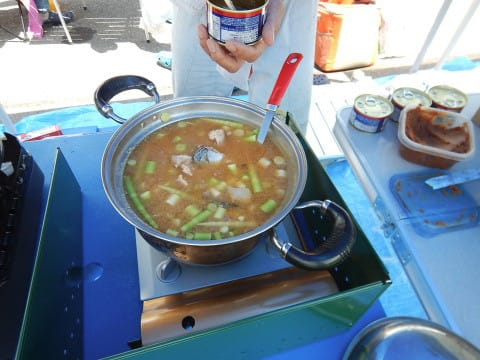

具はシンプルに，タケノコとサバ缶だけ．

新鮮なタケノコのおいしさを最大限引き出す．

超シンプルな味付けで，出来上がり！

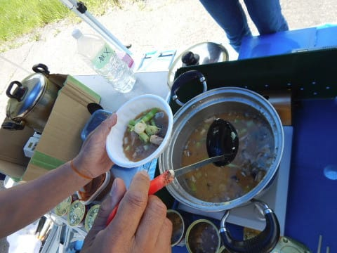

うは～～～

タケノコたっぷり！！

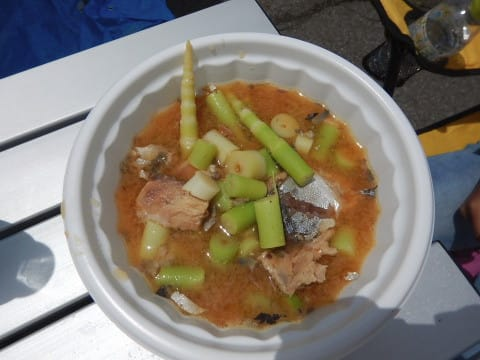

いただきま～す！！

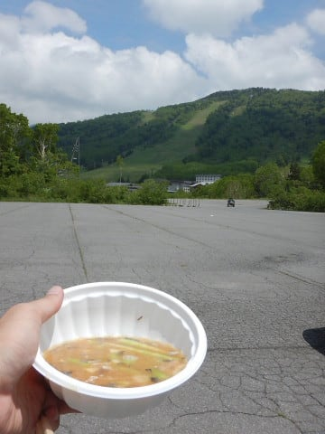

…志賀高原の景色の中食べる

タケノコ汁の，この美味さよ…！（感動）

当然，ネマガリダケが大好物という．

小学生にしては渋い味覚を持っている

わが娘．

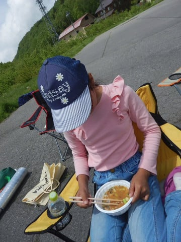

おかわりして，何杯食べたことやら…

焼額朝礼メンバーの皆さんも，

ひたすらタケノコだけでおなか一杯になるほど，

たらふく食べて大満足！

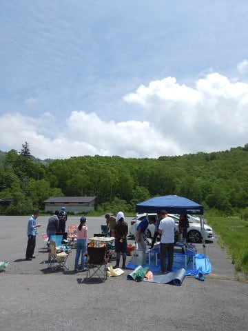

いや～．

もうタケノコだけでおなか一杯．

これ以上食べなくてもいいや…

と言っているところで．

さらに投入される，長野県民のソウルフード．

武蔵屋のジンギスカンロース！

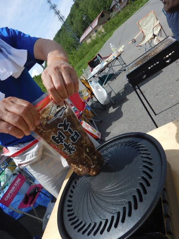

みんな，おなか一杯とか言いながらも…

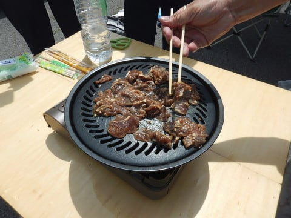

美味しいので，ついつい食べてしまうようで．

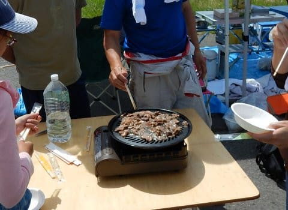

このあとも，デザートやらなにやらが登場して，

いろいろシアワセな時間を過ごせたこの日．

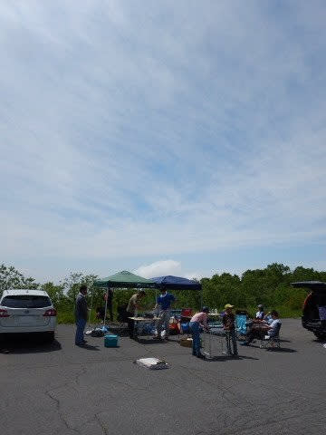

タケノコもおいしかったけど．

普段，ウェア姿しか見たことのなかった人たちと，

ゆっくりお話できて．

なかなか楽しいイベントだったなぁ…

プロデュースしてくれたGokuさん，

そして，参加者のみなさん．

ありがとうございました＆おつかれさまでした～！！！

…

そして．

昼間に食べきれなかったタケノコたち．

我が家に帰ってから，

また皮むき大会を実行して…

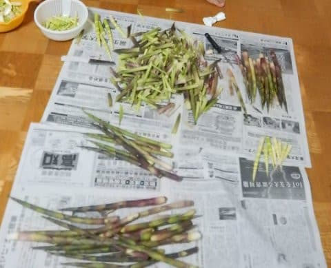

夜ご飯も焼きタケノコやら

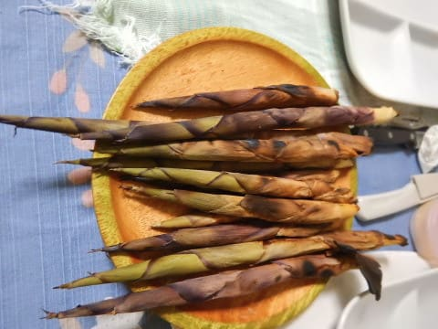

天ぷらになっていただき．

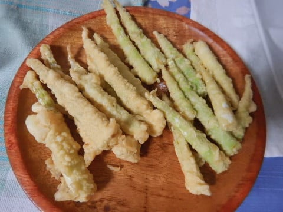

ホントにタケノコばっかり食べた

一日でした…

## 💬 コメント一覧

### 💬 コメント by (seeker_NT)
**タイトル**: 筍狩り
**投稿日**: 2018-06-12 16:25:34

こんにちは。

私たちも金曜に志賀高原へ行ってきました。

ハイキングが中心だったので筍狩りはしませんでしたが、金曜の宿で提供された竹の子料理で楽しませてもらいました。もちろん鯖缶入りの筍汁も！　焼額山はコゴミやゼンマイ、タラの芽等、山菜が豊富にありましたが、皆さんは根曲がり竹いっぽん狙いで楽しまれたのですね。　

翌金曜は8時には高天ヶ原を出たので、皆さんとは道中すれ違いだったようですね。

　その後、竜王～野沢温泉へ。竜王ロープウェイの乗り場には、朝一から明らかに筍狩りと思しき人々が多数。実は前日金曜に、竜王の蕎麦屋を予約しようと電話をしたら「明日は筍狩りにいくので蕎麦はお休みです。」と想定外の返答がありました。どうやら９日は竜王ロープウェイ運行初日なので、地元の人も半ば仕事を投げ打って筍狩りなんだそうです。　中には、50名前後の男性が社名の入った作業着を全員着用して、足元は安全靴(なぜだ？)。ロープウェイが山頂到着後は組織的人海戦術で笹薮に入って筍を一網打尽にしていました。そうかと思えば野良着を着たかなりシニアな男女グループが隊列を組んで私語も無く黙々と(多分)目当ての笹薮へ入って行きました。なんかハイキングで来ている私たちが不謹慎に感じるほど、ピリついた感じでした。

　でも、志賀高原は管理者の和合会・共済会へ入山料を納めてますが、竜王(同じ山ﾉ内町なのに？)・野沢はフリーなようです。　その内、入山規制とかされちゃうのかなぁと思った次第です。

### 💬 コメント by (Goku)
**タイトル**: タケノコ20000本倶楽部
**投稿日**: 2018-06-12 20:17:00

土曜日はお疲れ様でした～♪

Ｓさん家族をお誘いしてから3年目、まさかこんなに大勢の参加者が集まる大イベントになるとは夢にも思いませんでした(笑)

来年は更に人が増え、鍋３つ位用意しないと間に合わないかもしれませんね。

でも、半分の方が初体験なのにいっぱい採れました♪

来年も楽しみですね。

### 💬 コメント by (さち)
**タイトル**: Unknown
**投稿日**: 2018-06-12 22:40:10

来年こそは参加希望(泣)

そんなことはさておき、

天気良くて良かったですね！

### 💬 コメント by (しんちゃん)
**タイトル**: ガチ採り
**投稿日**: 2018-06-13 00:00:52

土曜日はお疲れ様でした。

初めて参加させていただきました。

ほんとにタケノコでおなか一杯になりました。

ビギナーズラックなのかもしれませんが、初めてなのにいい感じのタケノコがたくさん採れて、夢中になってしまいました。シーズン中はゴンドラ頂上までの数分間しか会話できないですがこの日は皆さんとゆっくりお話しできてとても楽しい時間でした。

20000ｍｺﾞｰﾙﾄﾞの方は、夏でもガチ採りだったのには「やっぱり」感がありました(笑)

ﾌﾟﾛﾃﾞｭｰｽ頂いたGoku様に感謝し、来年も参加したいと思います。

### 💬 コメント by (Skier_S)
**タイトル**: タケノコ狩り，楽しかったですよ～！！
**投稿日**: 2018-06-13 02:03:54

＞Seeker-NTさま

あ，金・土で志賀近辺にいらしてたのですね…！

今回は，こちらはタケノコ狩りメインで，

ガッツリタケノコづくしを楽しんできました．

ワラビやゼンマイも，家へのお土産用に

採って行きましたよ～！

この時期は，志賀高原もプロっぽい人が

そこそこいましたが．

無料の竜王方面は，もうその道のプロが

いっぱい集まるんでしょうね…

かなり高く売れるらしいですから（笑）．

買うとお高いタケノコ，いっぱい採って

たらふく食べられるので．

タケノコ狩り，おススメです！

＞Gokuさま

土曜はありがとうございました～！！！！

ホントにお世話になりました．

いや，行く前は，12人は多いな～…

と思ってましたが．

実際やってみると，まだ大人数でも

行けそうな感じですね（笑）．

来年はすごい人数が集まるのかも…

＞さちさま

いやーーーー．

良かったですよ．

タケノコ狩り＆バーベキュー…

さちさんなら，頼めばタケノコ狩りは

志賀高原でナンボでもできそうな気がしますが（笑）．

だんだん参加者が増えて行っているので，

来年は，20000mクラブな方が

全員集合になるかもしれません（笑）．

＞しんちゃんさま

土曜はお疲れ様でした～！

タケノコ狩り，採れ始めると楽しくなってきて，

もう夢中になりますよね（笑）．

そして，採れたてタケノコのおいしいこと…

メンバーとのおしゃべりも楽しかったですね！

これ，一度参加すると，絶対毎年参加したく

なりますよね～！！

もう，Gokuさんには感謝の限りです．

