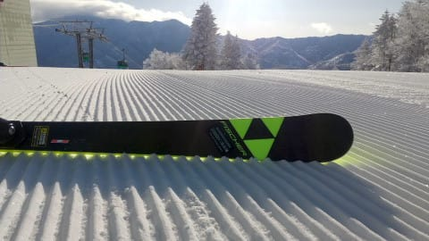
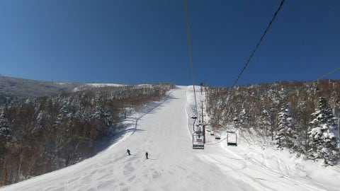
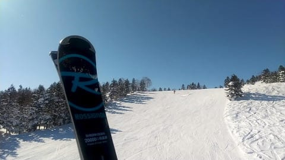
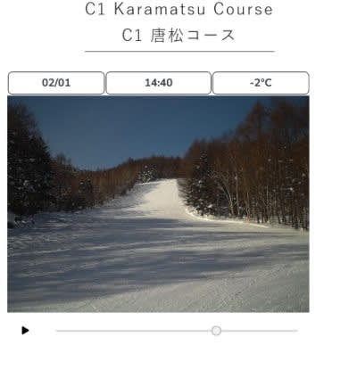
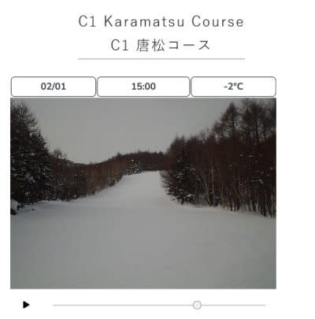
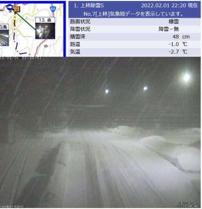
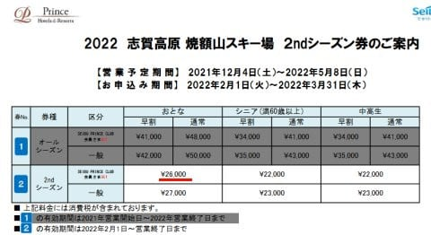

# 焼額山スキー場の2ndシーズン券が発売になったよ！…早朝も使えるからお得かも

📅 投稿日時: 2022-02-02 00:07:55

🏷️ カテゴリ: [スキー雑談](c1f9d2cb7478308da16419928ea3945e9.md)

えー．

本日も志賀高原特派員からの

写真が送られてきたわけですが．

写真を見ると…

なんと．

本日は，意外とすっきり晴天でスタート

したようで．

よだれじゅるじゅるもののシマシマ写真

のあとは，これまた飯テロならぬ，

ゲレンデテロ写真みたいな晴天の

ピカピカバーンの写真が’送られてきて…

曇り空になるかと思った本日．

夕方まで晴天が続いたようです…！

…ただ．

焼額山ライブカメラを見ると．

14:40まで晴天だった焼額山．

（[焼額山スキー場ライブカメラページ](https://www.princehotels.co.jp/ski/shiga/livecamera/)より，以下同じ）

15:00に一気に曇ったらしく…

営業終了直前まで晴れているという，

奇跡の晴れパターンだったようで．

さらに現在，志賀高原では激しい勢いで

雪が降っているようです…

（[北信建設事務所道路気象状況ページ](http://hokushin.pref-nagano-roadcamera.jp/)より）

ってなことで．

2月に突入したので…

焼額山スキー場の，2ndシーズン券が

発売になりました！！

…これは，2月からシーズン終了までの

焼額限定シーズン券になりますが．

お値段はプリンス会員なら大人2万6000円です．

(プリンス会員は申し込めば無料で登録できます）

（[焼額山スキー場ホームページ](https://www.princehotels.co.jp/file.jsp?id=367843)より，以下同じ)

…そして．

ナイターと早朝も滑れるという

危なさ素晴らしさ！

…これ，2月にあと5回ナイター営業日があるし．

さらに4月からGWまで早朝営業もあるし…

特にGWのころには，雪がいい早朝営業の

2時間を滑らないのはもったいない感じ

なので，昨シーズンは10日くらい早朝で

滑ってるし．

さらに今シーズン．

5月5日で志賀全山共通シーズン券の

有効期限が終わっちゃうけど．

焼額は5月8日まで滑れるので，

5月7，8の週末に焼額を滑ろうとすると，

全山共通シーズン券をもっていても

リフト券を買わなくちゃいけなくなるし…

ナイター2200円，早朝2500円を払うことを

考えると…

2ndシーズン券を買った方が得なのかも？？？

…という気になってしまう今日この頃．

…いや．

ヤバい．

これを買ってはヤバいのだ．

なんてったって，

「早朝もナイターもタダってのは体に悪い」

という迷言を残した人もいるくらいなので．

これを買うのはヤバいなぁ…

と，思いながらも．

今シーズンもGWの最後までたっぷり

雪が残ったら，間違いなく買った方が

お得のはず…

という，ヤバいささやきが聞こえる…っ！！！

うーん．

危ない…

これは危ないっ！！

## 💬 コメント一覧

### 💬 コメント by (m&t)
**タイトル**: Unknown
**投稿日**: 2022-02-02 00:35:02

やばい、我々も2ndシーズン券の方がお得かも・・・

### 💬 コメント by (かず)
**タイトル**: Unknown
**投稿日**: 2022-02-02 02:02:36

土曜朝からかと思ってました…金曜から行ける準備はしておこう！今のところ振り終わりは日曜夜ですか？

### 💬 コメント by (新米パパ)
**タイトル**: Unknown
**投稿日**: 2022-02-02 09:29:14

人違いならすみませんですが、

カズさんは、もしかして上○森林のクラチャンだったりされるお方ですか？

### 💬 コメント by (アリス)
**タイトル**: 今週末のヤケビ
**投稿日**: 2022-02-02 16:01:25

S様

2ndシーズン券は魅力ですね♪

早朝とナイター考慮すればお得かもです・・・

久しぶりの週末志賀高原参戦予定です。

ヤケビでＳさんを探してみますね♪

レインボー様

明日から志賀高原入りしますので、GSか唐松あたりでレインボー様を逆探知してみます♪

銀嶺のお蕎麦ランチも狙っています♪

### 💬 コメント by (かず)
**タイトル**: Unknown
**投稿日**: 2022-02-02 16:09:37

新米ぱぱ様  全くよく分からないので人違いと思います  笑  自分はレアキャラ  素野棒打です

### 💬 コメント by (新米パパ)
**タイトル**: Unknown
**投稿日**: 2022-02-02 19:05:51

カズ様、失礼いたしやした。

志賀高原で高低差を競いひたすら滑り倒しているゴルフのセミプロの噂をお聞きしたもので。

### 💬 コメント by (Skier_S)
**タイトル**: 今週末は積もる！
**投稿日**: 2022-02-03 00:28:29

＞m&tさま

ぜひ，ヤバい人の仲間に入ってください(笑)

早朝もナイターも行けますよ~！！！

＞かずさま

土日の方が積もりそうですが，金曜も10~20cmは積もりそうです．

降り終わりは…月曜朝でしょうか．

＞新米パパさま

志賀高原で高低差を競い，ひたすら滑り倒しているゴルフのセミプロって…

一人，私の頭に思い浮かぶ人がいますね(笑)．

残念ながらかずさんとは違う方です…

＞アリスさま

今シーズンはGWの休日の並びがいいので，GWに雪が多くて

ラストまで早朝営業してくれるならお得だと思います…

