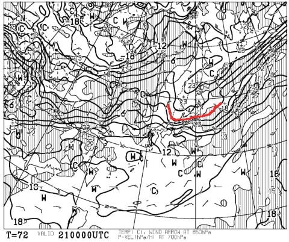

# 11月21，22，23日の3連休のスキー場の天気は…21日朝はちょっと冷えて，23日から冷え込みそう！

📅 投稿日時: 2020-11-19 11:04:03

🏷️ カテゴリ: [スキー天気予想](c6554f5c3c106093b511a8daae23757e8.md)

えー．

昨日もいろいろあって，更新できなかったので．

いつもと違う時間に更新！

今週末は3連休が控えていますが…

私の呪わしい予想が当たってしまい，

19，20日と異常な高温になり，

20日は雨も降りそうな今日この頃…（涙）

あぁ…なぜいつも当たらなくていい

悪い予想ばっかり当たるのか…

ただ，20日の雨はそれほどひどくならなさそうなのが

ちょっと救いかな．

ということで．

3連休は超劇冷えになってスキー場は

オープンできそうなのか？？？

早速天気図を見てみましょう…

まずは初日21日の朝9時の850hpa気温図を見ると…

うむ？

赤い0度線がギリギリ長野県北部まで下がってます…！！

そして，地上天気図では，わずかに降水量もありそうなので…

21日朝は，長野の標高の高いところは，うっすら

雪が積もるかも！！

…そして，20日夜から人工降雪機が動かせそうなので…

横手山が，もし20日の高温＆雨にやられず，

そこそこ雪が残っていてくれれば．

20日夜からの人工降雪でオープンできるかも！？？

…あ，積雪がかなりやばい感じの熊の湯，

一ノ瀬は，一晩の人工降雪でのオープンは

無理だと思います…

そして．21日，朝は冷えるけど．

昼間は気温が上がるので，人工降雪は

厳しいうえに…

もしかすると，ぱらぱらと時折液体が

落ちてくるかも…

で．続く3連休中日．

22日の850hpa気温図は…

うううーむ．

また，赤い0度線は東北地方まで上がってます（泣）

これだと，昼間に人工降雪機を動かすのは

難しそうです（涙）

22日の地上天気図を見ると，

日本海側に降水域がかかってますが．

これは，21日夜からぱらぱらと

雨が残っている可能性がありますが．

まぁ，昼間は降らないと思います．

どちらにしろ，22日は人工降雪が

打てなさそうなので．

スキー場がオープンする可能性は

ほぼないでしょう（涙）

そして，3連休最終日の23日月曜日の850hpa気温図ですが…

うーむ．

ギリギリ新潟くらいに赤い0度線がいますね…

これは結構きわどいところ．

地上天気図は，降水域が日本にはかかってないので，

雨が降ることはなさそうですね…

この状況だったら，23日は標高が高い志賀だと

ギリギリ人工降雪が打てるかな…

でも．

気温が高めで，造雪量もそれほど期待できないので．

23日に熊の湯・一ノ瀬オープンは期待薄です（涙）

ってなことで，まとめると．

21日：朝は雪がちらつき，うっすら積もっているかも？

　前日夜から人工降雪機フル稼働！

　…運が良ければ横手再オープンできるか？

　昼間は気温が上がり，人工降雪は無理．

　一晩だけの降雪では熊・一ノ瀬やその他

　かぐら・鹿沢のオープンは無理でしょう．

　日本海側，志賀高原あたりまで，昼間

　ぱらぱら液体が落ちてくる時があるかも…

　軽井沢，太平洋側は大丈夫です．

　降りません．むしろ晴れるかな？

22日：曇り～晴れ．気温はそんなに冷えない．

　人工降雪は厳しそう…

　

23日：曇り～晴れ．朝方と夕方からは人工降雪機が

　動かせるかな…

　という程度の気温．

ということで．

3連休の新たなスキー場オープンは期待しないでおきましょう（涙）

で．

23日以降の気温傾向を見てみると…

うむ！？？

24，25日は，平年より冷えそう…！！

24，25日の850hpa気温図は…

をを！！！！

24日はきわどいけど，25日は赤い

0度線がかなり南下してます！

これは…24日は標高が高い志賀は

ガンガン人工降雪機が動かせて．

25日は標高が低いスキー場でも，

フルパワーで人工降雪ができそう！！

…これは．

ようやく28，29日の週末は期待できるかも…！！

## 💬 コメント一覧

### 💬 コメント by (Goku)
**タイトル**: Unknown
**投稿日**: 2020-11-19 19:56:17

今週末はちょっと早いけど年末大掃除でもしますか・・・（マジで）

### 💬 コメント by (レインボー73)
**タイトル**: Unknown
**投稿日**: 2020-11-19 21:08:12

連休明けの火曜日からは、横手はできそうでしょうか？

### 💬 コメント by (真美子)
**タイトル**: Unknown
**投稿日**: 2020-11-19 21:45:08

軽井沢プリンススキー場は、2コース出来ています。本日の暖かさでも茶色は見えないようでした。

と言うのは、私はゴルフをしており、スキー場は近場で見るだけの人だったのです。

１１月第三週、軽井沢はゴルフ、スキーと出来るので、来年はスキー用具も持って行こうと思いました。

### 💬 コメント by (Northfox)
**タイトル**: 今週末は
**投稿日**: 2020-11-19 23:58:19

いよいよスタッドレスタイヤに交換します♪

期待の持てる情報をありがとうございました！

### 💬 コメント by (Skier_S)
**タイトル**: 明日どれだけ雪が解けるか…
**投稿日**: 2020-11-20 01:20:59

＞Gokuさま

軽井沢は営業してますよ(笑)

＞レインボー73さま

うーむ…

なんとも言えないですが．

先週の造雪状況を見るに，火曜オープンしている可能性はそこそこあるかと．

木曜くらいまでにオープンする確率なら，かなり高いです．

＞真美子さま

プリンスはオープン時期から2コースという贅沢さですよね…

アイスクラッシュなので，気温が高くてもガンガン造雪できるのが軽井沢の強みかと．

ぜひ，ゴルフとスキー，同時にできるのが軽井沢の面白いところ．

一度軽井沢で滑ってみてください！

＞Northfoxさま

少なくとも，28，29日の週末，天然雪は期待できないけど，人工雪の

スキー場は何とかなるかも…！

