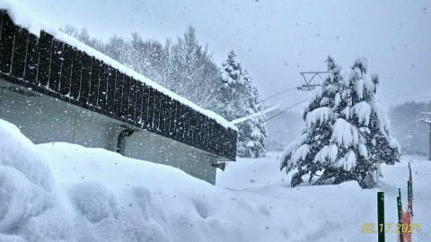
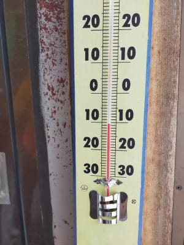
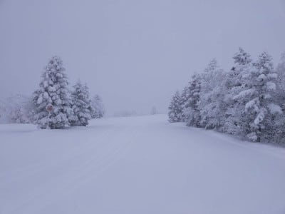
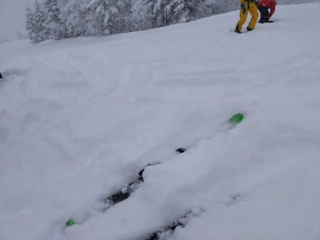
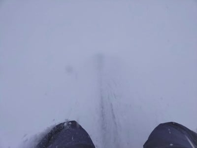
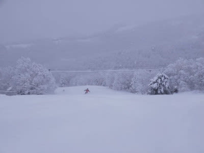
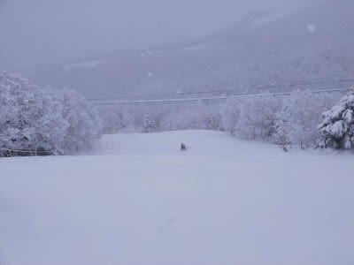
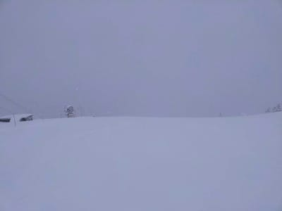
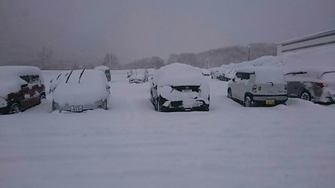
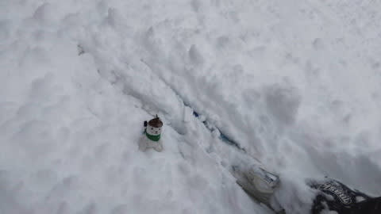

# 2月20，21日の週末の志賀高原は，土日とも晴れそうだけど，日曜はかなり気温が上がりそうな予感…詳細は今晩！

📅 投稿日時: 2021-02-18 08:52:15

ということで．

昨日も記事を書きかけで知らぬ間に

布団の魔力に惹かれて落ちてしまうという

失態を犯したため，朝更新です…

本日も，優秀な特派員からの志賀高原

スキー場のレポート，行ってみましょう！

まず，朝イチの駐車場は10cmちょいの

積雪があったようですね…！

…ちなみに，今日のこの写真は，

いつものおこみん担当特派員と違う人が

積雪をわざわざ対おこみん比で送って

くれました…(笑)

昨晩から，雪が止むことなく降り続いて

いるようで…

朝は結構本格的に降ってるように

見えますね…

そして，山頂の気温は…

－10℃以下と冷え冷え！

山頂も雪が降り続けていて…

圧雪コースの上にも10~20cmの積雪が！

下地は硬いですが，その上にかなり軽い

パウダーが乗っていて…

うひゃー！

気持ちよさそう！

脛パフの最高パウダーだったみたいです…

オリンピックコースは朝圧雪が入るので

それほど深くなく．

特派員からは，午後の西館が良かったとか…

でも，今日もコースはガラガラ，

終日－10℃程度の雪降りの一日で．

で，この日はラストまだ滑った特派員が

おらず，みんな早上りだったようですが．

昼間だけでも，結構雪が積もったようです…

そして．

今日のおこみんも猪苗代へ出張中！

猪苗代も，朝は新雪が結構積もっていた

ようですね(笑)．

ってことで．

本来なら水曜夜の天気予想ですが．

時間が無いのでまとめだけ．

詳細は今晩やります！

えー．

18日は終日雪降り激冷えパウダーデー！

19日は午前中は冷えひえ雪降り．

午後に雪は止むかな…

20日，21日は晴れそうです…

が，20日はちょっと風が強く，

気温もプラスまで上がりそう…

日差しがいいがバーンは雪が

しっとりするかな？

21日もすっきり晴天！

だけど，この日の昼間は＋3~5℃まで

上がり3月中旬並み…（涙）

せっかくの冷え冷え雪も，春のゲレンデに

なっていきそう…

ということで．詳細は今晩！

## 💬 コメント一覧

### 💬 コメント by (つーちゃん)
**タイトル**: Unknown
**投稿日**: 2021-02-18 12:51:29

せっかく回復したコンディションも

高温にやられてしまう(ToT)

週末を狙ったかの様です…

今シーズンの週末は呪われてます

それか日頃の行いが悪い人が週末にいるのかも

え？私じゃないですよ(・Д・)

### 💬 コメント by (レインボー73)
**タイトル**: Unknown
**投稿日**: 2021-02-18 15:52:41

木曜日の志賀高原情報

昨夜は○○川県からの刺客に殺られて、今日はスマホを忘れる失態。話しが面白過ぎて、いつも睡眠不足にさせる恐ろしい刺客です。

私の脳の容量は極端に狭められているため（元々との噂も）、昼の休憩を過ぎると空っぽ！　気温とかぜーんぶ忘れました。

朝の山頂がー13℃だったかな？　パノラマからカラマツは気持ちよかったけど、スピードは今ひとつ。すぐに１ゴンへ。

見ると、ＧＳサイドの積雪が物足りない。ここはやめて、ダイヤモンドへ瞬間移動。この作戦が大当たり。

昨日の視界不良のせいか、50cmほどのふかふかも。イナゴの大群が去ったあとのように散々食い尽くし、目指すはタンネ。

でも意外と浅い。一回で見きって高天へ。

高天の非圧雪は片斜面なのが最大のネック。そこで、リフト下辺りからスタートすると、そのままリフト下のふかふかを滑るか、斜めにネットめがけて滑るかで、結構楽しめました。高天はふっかふかでしたよ。よかった。

昼はまたまた銀嶺でラーメン。本来ならここでコメントを投稿するはずなのに、なんか物足りない自分がいました。

食後は昨日のベスト西館へ。あれれ、圧雪の上に少しだけの新雪。普通じゃん！　サイドの非圧雪との段差が大きすぎて入らなかったのが失敗。入った仲間によると、腰パフだったとか。痛恨の極み！

西館リフトは１時からなので、ブナからタマゴへ。

うギャー！　昨日の帰路にすれ違ったバス８台の団体、○潟県の（これでは匿名にならないよね）長○高校（見事なまでに匿名になってる）御一行様と鉢合わせ。たまゴン15分くらい待ったかなあ。

その後も高天の非圧雪はふかふか。

今日はパウダーdayでした。

### 💬 コメント by (かず)
**タイトル**: Unknown
**投稿日**: 2021-02-18 17:58:10

奥志賀スタートしました  予想より降らなかったですね

雪が締まり過ぎて全然走らない…埋まる…前転！！ヤケビのほうが軽かった……

### 💬 コメント by (Skier_S)
**タイトル**: 今週末は気温が上がる…
**投稿日**: 2021-02-19 07:06:15

＞つーちゃんさま

土曜はなんとかそれほどひどくならずに済みそうな感じ．

日曜がヤバいか…

うん．私の呪いかもしれません(笑)．

＞レインボーさま

レポートありがとうございます！

私にとっては，ラスリフまで滑る人を早めに切り上げさせて

拉致した方の方が刺客なのかも…

と思っちゃいました(笑)

＞かずさま

それほど降らなかったですね…

残念ながらかなり西に風が回ったので(涙）

