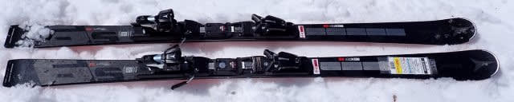
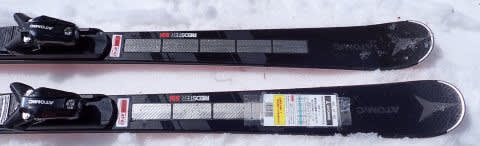
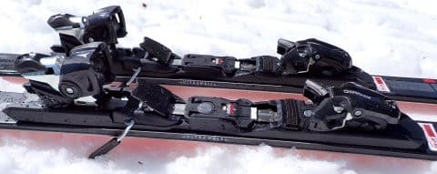
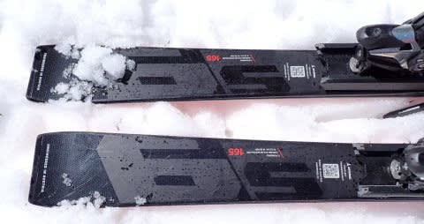
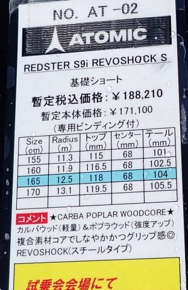

# 2025シーズンモデルのスキー板，試乗レポートその21…ATOMIC REDSTER S9i Revoshock S

📅 投稿日時: 2024-06-29 04:13:57

🏷️ カテゴリ: [スキー板試乗](c0bd8048615710cee890e403a36cc9a2b.md)

えー．

高校生の娘の定期試験が近づいているので，

私の仕事が終わった後に，ちょっと勉強を

教えているのですが…

最近の高校生の勉強のレベルは高い…！

私が高校生の頃より，覚えることが

増えて，問題の難易度も上がっている気が

しますね…

そんな中で．

今日は物理を教えていたのですが．

試験範囲の問題に

地球を回る楕円軌道上の人工衛星の

近地点高度hの時の速度v1，

静止軌道と同じ高度の遠地点での速度v2，

円形の静止軌道に移行した場合の速度v3

を求め，楕円軌道上と静止軌道上の

衛星のエネルギー差を求めよ…

という，めちゃくちゃマニアックな問題が！！

これって，GEO衛星のトランスファー軌道の

計算と，アポジモーターのエネルギー問題

そのものじゃないか！！

とりあえず，

「楕円軌道はケプラーの第2法則と

　エネルギー保存則の二つの式を

　連立すれば解けるよ」

などと教えつつ．

ついでに雑談として．

「ロケットでは静止衛星軌道まで衛星を

　もっていけないので，ロケットではまず

　『静止トランスファー軌道』って呼ぶ

　この楕円軌道に打ち上げるんだよ…」

「その楕円軌道の近地点を，Geoに

　近い(Peri)という意味でPerigee，

　遠地点をGeoから遠い(Apo)という

　意味でApogeeっていうんだよ…」

「で，楕円軌道の遠地点…Apogeeで

　衛星にくっついたエンジンを点火

　して静止軌道に移るんだよ」

「だから，静止衛星なんかのお尻に

　くっついているエンジンを，アポジ

　モーターっていうんだよ…」

とか話した後．

私「アポジモーターって聞いたことあるでしょ」

と聞いてみたら…

娘「何それ，知らない」

私「え…？？聞いたことない？？」

横で聞いてた妻「日本人全員で言えば，

　知ってる人より知らない人が圧倒的に

　多いと思う」

ががーーーん．

そうなの？？？

アポジモーターって割と一般的に

聞く用語だと思ってたけど…

たぶん，男性は知ってる率高いですよね．

皆さん聞いたことありますよね？？

少なくともキセノンイオンエンジンより

メジャーだと思う…←比較する対象がおかしい

ってな感じの，内容と全くない前フリの

後は，本題へ．

今日も2025シーズンモデルのスキー板の

試乗レポート．

今回も昨日に引き続き，アトミック編です！

〇ATOMIC REDSTER S9i Revoshock S 165cm 

基礎小回り．

[前回レポートしたS9i PRO](ef746ecfc860c46d817807ba4080137d5.md)は，来シーズンは

ビンディングもICONビンディングに変わり

モデルチェンジしますが…

この板は，ビンディングもTLビンディングの

ままで，REVOSHOCKも変わっておらず，

今シーズンモデルとほぼ変わってない

ということですが…

履いた感じ，ビンディングもプレートも

軽く，さらにコアも軽量カルバウッドコアと

いうこともあり…かなり軽い！

かなり軽快な履き心地．

フレックスはS9i PROよりはずっとたわみ

やすく，良くたわんだ中でトップから

テールまでしっかぐグリップして，

エッジに乗ってクルンと回ってきて

くれます．

フレックスは結構柔らかめだけど，

トーションがそこまで弱くないので，

グリップは比較的しっかりしています．

今シーズンモデルからキャリーオーバー

で，構造は変わってないとのこと

ですが…去年よりグリップが強くなった

ように感じるのは気のせい？

昨シーズンの試乗板が，ヘタり気味だった

のか，エッジが丸まっていたのかも…

とはいえグリップが強すぎることもなく，

ずらしもキレもできて，軽さで板を

動かしやすいので荒れた斜面や不整地でも

滑りやすい感じ．

とりあえず，良く回るうえに軽いので，

板を動かしやすくていろんな小技が使える

感じ．

板の軽さでどのようにでも板が動かせるので，

荒れた斜面でもコブでも，好きなように

板を動かしていけます．

ただ，その裏返しとして．

板の安定感とガッツリグリップがあるわけで

無いので…

硬い斜面の超ハイスピードでガッツリ切って

いくという板ではないし，荒れた斜面を

安定感で何事もなかったかのように

乗り越えていく板じゃないけど．

その代わり，その軽快さゆえに，荒れた春の

雪で飛ばされたり，板が叩かれたりしても，

飛ばされたら飛ばされた中で好きなように

板を動かして谷回りに差し込んでいけるし，

どうとでも操作できる自由度がある感じ．

切って行こうと思えば，しっかりグリップして

小さめの半径でキュンとカービングして

くれるし．

板を動かしていっても操作性は高いし．

そんなに気合を入れなくても履ける，

荒れた斜面でも整地でもOKの，小回り

ベースのゲレンデ普段履きとして良さそう

だな…と思いました．

## 💬 コメント一覧

### 💬 コメント by (副院長)
**タイトル**: Unknown
**投稿日**: 2024-06-29 23:22:58

S様、物理むずかしいすぎて、ポカーンです。私、生物化学で受験です。S様スゴすぎる。板に関してはフムフムです。よく理解しました．、メモしときます。

### 💬 コメント by (Skier_S)
**タイトル**: >副院長さま
**投稿日**: 2024-06-30 01:39:43

私は物理が専門分野（？）なので…

でも，娘には物理化学数学と，なぜか歴史も教えてます(笑)．

