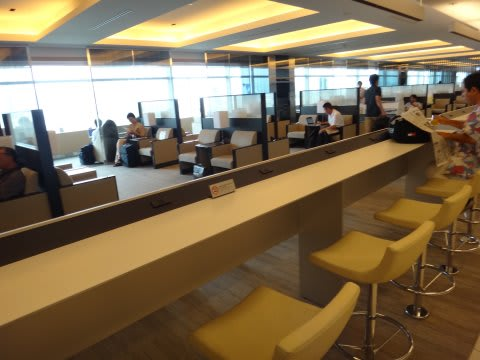
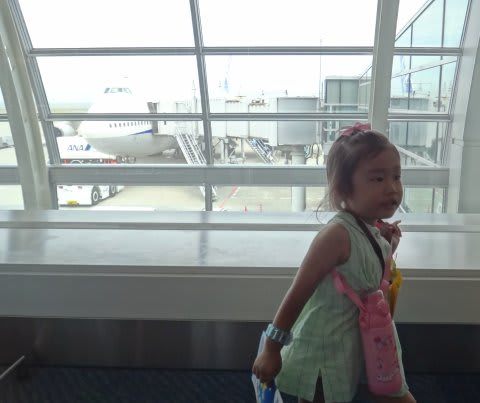
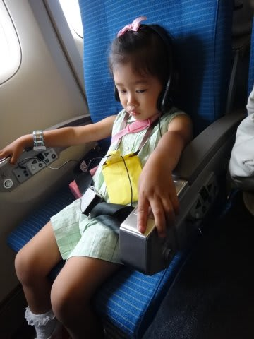
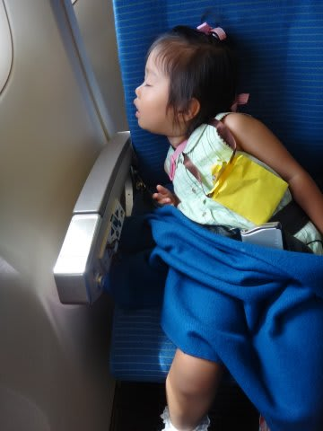
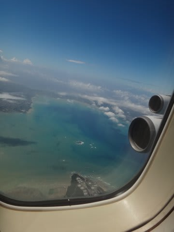
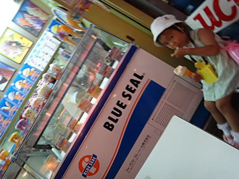
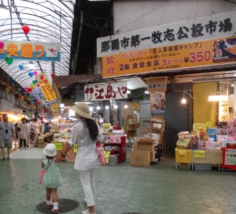
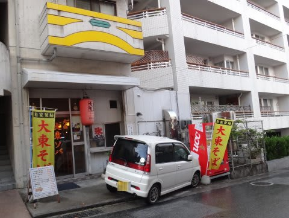
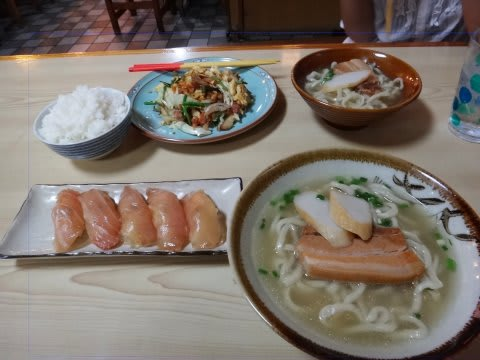
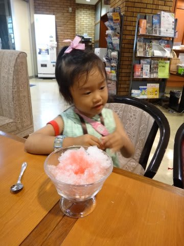

# 子連れで座間味に行ってみた　その１

📅 投稿日時: 2011-08-08 00:12:35

🏷️ カテゴリ: [ダイビング日記](ce3a7a8d424d112fce83ee85c81a0e344.md)

出発前日…

ニュースは台風6号が明日沖縄に接近予定，と繰り返し流してます．

うーーーむ．

うーーーむ．

出発日に狙ったように接近とはっ！

台風を呼ぶ男伝説は健在だったのかっ！

＃これまで，台風で沖縄行きの飛行機が飛ばなかったり遅れたり

＃したこと数え切れず…

ANAのHPを見ても，

「明日の沖縄，九州方面のフライトは台風の影響で欠航・遅延などが…」

…

とりあえず．

明日を待つしかないですな…

で．

あけて当日．

台風は大きく東にそれて．

沖縄便は無事飛んでるみたいですね～

九州・四国便はほぼ全滅みたいですが…

とりあえず，私の台風呼び寄せパワーと妻の強烈晴れ女パワーが

ある程度バランスした結果でしょうか（良くわからん理屈だ)

ということで．

予定通り羽田空港へ．

あー．

羽田のANAラウンジ，新しくなって広くなりましたね～．

飲み物のサービス内容は変わらないけど，ゆったりした感じになってます．

んで，搭乗時間に飛行機に乗り込むんですが．

これまで子連れの特権で，ぶっちぎり優先搭乗で乗ってたけど…

今回．子供が3歳になってしまい，国内線も子供料金が取られるように

なっただけじゃなく，優先搭乗もできなくなってしまいました…

残念．

んで．

娘の国内線も有料になった今回．

子供の座席もちゃんと準備されてます．

しかし…

やっぱり，乗ったとたんに寝るのは変わらないのね．

離陸前から着陸後までの2時間半，ぐっすり寝てました．

手間がかからない子供だこと…

で．

2時間半のフライトで，那覇に到着．

…娘はまだ3歳というのに．

これで3度目の沖縄上陸です…

今日は那覇に泊まって，座間味への移動は明日の朝の予定です．

＃この日は，座間味行きの高速船もフェリーも台風で欠航．

＃明日の移動予定にしといてラッキー…

なので，座間味行きの船が出る，「とまりん」そばの

ホテルに荷物を置いた後，那覇を散策．

すでに数え切れないくらい来ている沖縄なので，いまさらの感はありますが…

国際通りやら牧志公設市場やら見て回って…

夜ご飯は私のお気に入りの[大東そば屋さん](http://gourmet.livedoor.com/restaurant/302414/)へ．

ここは，かれこれ7年以上前…大東島に行った際に

「うちの息子が那覇でお店をやっているから」

と教えてもらった店．

那覇市内では珍しい，手打ち麺の本格沖縄そばが

食べられます．

あと，なつかしの大東寿司も．

夕食後．

ホテルに戻りますが．

今回泊まった[ホテルラッソ那覇](http://www.rasso.co.jp/tomari/)．

一泊朝食つき3000円以下なのに，

ロビーでコーヒーやらジュース飲み放題な

だけじゃなく，カキ氷までサービス…

娘大喜び．

とりあえず．

明日からダイビングなので．

今日は早めに寝て．

明日に備えましょう．

おやすみなさい～
