# 2010年7月，2歳の子連れで座間味でダイビング！その16…座間味ラストダイビング，終了

📅 投稿日時: 2021-10-21 02:04:03

🏷️ カテゴリ: [ダイビング日記](ce3a7a8d424d112fce83ee85c81a0e344.md)

ってなことで．

本日は，予想通り冷え込み．

志賀高原は，朝から雪でした！

横手山では朝9時ごろに，すでに

結構積もってたし…

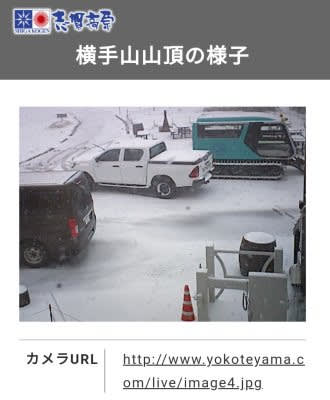

（[志賀高原ライブカメラページ](www.shigakogen.gr.jp/live/live_camera_yokote.html)より）

一の瀬ファミリーも，うっすら雪が

積もってましたね～！！

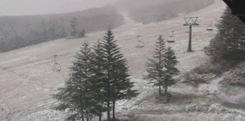

（[志賀高原ライブカメラページ](www.shigakogen.gr.jp/live/live_camera_ichinose_ski.html)より）

それほどドサドサ積もったわけでは

なさそうですが…

夜になっても，まだ志賀3号トンネル

付近の路面には雪がうっすら残って

ましたし…

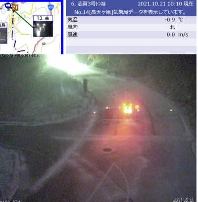

（[北信建設事務所道路気象情報ページ](http://hokushin.pref-nagano-roadcamera.jp/)より）

横手山は，この状況ならガンガン

人工降雪打ててるのかな…？

850hpa気温偏差予想によると，この

冷え込みは水色矢印で示したように，

当初予想より1日延びて．

24日の日曜まで冷え冷え期間が続き

ますよ～！！

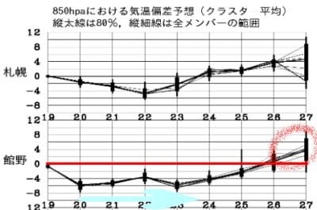

ただ．

その後…26日以降，赤丸で囲ったように，

気温が上がっちゃうので…

せっかくの人工降雪，融けちゃわないか

心配…

ってなことで．

今日も本題はダイビング日記です～！

ーーー

ということで，本日の午後のダイビング．

…つまり，今回の座間味旅行の

最後の1本が，スタートです…

エントリーすると．

透明度が高く，日が射して．

いかにも沖縄らしいダイビング…！

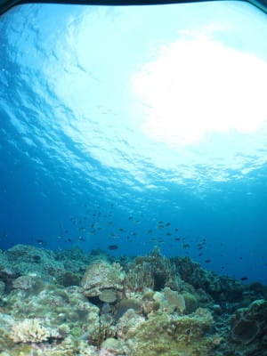

キャベッジコーラルや…

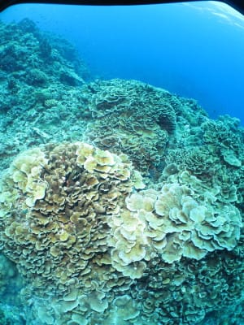

イソバナが映えるポイントです．

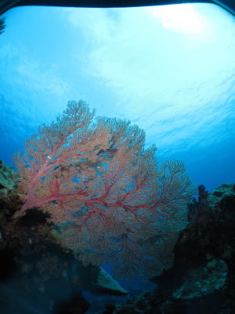

が…

ここのメインは地形らしく．

ちょっと洞窟っぽい岩の割れ目に

入っていきますが…

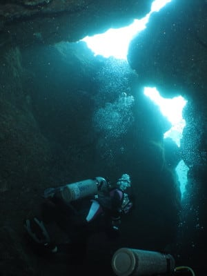

ダメだ．

このカメラだと，洞窟の中では

C4040で撮った時みたいな，

光のきれいなキラキラが入らない…（涙）

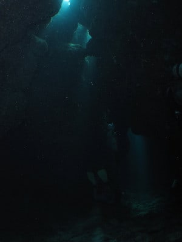

ちなみに，以前のカメラ，C4040だと

こんな感じで，光が差し込んでいる

光の帯が綺麗に入れられたんだけど…

(C-4040でかつて撮った写真)

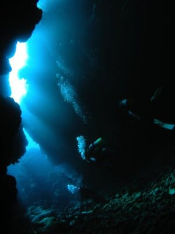

今回のカメラでは，頑張ってみたものの

これが限界か…

…やっぱり．

C-4040は，名機だったんだなぁ…

とりあえず．

トンネルを抜けた後…

また再び，サンゴの見事に広がる

上を漂っていきます…

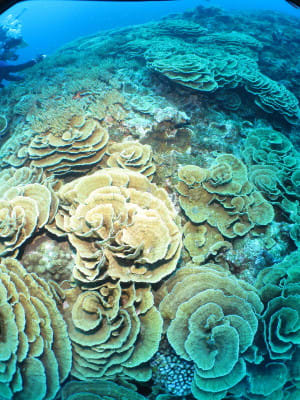

いや．

サンゴは見事…！

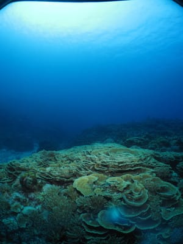

…でも．

ちょっと魚影は薄めかな…

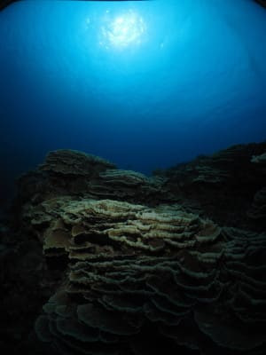

だけども．

透明度も良く．

天気も良かったので，日が射して

明るい海をのんびり漂えて．

いい1本だったかな．

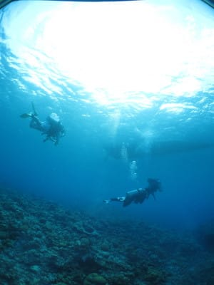

ってことで．

今回の旅程の最後の1本，終了です…

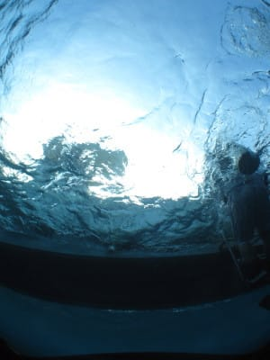

あぁ…最後のダイビングも

終わっちゃった…
