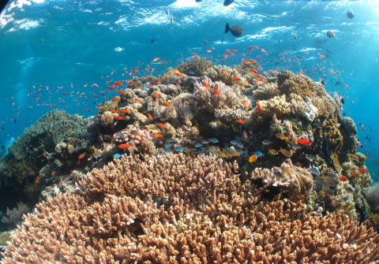

# 子連れコモドダイビングクルーズagain　その24　4日目からは北エリア攻略！

📅 投稿日時: 2011-09-24 01:56:34

石垣から帰ってきたけど．

詳細レポートは後日ということで．

コモドレポート，ひたすら続きます．

すでにその23だけど…いつ終わるんだ？？？

-----

さて．

明けてクルーズ4日目．

昨晩のうちにクルーズ航路最南端から一気に最北端まで移動し，船は北エリアへやってきています．

北エリア．

そう．

透明度が30mオーバーと高く，水温も27～28度と高く快適な，大物エリア．

半径数100mに4箇所ほどポイントが固まっており．

明日の朝まで本船をここに止めっぱなしにして，

ひたすらひたすらこれらのポイントを潜りまくるという，

コモドクルーズのハイライト．

で…

今日の朝の1本目は，潮流の関係から，いつもよりちょっと早め．

6時半からブリーフィング開始です．

なので，いつもより早めに起きると…まだ日の出前．

これだけ朝早いので，娘はまだ熟睡中．

寝ている間に，こそっと夫婦で潜りに行く作戦．

リンダさん，起きたらよろしく～

ということで，夫婦揃ってブリーフィングに参加．

＃書いてみて改めて思うが，ひどい両親だ…

んで．

1本目のポイントですが．

北エリアで一番面白い…

…っつーより，コモドクルーズの目玉．ハイライト．

パラオのブルーコーナーを越える，大物がんがんではずれのない，

世界的に見ても面白いポイントと私が信じている．

そう．

Castel Rock．

…

…へ，行く予定が．

流れが速すぎてCastelへは入れず，流れのないLight Houseへ変更．

＃Castelへ入れるように計算して，朝6時半スタートだったというのに！

ありゃー．

残念．

まぁ，Light Houseは大物は出ないといえきれいだし．

上手く行きゃバッファローフィッシュの群れなんかも見れるし，

2本目以降でCastelに入れれば，ま，いっか．

と．

このときはあまり深く考えずに，Light Houseへ．

いやーーーー！！

水があったかい！

昨日までの水温23～24度の世界とうって変わって，

一気に水温27度へ．

そして，透明度がいい！

浅瀬では，サンゴに群れるきれいなデバスズメダイやハナダイが

朝日に照らされてきらきら光ってます．

コモド，どこに潜ってもサンゴがきれいだなぁ…

ちょいと深場へ足を伸ばすと…

おっと．

まだ水深15m程度というのに，スミレナガハナダイがそこかしこに．

沖縄だと水深30mくらいの魚ですけどね～

ここでは，浅いところにかなりの数が．

深場から浅場へ移動しているとき…

透明度が高いので，深度20m近くでも水面がきれいに見えるんですが．

なんか，いる．

あれは…

マンタではないかっ！

Light Houseは時々マンタが出るとは聞いていたけど…

マンタポイントではない北エリアのこんなところでマンタに会えるとは．

普通，マンタポイント以外では一瞬で通り過ぎるマンタですが．

ここでは，一度見えなくなったかと思ったら．

しばらくあとでまた戻ってきて，頭上をぐるぐる2-3周回っていってくれました．

うーむ．

しかし．

メンバーみんな，

「ああ，マンタか…」

って感じで．

特に興奮もしていなかったという．

コモドで潜っていくと，だんだん感覚がおかしくなっていきます…

で．

マンタさんを見たあとは．

5m程度の浅瀬でサンゴときれいな魚たちを見て癒されます．

あー．

流れがんがん，大物がんがんのCastelにはいけなかったけど．

マンタも出たし，こんなダイビングも良いものだ…

…と．

この先に何が起こるかを知らない私は，このときに

呑気にも思ったのだった…

