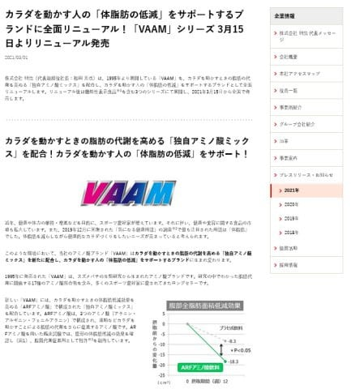
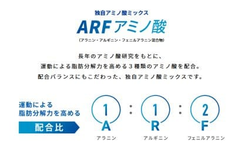
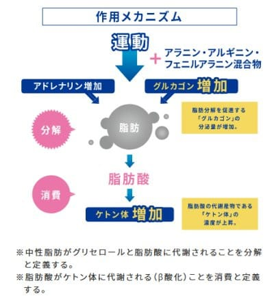

# なぜ登山でVAAMを試してみようと思ったのか？最終回…VAAMはモデルチェンジしてシンプル化してたんだ…

📅 投稿日時: 2022-11-01 02:55:13

ってなことで．

横手山が人工降雪を始めてますが．

11月2日の雨でせっかくの人工雪が解けるんじゃないか…

と予想していたところですが．

低気圧通過がちょっと早まり，

雨が降るのは11月1日になりそうで…

そして，志賀はそこまでひどい降りには

ならなさそうな予想になってきました．

…無事，11月1日の雨を乗り越えて

くれれば．

11月5~7日の間はかなり冷えそうで．

5，6日は人工降雪機がガッツリ動かせそう！！

ただ，冷え込みは7日以降は続かなさ

そうなのがちょっと惜しい…

さて．

横手山，一体いつオープンするのか？？

…ってなことで，本題へ．

読者を完全に振り切ってしまい，

もう読む人がごくごく一部の特殊嗜好の方を除いていなくなった

という噂の，このVAAMの解析記事．

今回が最終回です！

ってなわけで，[前回](ee65fe930d3c233bbbac696553903c397.md)．

VAAMが知らぬ間に，

スズメバチの17種類のアミノ酸ミックスから，

3種類のアミノ酸ミックスに変わっていた

という事実に気づいたわけですが…

…え？

3種類のアミノ酸ミックス…？？

これ，最初は間違いなく17種類のアミノ酸

ミックスだったよね…

と，調べてみると．

明治のプレスリリースに，その答えがありました…！

（[株式会社　明治　プレスリリースページ](https://www.meiji.co.jp/corporate/pressrelease/2021/0301_01/index.html)より）

どうやら，VAAMは2021年3月15日に

全面リニューアルされて．

「1995年に発売された「VAAM」は、スズメバチの

生態研究から生まれたアミノ酸ブランドです。

研究の中でわかった脂肪代謝に関係する

17種のアミノ酸混合物を含み、多くの

スポーツ愛好家に愛されてきたロングセラーです」

と，元々は17種類のアミノ酸だったものが…

「新しい「VAAM」には、カラダを動かすときの

体脂肪低減効果を高める「ARFアミノ酸」で

構成された「独自アミノ酸ミックス」を

配合しています」

とのことで，17種のアミノ酸混合物から，

2021年3月に，

アラニン・アルギニン・フェニルアラニンの

3種類のアミノ酸ミックスに変わった

ようです…！！

（[株式会社　明治　VAAM商品説明ページ](https://www.meiji.co.jp/products/brand/vaam/about/)より）

とりあえず．

前回説明した論文にあったように．

VAAMの効果が，

アミノ酸が肝臓などでのグルカゴン・

アドレナリンなどのホルモン分泌を促進

　⇒グルカゴン・アドレナリンは

　　脂肪分解を促進

　⇒脂肪が分解されるとピルビン酸から

　　オキサロ酢酸化が促進，クエン酸

　　回路が元気になる…

というロジックなら．

人体に効かないだろうアミノ酸も混ざっている

17種類のアミノ酸を全て入れなくても，

脂肪分解を促進する，グルカゴン・アドレナリンの

分泌を促すアミノ酸だけを選んで入れれば

効果があるわけで．

…そう考えれば．

アドレナリン・ノルアドレナリン（カテコールアミン）

の原料となるアラニン・フェニルアラニンと．

「アルギニン刺激によるグルカゴン分泌」というのが

よく知られているアルギニンをぶち込めば．

（例えば[こんな論文](https://www.jstage.jst.go.jp/article/tonyobyo1958/19/2/19_2_257/_pdf/-char/ja)とか）

脂肪分解を促進し，血糖値低下を抑制する

アドレナリン＆グルカゴンというホルモンが

ガンガン分泌されて，

脂肪代謝は進むし，血糖値低下も抑えられ，

エネルギー不足による筋肉の分解も

抑えられる

ってことだな…

と，思ったら．

ちょうどそれを説明する図が，

VAAMの商品説明ページに書かれてました…

（[株式会社　明治　VAAM商品説明ページ](https://www.meiji.co.jp/products/brand/vaam/about/)より）

ってなことで．

VAAMは，不足するアミノ酸を補充するとか．

代謝に必要なアミノ酸を体に補給するというより．

脂肪分解を促進し，血糖値低下を抑える

アドレナリン＆グルカゴンというホルモンを

分泌させるアミノ酸をぶち込む

モノだということがよく分かりました…

ってなことで．

最初の頃は，どういうメカニズムで効いてる

のか分からず，なぜだか脂肪燃焼促進効果が

あることが実験で分かって，

「スズメバチに学んだ…」

というコピーで売っていたVAAMだったわけですが．

なんで効くのかの解析が進んで，

2021年からは必要なアミノ酸だけに絞られた

ようです…

とりあえず，アドレナリン＆グルカゴンには

脂肪分解＆糖新生の作用があるのは間違いなく．

そのため，VAAMの売り文句にある，

通常よりも早く脂肪燃焼が始まる

ダイエット効果もあるわけだけど．

そのほかにも．

エネルギー不足のバテを防ぐ効果もあるし．

エネルギー不足のため筋肉が分解されて

エネルギー源にされちゃうことも防げるので，

筋肉損傷も防げるし．

（これが[初回](e8b6d72454481512a12bcfd15198af308.md)の徳島西医師会の佐藤先生の解析結果の，VAAMを摂取すると筋肉損傷が少なくなるという理由でしょうねぇ…）

まぁ，自分が山歩きで使っても，

空腹感の抑制とかバテ予防とかの効果は

感じられたし．

今後もVAAMは山登りのお供としよう…

ということを．

大量の論文やら文献を読んだ結果として，

やっと納得できた，Skier_Sだったのでした…

しかし．

ここまで調べないと，「VAAM，いいね」と

納得できない自分がめんどくさい…

（おしまい）

## 💬 コメント一覧

### 💬 コメント by (西舘)
**タイトル**: Unknown
**投稿日**: 2022-11-01 08:23:47

Sさんはに、これ以上脂肪を減らして欲しくない！と思って読み始めましたが、それなら仕方ないね、飲んで良し！と安心できました。

VAAM、志賀高原に持ち込もうかな、我が家は燃やしたい脂肪をまだまだいっぱい持っているからさ！

### 💬 コメント by (副院長)
**タイトル**: Unknown
**投稿日**: 2022-11-01 08:50:09

長期の解説ありがとうございました。よし、VAAMと、VAAMアスリートで、脂肪減らします。実はスキーウエア―が、パツパツになってきてるんです。私のシーズンインまで2か月頑張ります。

### 💬 コメント by (スシネコ)
**タイトル**: Unknown
**投稿日**: 2022-11-01 12:29:22

深夜早朝の解説、長い間お疲れ様でした。

割と昔からVAAM派だったにもかかわらず、「3種類のアミノ酸ミックスに変わった」のは全く気付きませんでした。他社と違ってVAAMが効いているのは17種類のスズメバチ効果だと信じていたのは・・・

新薬の臨床試験では、治験薬の効果を調べるために比較試験として偽薬を用いているのを、仕事で目を通していましたが、ひょっとして私自身がプラセボ効果？

### 💬 コメント by (Skier_S)
**タイトル**: アミノバイタルがすごく効くエビデンスは見つけられてない
**投稿日**: 2022-11-02 00:31:20

＞西舘さま

今年，さらに体脂肪率が落ちて行ってます…

最近，毎年山を歩くスピードが加速して，距離も伸びてきてるのが効いてる気が…

とりあえず，終日激しい運動をする場合には，VAAMは悪くなさそうです．

＞副院長さま

運動とセットにすれば，VAAMは優先的に脂肪を燃焼させる効果があるので，

脂肪を減らす効果は確かに間違いなくありそうですよ~！

＞スシネコさま

そうなんですよ…知らぬ間にリニューアルしてたんですよ．

私もてっきり，17種類のアミノ酸効果だと思い込んでいて，

それで論文を追いかけていたんですが…

最初はなんでVAAMが効くのかが分からないけど効果があったという論文から始まり，

だんだんVAAMがなんで人体に効くのかが明らかにされていっているのが面白く．

最後は結局「グルカゴンとアドレナリン・ノルアドレナリン分泌促進効果だよね」

と突き止められて．

最後には，商品としてのVAAMも，グルカゴン＆アドレナリン&ノルアドレナリンの

分泌を促進するアミノ酸だけに絞られた…

というドラマが読み取れたので，長々と記事にしてみました…

ちなみに私は「サプリが効いた」という体験レポートのほとんどはプラセボの類だと思っているので，

こうやって論文を調べちゃいます（笑）

### 💬 コメント by (まだついて行けてる読者)
**タイトル**: アミノバイタル
**投稿日**: 2022-11-04 03:38:13

アミノバイタルって分岐鎖アミノ酸(BCAA)がウリだとすると、Leucine, mTORが手がかりになるかと思います。

### 💬 コメント by (Skier_S)
**タイトル**: >まだついて行けてる読者さま
**投稿日**: 2022-11-05 01:40:23

おそらく，アミノバイタルはロイシン高含有のBCAAなので，ロイシンの筋肉合成効果を

狙っているんだろうな，とは思いつつ．

ただ，1g程度のロイシンで効き目があるのかな？というところが分からないんです…

そして，mTORは全く知らなかったので，ちょっと調べてみます…

（そしてまた夜寝られなくなる）

### 💬 コメント by (初めてのバーム)
**タイトル**: Unknown
**投稿日**: 2024-08-02 15:39:21

試しにVaalを買ってみたものの、効果の原理がわからず検索して、このブログを見つけました。文系の私でも理解できるように、程よく砕かれた説明をありがとうございます。

### 💬 コメント by (Skier_S)
**タイトル**: ＞初めてのバームさま
**投稿日**: 2024-08-03 01:30:38

この記事が役立ったならよかったです…

かなりの調査日数をかけた力作だったので，役立ったと言っていただけると励みになります．

私も今ではVaamをすごい愛用してます…！

