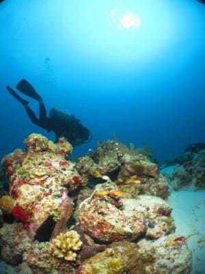
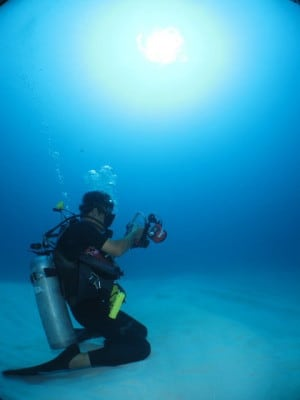
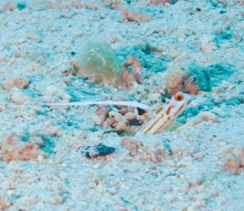
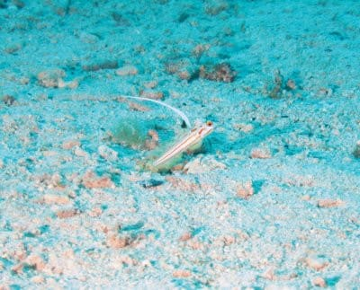
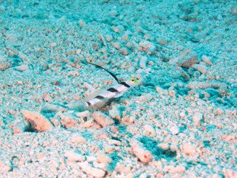
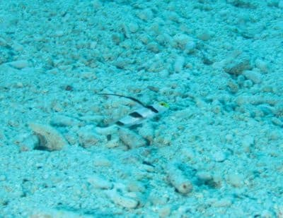
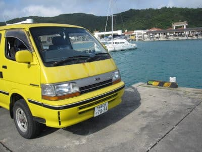

# 2010年7月，2歳の子連れで座間味でダイビング！その11…午後のハゼダイビングは天国！…だったんだけど

📅 投稿日時: 2021-10-09 06:58:51

🏷️ カテゴリ: [ダイビング日記](ce3a7a8d424d112fce83ee85c81a0e344.md)

えー．

2018シーズンを振り返ると．

このシーズンは2017年10月6日にイエティが

オープンして．

[10月7日に初滑りしてる](e8fc9d43265678c803c9cde7d630b7725.md)んですよね…

あぁ…

2018シーズンだったら，もう今頃

滑っていたのか…

狭山もYetiもオープン日はまだアナウンス

されてませんが，果たしていつオープン

なのかな…？？

Yetiが10月29日オープンだったら，

アイスクラッシュなのに，人工降雪機で

11月6日（5日プレオープン）の横手山より

1週間しか違わなんですけど？？

Yeti，もう少し早くにオープンして

欲しいなぁ…

ってなことで．

早いシーズンだったら，もうスキーシーズン

だったのか…

と，古き良き時代を懐かしみつつ．

今日はダイビング日記です！！

ーーーーー

ということで…

午後のシアワセの貸切ダイビングへ

向かったわけですが．

リクエストしたのは，ヤシャハゼとか

ヒレナガネジリンボウとかのハゼが

たくさんいるポイント．

エントリー後，ところどころに根が

点在する，きれいな砂浜の上を

ハゼエリアに進んでいきます．

ハゼエリアに着いたので，ガイドも私も

カメラを準備して…

まず，マイヤシャハゼをロックオン．

じりじり近づきます．

10cm近づいて，カメラを確認．

数枚撮影して，またじりじり

10cm匍匐前進…

最初のポイントから，ハゼの直前に

近づくまでかれこれ10分以上．

ほかのゲストがいた昨日までじゃ，

絶対不可能なダイビングですね．

ハゼの直近に寄れたー！

…しかし．

このカメラ．あまり近づきすぎると，

望遠での最短撮影距離より近くなっちゃう

みたい．

うーん．広角でハゼを撮らなきゃなら

ないって…

ちょっと小さくなっちゃうんですが．

とりあえず広角で撮影．

ちっちゃくなっちゃったけど．

…これ，さっきのちょっと離れて

望遠の方がいい写真かも？？

などと，いろいろ苦労しながら．

ヤシャハゼをGetしたあとは…

今度はヒレナガネジリンボウへ！！

これも，マイヒレネジをロックオン．

同じく15分ほどかけて，大量の動画と

静止画を撮影．

望遠時の最短撮影距離40ｃｍより近づき，

やっぱり

「もう少しマクロが強いほうが…」

と切望．

しかし，今回はマイ人生でもっともヒレネジに

寄れたかな！！

ほかの人がいないから，引っ込めても

いいってのが気楽ですね～

しかし．

当然，絞り優先AEがないこのカメラ．

望遠で撮影中に絞りがF11になったり，

F5.6になったり不安定．

何度かフラッシュ光量が

おかしな写真を量産してしまいました…

このカメラ，やっぱりかなり悲しい．

とか．

カメラはちょっと残念で，いろいろ苦労

したものの．

他のゲストを待たせる心配なく，

ハゼまですぐ目の前まで近づけて．

ひたすらひたすら，ハゼに近づき

大量に写真を撮り続けた，シアワセダイブ

だったのでした…

ってな感じで．

写真も動画もいっぱい撮ったし．

いやー．

満足．

結局，半径5ｍのハゼエリアで，30分以上

張り付いてました…

あとは白砂の上を，今回はハイビジョン

動画を大量に撮影しながら移動して，

エグジット．

いやー．

満足だわ…

ってことで．

宿に戻って．

さーーーーて．

今日撮ったハゼの写真，きれいに写ってるかな～？？？？

きれいに写ってるかな～

写ってるかな～

…

…

…

う，写ってないっ!！！！！！！！！！！！！！！！

どうしたことだ．

ハゼを写した写真が最初の数枚しか無いぞ…

動画も全く残ってないんですけどっ！？？？

（続く）
